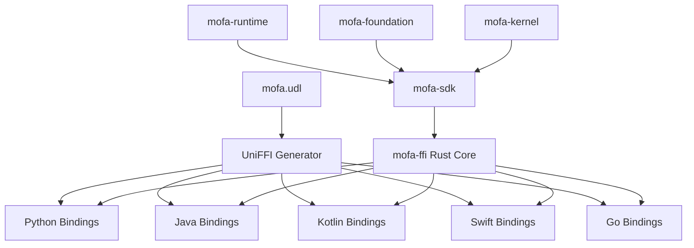

## Overview

MoFA provides native language bindings for **Python**, **Java**, **Kotlin**, **Swift**, and **Go** through [Mozilla UniFFI](https://mozilla.github.io/uniffi-rs/). These bindings expose the full power of MoFA's Rust core with zero-cost abstractions and idiomatic APIs for each language.

<CardGroup cols={2}>
  <Card title="Python" icon="python" href="/bindings/python">
    Native Python bindings with type hints and async support
  </Card>
  <Card title="Java" icon="java" href="/bindings/java">
    Java bindings with Maven/Gradle integration
  </Card>
  <Card title="Kotlin" icon="k" href="/bindings/kotlin">
    Kotlin bindings with coroutine support
  </Card>
  <Card title="Swift" icon="swift" href="/bindings/swift">
    Swift bindings for iOS and macOS
  </Card>
  <Card title="Go" icon="golang" href="/bindings/go">
    Go bindings with goroutine support
  </Card>
</CardGroup>

## Architecture

MoFA's binding architecture leverages UniFFI to generate language-specific interfaces from a single UDL (UniFFI Definition Language) file:



### Layered Architecture

<Steps>
  <Step title="Kernel Layer">
    Core Rust implementation in `mofa-kernel` - agent lifecycle, metadata, communication primitives
  </Step>
  <Step title="Foundation Layer">
    Business logic in `mofa-foundation` - LLM integration, persistence, agent abstractions
  </Step>
  <Step title="SDK Layer">
    Standard API surface in `mofa-sdk` - high-level interfaces, secretary agent mode
  </Step>
  <Step title="FFI Layer">
    Foreign Function Interface in `mofa-ffi` - UniFFI bindings, type conversions
  </Step>
  <Step title="Language Bindings">
    Generated language-specific wrappers with idiomatic APIs
  </Step>
</Steps>

## UniFFI Definition Language

The `mofa.udl` file defines the interface exposed to all languages:

```rust
namespace mofa {};

// Error types
[Error]
enum MoFaError {
    "ConfigError",
    "RuntimeError",
    "LLMError",
    "IoError",
    "InvalidArgument",
    "ToolError",
    "SessionError",
};

// Agent lifecycle types
enum AgentStatus {
    "Created",
    "Initializing",
    "Ready",
    "Running",
    "Executing",
    "Paused",
    "Interrupted",
    "ShuttingDown",
    "Shutdown",
    "Failed",
    "Destroyed",
    "Error",
};

// LLM Agent interface
interface LLMAgent {
    [Throws=MoFaError]
    string agent_id();
    
    [Throws=MoFaError]
    string name();
    
    [Throws=MoFaError]
    string ask(string question);
    
    [Throws=MoFaError]
    string chat(string message);
    
    void clear_history();
    sequence<ChatMessage> get_history();
};
```

## Core Features

### LLM Agent Interface

All bindings provide a consistent LLM agent API:

- **Builder Pattern**: Fluent API for agent configuration
- **Simple Q&A**: Stateless question answering via `ask()`
- **Multi-turn Chat**: Contextual conversations via `chat()`
- **History Management**: Access and clear conversation history
- **Multiple Providers**: OpenAI, Azure, Anthropic, Gemini, Ollama, custom

### Session Management

Persistent conversation sessions with storage backends:

- **In-Memory Sessions**: Fast, ephemeral storage
- **File-Based Sessions**: JSONL persistence
- **Metadata Support**: Store custom key-value pairs
- **Session Lifecycle**: Create, retrieve, save, delete, list

### Tool Registry

Define custom tools in your language that agents can invoke:

- **FfiToolCallback Interface**: Define tools in Python, Java, Kotlin, Swift, or Go
- **Dynamic Registration**: Register tools at runtime
- **JSON Schema**: Automatic parameter validation
- **Error Handling**: Structured success/failure results

## Type Conversions

### Rust to Language Mappings

| Rust Type | Python | Java | Kotlin | Swift | Go |
|-----------|--------|------|--------|-------|----|
| `String` | `str` | `String` | `String` | `String` | `string` |
| `bool` | `bool` | `boolean` | `Boolean` | `Bool` | `bool` |
| `u32` | `int` | `int` | `Int` | `UInt32` | `uint32` |
| `f32` | `float` | `float` | `Float` | `Float` | `float32` |
| `Vec<T>` | `List[T]` | `List<T>` | `List<T>` | `[T]` | `[]T` |
| `Option<T>` | `Optional[T]` | `T / null` | `T?` | `T?` | `*T` |
| `Result<T, E>` | raises `E` | throws `E` | throws `E` | throws `E` | `(T, error)` |

### FFI-Safe Types

UniFFI enforces FFI-safe type boundaries:

<CodeGroup>

```rust Rust (FFI Layer)
pub struct TokenUsageInfo {
    pub prompt_tokens: u32,
    pub completion_tokens: u32,
    pub total_tokens: u32,
}

pub struct AgentOutputInfo {
    pub content: String,
    pub content_type: String,
    pub tools_used: Vec<ToolUsageRecord>,
    pub duration_ms: u64,
    pub token_usage: Option<TokenUsageInfo>,
    pub metadata_json: String,
}
```

```python Python
class TokenUsageInfo:
    prompt_tokens: int
    completion_tokens: int
    total_tokens: int

class AgentOutputInfo:
    content: str
    content_type: str
    tools_used: list[ToolUsageRecord]
    duration_ms: int
    token_usage: Optional[TokenUsageInfo]
    metadata_json: str
```

```java Java
public class TokenUsageInfo {
    public int promptTokens;
    public int completionTokens;
    public int totalTokens;
}

public class AgentOutputInfo {
    public String content;
    public String contentType;
    public List<ToolUsageRecord> toolsUsed;
    public long durationMs;
    public TokenUsageInfo tokenUsage;
    public String metadataJson;
}
```

</CodeGroup>

## Performance Characteristics

### Zero-Copy Where Possible

UniFFI minimizes data copying:

- **String Views**: Shared string data where safe
- **Reference Counting**: `Arc<T>` for shared ownership
- **Direct FFI Calls**: No intermediate serialization for primitives

### Async Bridging

Rust's async runtime is bridged to language-native async:

<CodeGroup>

```rust Rust Core
pub async fn ask(&self, question: &str) -> Result<String, AgentError> {
    // Tokio async runtime
    self.provider.complete(question).await
}
```

```rust FFI Layer
pub fn ask(&self, question: String) -> Result<String, MoFaError> {
    // Bridge to blocking call
    self.runtime.block_on(async {
        let agent = self.inner.read().await;
        agent.ask(&question).await
    })
}
```

</CodeGroup>

## Building from Source

### Prerequisites

<Tabs>
  <Tab title="All Languages">
    ```bash
    # Install Rust
    curl --proto '=https' --tlsv1.2 -sSf https://sh.rustup.rs | sh
    
    # Build MoFA FFI
    cd mofa
    cargo build --release --features uniffi -p mofa-ffi
    ```
  </Tab>
  
  <Tab title="Python">
    ```bash
    # Install UniFFI bindgen
    cargo install uniffi-bindgen
    
    # Generate bindings
    cd crates/mofa-ffi
    ./generate-bindings.sh python
    ```
  </Tab>
  
  <Tab title="Java/Kotlin">
    ```bash
    # Install UniFFI bindgen for Java
    cargo install uniffi-bindgen-java
    
    # Generate bindings
    cd crates/mofa-ffi
    ./generate-bindings.sh java
    ```
  </Tab>
  
  <Tab title="Swift">
    ```bash
    # Swift bindings use uniffi-bindgen
    cargo install uniffi-bindgen
    
    # Generate bindings
    cd crates/mofa-ffi
    ./generate-bindings.sh swift
    ```
  </Tab>
  
  <Tab title="Go">
    ```bash
    # Install UniFFI bindgen for Go
    cargo install uniffi-bindgen-go --git https://github.com/NordSecurity/uniffi-bindgen-go
    
    # Generate bindings
    cd crates/mofa-ffi/bindings/go
    ./generate-go.sh
    ```
  </Tab>
</Tabs>

## Common Patterns

### Error Handling

All bindings expose unified error types:

<CodeGroup>

```python Python
from mofa import MoFaError

try:
    agent = builder.build()
    response = agent.ask("Hello")
except MoFaError as e:
    print(f"Error: {e}")
```

```java Java
import com.mofa.MoFaError;

try {
    LLMAgent agent = builder.build();
    String response = agent.ask("Hello");
} catch (MoFaError e) {
    System.err.println("Error: " + e.getMessage());
}
```

```go Go
agent, err := builder.Build()
if err != nil {
    log.Fatalf("Error: %v", err)
}

response, err := agent.Ask("Hello")
if err != nil {
    log.Printf("Error: %v", err)
}
```

</CodeGroup>

### Resource Management

UniFFI handles reference counting automatically:

- **Automatic Cleanup**: Objects are freed when no longer referenced
- **No Manual Memory Management**: GC/ARC handles cleanup
- **Thread-Safe**: Internal `Arc<RwLock<T>>` for concurrent access

## Limitations

### Current Constraints

<Warning>
  UniFFI has some limitations to be aware of:
  
  - **No Callbacks from Rust to FFI**: Callbacks flow from FFI languages to Rust only
  - **No Generic Types**: All types must be concrete in UDL
  - **No Lifetimes**: All data must be owned or Arc-wrapped
  - **Blocking Bridge**: Async Rust calls are bridged to blocking FFI calls
</Warning>

### Workarounds

- **Callbacks**: Use `FfiToolCallback` trait for foreign tool implementations
- **Generics**: Use JSON strings for flexible data exchange
- **Streaming**: Return batch results, not true streams (for now)

## Next Steps

<CardGroup cols={2}>
  <Card title="Python Guide" icon="python" href="/bindings/python">
    Complete Python binding documentation with examples
  </Card>
  <Card title="Java Guide" icon="java" href="/bindings/java">
    Java integration with Maven and Gradle
  </Card>
  <Card title="Kotlin Guide" icon="k" href="/bindings/kotlin">
    Kotlin bindings with coroutines
  </Card>
  <Card title="Swift Guide" icon="swift" href="/bindings/swift">
    Swift bindings for Apple platforms
  </Card>
  <Card title="Go Guide" icon="golang" href="/bindings/go">
    Go bindings with idiomatic Go patterns
  </Card>
</CardGroup>

## Resources

- [UniFFI Documentation](https://mozilla.github.io/uniffi-rs/)
- [MoFA FFI Source](https://github.com/mofa-org/mofa/tree/main/crates/mofa-ffi)
- [Example Code](https://github.com/mofa-org/mofa/tree/main/examples)
