## Why Multi-Agent Systems?

Complex problems often require **multiple specialized agents** working together:

- **Code generation**: Architect designs, Developer implements, Reviewer validates
- **Research**: Searcher finds sources, Analyst synthesizes, Writer drafts
- **Customer support**: Classifier routes, Specialist handles, QA verifies

MoFA provides **7 built-in coordination patterns** for multi-agent collaboration.

## Coordination Architecture

```mermaid
graph TD
    A[Task] --> B[Coordinator]
    B --> C{Pattern?}
    
    C -->|Sequential| D[Agent 1 → Agent 2 → Agent 3]
    C -->|Parallel| E[Agent 1 + Agent 2 + Agent 3]
    C -->|Hierarchical| F[Supervisor → Workers]
    C -->|Debate| G[Agents Argue → Consensus]
    C -->|MapReduce| H[Map → Reduce]
    
    D --> I[Aggregated Result]
    E --> I
    F --> I
    G --> I
    H --> I
```



## Coordinator Trait

All coordination patterns implement the `Coordinator` trait:

```rust mofa-kernel/src/agent/components/coordinator.rs
#[async_trait]
pub trait Coordinator: Send + Sync {
    /// Dispatch task to agents
    async fn dispatch(
        &self,
        task: Task,
        ctx: &AgentContext,
    ) -> AgentResult<Vec<DispatchResult>>;
    
    /// Aggregate results from multiple agents
    async fn aggregate(
        &self,
        results: Vec<AgentOutput>,
    ) -> AgentResult<AgentOutput>;
    
    /// Get coordination pattern
    fn pattern(&self) -> CoordinationPattern;
    
    /// Select agents for task
    async fn select_agents(
        &self,
        task: &Task,
        ctx: &AgentContext,
    ) -> AgentResult<Vec<String>>;
}
```

## Coordination Patterns

<Tabs>
  <Tab title="Sequential">
    **Sequential Execution**: Output of one agent becomes input to the next.
    
    ```mermaid
    graph LR
        A[Task] --> B[Agent 1]
        B --> C[Agent 2]
        C --> D[Agent 3]
        D --> E[Result]
    ```
    
    **Use Cases**:
    - Data pipelines (fetch → process → store)
    - Multi-step reasoning (plan → execute → verify)
    - Content generation (research → draft → edit)
    
    **Example**:
    ```rust
    use mofa_kernel::agent::components::coordinator::{
        Task, CoordinationPattern
    };
    
    // Create task
    let task = Task::new(
        "task-1",
        "Research Rust async programming"
    )
    .with_type(TaskType::Analysis);
    
    // Sequential pattern: research → summarize → format
    let pattern = CoordinationPattern::Sequential;
    let coordinator = SequentialCoordinator::new(vec![
        "researcher".to_string(),
        "summarizer".to_string(),
        "formatter".to_string(),
    ]);
    
    let results = coordinator.dispatch(task, &ctx).await?;
    let final_output = coordinator.aggregate(
        results.into_iter().filter_map(|r| r.output).collect()
    ).await?;
    ```
  </Tab>
  
  <Tab title="Parallel">
    **Parallel Execution**: All agents execute simultaneously, results aggregated.
    
    ```mermaid
    graph TD
        A[Task] --> B[Agent 1]
        A --> C[Agent 2]
        A --> D[Agent 3]
        
        B --> E[Aggregator]
        C --> E
        D --> E
        
        E --> F[Result]
    ```
    
    **Use Cases**:
    - Multiple perspectives (get opinions from different experts)
    - Redundancy (run same task on multiple agents, pick best)
    - Independent subtasks (parallel data fetching)
    
    **Example**:
    ```rust
    let pattern = CoordinationPattern::Parallel;
    
    // All agents analyze the same code from different angles
    let coordinator = ParallelCoordinator::new(
        vec!["security_analyst", "performance_analyst", "style_checker"],
        AggregationStrategy::CollectAll,
    );
    
    let results = coordinator.dispatch(task, &ctx).await?;
    // Returns: {"results": [...], "count": 3}
    ```
  </Tab>
  
  <Tab title="Hierarchical">
    **Hierarchical (Supervision)**: Supervisor delegates to workers and reviews results.
    
    ```mermaid
    graph TD
        A[Task] --> B[Supervisor]
        B --> C[Worker 1]
        B --> D[Worker 2]
        B --> E[Worker 3]
        
        C --> F[Supervisor Review]
        D --> F
        E --> F
        
        F --> G[Final Decision]
    ```
    
    **Use Cases**:
    - Quality control (workers execute, supervisor validates)
    - Complex task decomposition (supervisor breaks down, assigns)
    - Routing (supervisor decides which specialist to use)
    
    **Example**:
    ```rust
    let pattern = CoordinationPattern::Hierarchical {
        supervisor_id: "lead_developer".to_string(),
    };
    
    // Supervisor delegates code review tasks
    let coordinator = HierarchicalCoordinator::new(
        "lead_developer",
        vec!["junior_dev_1", "junior_dev_2"],
    );
    
    let results = coordinator.dispatch(task, &ctx).await?;
    ```
  </Tab>
  
  <Tab title="Consensus">
    **Consensus**: Agents negotiate until agreement is reached.
    
    ```mermaid
    graph TD
        A[Task] --> B[Round 1: All Agents Propose]
        B --> C{Agreement?}
        C -->|No| D[Round 2: Agents Debate]
        D --> E{Agreement?}
        E -->|No| F[Round 3: Vote]
        E -->|Yes| G[Consensus Result]
        F --> G
    ```
    
    **Use Cases**:
    - Critical decisions (medical diagnosis, financial planning)
    - Conflict resolution (multiple valid approaches)
    - Distributed consensus (Byzantine fault tolerance)
    
    **Example**:
    ```rust
    let pattern = CoordinationPattern::Consensus {
        threshold: 0.75,  // 75% agreement required
    };
    
    // Agents must reach consensus on architecture decision
    let coordinator = ConsensusCoordinator::new(
        vec!["architect_1", "architect_2", "architect_3"],
        0.75,
    );
    
    let results = coordinator.dispatch(task, &ctx).await?;
    ```
  </Tab>
  
  <Tab title="Debate">
    **Debate**: Agents alternate proposing and critiquing solutions.
    
    ```mermaid
    graph LR
        A[Task] --> B[Agent 1: Proposes]
        B --> C[Agent 2: Critiques]
        C --> D[Agent 1: Refines]
        D --> E[Agent 2: Final Review]
        E --> F[Best Solution]
    ```
    
    **Use Cases**:
    - Iterative improvement (writing, code review)
    - Red team / blue team (security analysis)
    - Socratic method (teaching, learning)
    
    **Example**:
    ```rust
    let pattern = CoordinationPattern::Debate {
        max_rounds: 3,
    };
    
    // Two agents debate design approach
    let coordinator = DebateCoordinator::new(
        vec!["optimist", "critic"],
        3,  // max rounds
    );
    
    let results = coordinator.dispatch(task, &ctx).await?;
    ```
  </Tab>
  
  <Tab title="MapReduce">
    **MapReduce**: Divide task, process in parallel, aggregate results.
    
    ```mermaid
    graph TD
        A[Large Task] --> B[Map: Split into Chunks]
        B --> C[Process Chunk 1]
        B --> D[Process Chunk 2]
        B --> E[Process Chunk 3]
        
        C --> F[Reduce: Aggregate]
        D --> F
        E --> F
        
        F --> G[Final Result]
    ```
    
    **Use Cases**:
    - Large document processing (split, analyze, combine)
    - Batch operations (process 1000s of records)
    - Distributed computation
    
    **Example**:
    ```rust
    let pattern = CoordinationPattern::MapReduce;
    
    // Process large dataset in parallel
    let coordinator = MapReduceCoordinator::new(
        vec!["worker_1", "worker_2", "worker_3"],
        |data| split_into_chunks(data, 3),  // Map function
        |results| merge_results(results),    // Reduce function
    );
    
    let results = coordinator.dispatch(task, &ctx).await?;
    ```
  </Tab>
  
  <Tab title="Voting">
    **Voting**: Agents independently decide, majority wins.
    
    ```mermaid
    graph TD
        A[Task] --> B[Agent 1: Vote A]
        A --> C[Agent 2: Vote A]
        A --> D[Agent 3: Vote B]
        A --> E[Agent 4: Vote A]
        
        B --> F[Tally Votes]
        C --> F
        D --> F
        E --> F
        
        F --> G[Winner: A]
    ```
    
    **Use Cases**:
    - Classification (multiple models vote on label)
    - Content moderation (vote on whether to flag)
    - Ensemble methods (combine ML model predictions)
    
    **Example**:
    ```rust
    let pattern = CoordinationPattern::Voting;
    
    // Multiple agents vote on content safety
    let coordinator = VotingCoordinator::new(
        vec!["safety_1", "safety_2", "safety_3"],
        AggregationStrategy::Vote,
    );
    
    let results = coordinator.dispatch(task, &ctx).await?;
    ```
  </Tab>
</Tabs>

## Task Definition

Tasks are the units of work passed to coordinators:

```rust
use mofa_kernel::agent::components::coordinator::{
    Task, TaskType, TaskPriority
};

let task = Task::new("task-1", "Analyze security vulnerabilities")
    .with_type(TaskType::Analysis)
    .with_priority(TaskPriority::High)
    .for_agent("security_expert")  // Optional: target specific agent
    .with_param("scope", json!("authentication"))
    .with_timeout(30_000);  // 30 seconds
```

**Task Fields**:

| Field | Type | Description |
|-------|------|-------------|
| `id` | String | Unique task identifier |
| `task_type` | TaskType | Category (Analysis, Generation, etc.) |
| `content` | String | Task description/prompt |
| `priority` | TaskPriority | Execution priority (Low, Normal, High, Urgent) |
| `target_agent` | Option&lt;String&gt; | Specific agent to use (optional) |
| `params` | HashMap | Additional parameters |
| `timeout_ms` | Option&lt;u64&gt; | Maximum execution time |

## Aggregation Strategies

How to combine results from multiple agents:

```rust
use mofa_kernel::agent::components::coordinator::AggregationStrategy;

let strategy = AggregationStrategy::Concatenate {
    separator: "\n---\n".to_string(),
};

let aggregated = aggregate_outputs(results, &strategy)?;
```

<Tabs>
  <Tab title="Concatenate">
    Join all outputs with a separator:
    
    ```rust
    AggregationStrategy::Concatenate {
        separator: "\n\n".to_string(),
    }
    ```
    
    **Result**: `"Output 1\n\nOutput 2\n\nOutput 3"`
  </Tab>
  
  <Tab title="FirstSuccess">
    Return the first successful (non-error) output:
    
    ```rust
    AggregationStrategy::FirstSuccess
    ```
    
    **Result**: First agent's successful output
  </Tab>
  
  <Tab title="CollectAll">
    Collect all outputs into a JSON array:
    
    ```rust
    AggregationStrategy::CollectAll
    ```
    
    **Result**: 
    ```json
    {
      "results": ["Output 1", "Output 2", "Output 3"],
      "count": 3
    }
    ```
  </Tab>
  
  <Tab title="Vote">
    Choose the most frequent output:
    
    ```rust
    AggregationStrategy::Vote
    ```
    
    **Result**: Output with most votes
  </Tab>
  
  <Tab title="LLM Summarize">
    Use LLM to summarize all outputs:
    
    ```rust
    AggregationStrategy::LLMSummarize {
        prompt_template: "Summarize these analyses: {results}".to_string(),
    }
    ```
    
    **Result**: LLM-generated summary
  </Tab>
</Tabs>

## Communication Patterns

### Message Bus

Agents communicate via the microkernel message bus:

```rust
use mofa_kernel::bus::MessageBus;

// Send to specific agent
bus.send("agent-2", Message::text("Process this")).await?;

// Broadcast to all
bus.broadcast(Message::event("task_completed")).await?;

// Pub/sub topics
bus.subscribe("llm_responses").await?;
bus.publish("llm_requests", Message::json(request)).await?;
```

### Agent Discovery

Find agents by capabilities:

```rust
use mofa_runtime::registry::AgentRegistry;

let registry = AgentRegistry::new();

// Find agents with specific capability
let llm_agents = registry.find_by_tag("llm").await?;

// Find by multiple criteria
let requirements = AgentRequirements::builder()
    .tag("code-generation")
    .supports_streaming(true)
    .build();

let agents = registry.find_matching(&requirements).await?;
```

## Priority Scheduling

Tasks are executed based on priority:

```rust
pub enum TaskPriority {
    Low = 0,
    Normal = 1,
    High = 2,
    Urgent = 3,
}
```

**Scheduler Behavior**:
- Higher priority tasks preempt lower priority
- Same priority uses FIFO queue
- Urgent tasks interrupt running tasks (if interruptible)

```rust
let urgent_task = Task::new("security-alert", "Analyze breach")
    .with_priority(TaskPriority::Urgent);

coordinator.dispatch(urgent_task, &ctx).await?;
// Interrupts current tasks and executes immediately
```

## Secretary Agent Pattern

MoFA includes a specialized **Secretary Agent** for human-in-the-loop workflows:


**Features**:
- 🧠 Autonomous task planning and decomposition
- 🔄 Intelligent agent scheduling
- 👤 Human intervention at key nodes
- 📊 Full process observability
- 🔁 Closed-loop feedback

<Card title="Secretary Agent Guide" href="/guides/secretary-agent" icon="user-tie">
  Learn how to build human-in-the-loop workflows
</Card>

## Real-World Example

**Scenario**: Code review system

```rust
use mofa_kernel::agent::components::coordinator::*;

// Sequential: Static analysis → Security scan → Style check
let analysis_task = Task::new(
    "code-review-1",
    "Review authentication.rs"
);

let sequential = SequentialCoordinator::new(vec![
    "static_analyzer",
    "security_scanner",
    "style_checker",
]);

let analysis_results = sequential.dispatch(analysis_task, &ctx).await?;

// Parallel: Multiple reviewers give feedback simultaneously
let review_task = Task::new(
    "code-review-2",
    "Get expert opinions on design"
);

let parallel = ParallelCoordinator::new(
    vec!["senior_dev_1", "senior_dev_2", "architect"],
    AggregationStrategy::CollectAll,
);

let review_results = parallel.dispatch(review_task, &ctx).await?;

// Hierarchical: Lead decides if changes needed
let decision_task = Task::new(
    "code-review-3",
    "Approve or request changes"
);

let hierarchical = HierarchicalCoordinator::new(
    "tech_lead",
    vec!["reviewer_1", "reviewer_2"],
);

let final_decision = hierarchical.dispatch(decision_task, &ctx).await?;
```

## Performance Considerations

<Warning>
  **Coordination Overhead**: Each coordination pattern adds latency:
  
  - **Sequential**: Sum of all agent latencies
  - **Parallel**: Max of all agent latencies + aggregation
  - **Debate**: Multiple rounds × agent latency
  
  Design workflows to minimize unnecessary coordination.
</Warning>

## Next Steps

<CardGroup cols={2}>
  <Card title="Workflow Engine" href="/concepts/workflow-engine" icon="diagram-project">
    Build complex stateful workflows
  </Card>
  
  <Card title="Examples" href="/examples" icon="code">
    See coordination patterns in action
  </Card>
</CardGroup>
