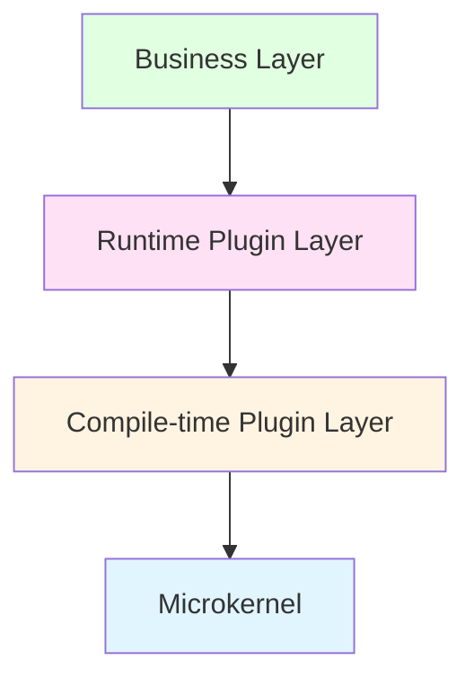
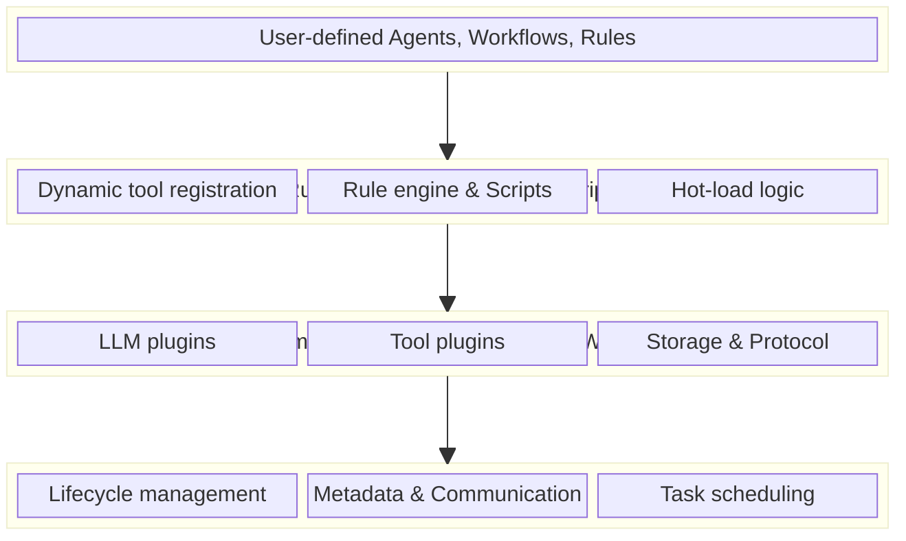
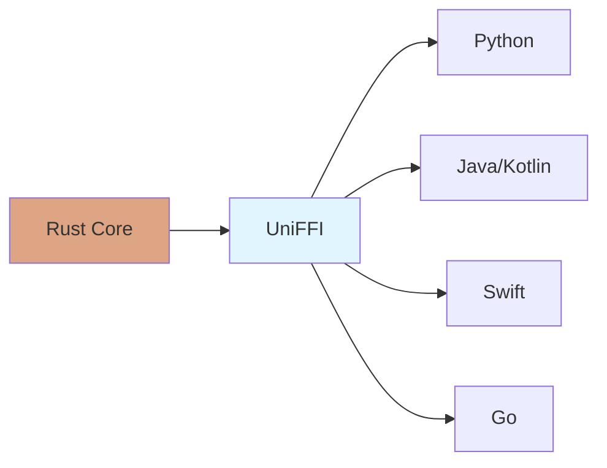
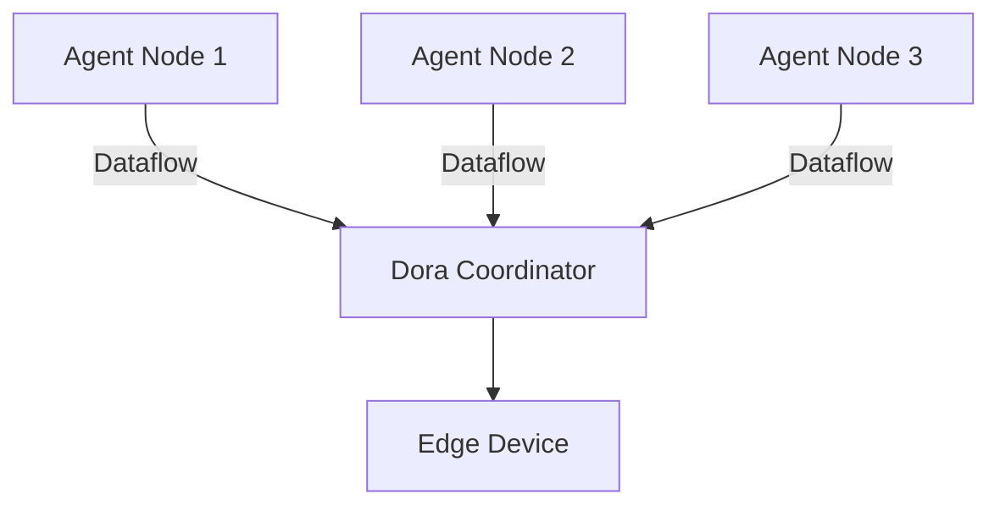

## Overview

MoFA (Modular Framework for Agents) implements a **layered microkernel architecture** with a revolutionary **dual-layer plugin system** that achieves the perfect balance between raw performance and dynamic flexibility.

Unlike traditional agent frameworks that sacrifice performance for flexibility or vice versa, MoFA's architecture enables:

- **Extreme Performance**: Zero-cost abstractions through Rust and compile-time plugins
- **Unlimited Extensibility**: Hot-reloadable runtime plugins without recompilation
- **Multi-Language Support**: Write once in Rust, use everywhere via UniFFI
- **Production-Grade**: Battle-tested microkernel design with clear separation of concerns

## Architecture Layers

MoFA follows a strict layered architecture with unidirectional dependencies:



### Layer Breakdown

<AccordionGroup>
  <Accordion title="1. Microkernel (mofa-kernel)" icon="cube">
    The minimalist core containing only essential primitives:
    
    - **Lifecycle Management**: Agent initialization, execution, and shutdown
    - **Metadata System**: Configuration, capabilities, and discovery
    - **Communication Bus**: Message passing and event distribution
    - **Task Scheduling**: Priority-based execution coordination
    
    **Design Principle**: Keep the kernel stable and minimal. All features are extensions.
    
    ```rust
    // mofa-kernel defines ONLY traits
    pub trait MoFAAgent: Send + Sync {
        fn id(&self) -> &str;
        async fn execute(&mut self, input: AgentInput) -> AgentResult<AgentOutput>;
        async fn initialize(&mut self, ctx: &CoreAgentContext) -> AgentResult<()>;
    }
    ```
  </Accordion>

  <Accordion title="2. Compile-time Plugin Layer" icon="microchip">
    Performance-critical implementations in Rust/WASM:
    
    - **LLM Plugins**: Native inference, API integration (OpenAI, Anthropic, Ollama)
    - **Tool Plugins**: File system, HTTP, database operations
    - **Storage Plugins**: PostgreSQL, MySQL, SQLite persistence
    - **WASM Plugins**: Sandboxed secure execution for untrusted code
    
    **Advantages**:
    - Zero runtime overhead
    - Type safety at compile time
    - Native system integration
    - Memory safety without garbage collection
    
    ```rust
    // Compile-time plugin example
    #[async_trait]
    impl AgentPlugin for LLMPlugin {
        async fn execute(&mut self, input: String) -> PluginResult<String> {
            // Zero-cost abstraction, directly compiled
            self.client.generate(&input).await
        }
    }
    ```
  </Accordion>

  <Accordion title="3. Runtime Plugin Layer (Rhai)" icon="bolt">
    Dynamic business logic via embedded Rhai scripting:
    
    - **Script Task Nodes**: Execute logic without recompilation
    - **Dynamic Tool Registration**: Add tools at runtime
    - **Rule Engine**: Priority-based decision making
    - **Hot Reload**: Update logic instantly in production
    
    **Advantages**:
    - Instant deployment
    - User-defined extensions
    - A/B testing without downtime
    - Secure sandbox with resource limits
    
    ```rust
    // Runtime plugin - hot reloadable
    fn process_order(order) {
        if order.amount > 1000 {
            return "manager_approval";
        }
        return "auto_approve";
    }
    ```
  </Accordion>

  <Accordion title="4. Business Layer" icon="briefcase">
    User-defined agents, workflows, and application logic:
    
    - Custom agent implementations
    - Workflow orchestration
    - Domain-specific rules
    - Integration glue code
  </Accordion>
</AccordionGroup>

## Complete Architecture Diagram

The full MoFA architecture showing all major components:



## Crate Structure

MoFA's workspace is organized into focused crates following the architecture layers:

<CodeGroup>
```plaintext Workspace Structure
mofa/
├── crates/
│   ├── mofa-kernel/        # Microkernel core
│   ├── mofa-foundation/    # Concrete implementations
│   ├── mofa-runtime/       # Execution system
│   ├── mofa-plugins/       # Dual-layer plugins
│   ├── mofa-sdk/           # Standard API
│   ├── mofa-ffi/           # Multi-language bindings
│   ├── mofa-cli/           # CLI tool
│   └── mofa-monitoring/    # Observability
└── examples/               # 27+ examples
```

```rust Kernel Layer (Traits Only)
// mofa-kernel/src/agent/mod.rs
pub trait MoFAAgent: Send + Sync {
    fn id(&self) -> &str;
    async fn execute(&mut self, input: AgentInput) -> AgentResult<AgentOutput>;
}

pub trait Tool: Send + Sync {
    fn name(&self) -> &str;
    async fn execute(&self, input: ToolInput) -> ToolResult;
}
```

```rust Foundation Layer (Implementations)
// mofa-foundation/src/agent/
pub struct SimpleToolRegistry {
    tools: HashMap<String, Arc<dyn Tool>>,
}

impl ToolRegistry for SimpleToolRegistry {
    fn register(&mut self, tool: Arc<dyn Tool>) -> AgentResult<()> {
        // Concrete implementation
    }
}
```
</CodeGroup>

## Key Architecture Principles

<CardGroup cols={2}>
  <Card title="Trait-Based Design" icon="layer-group">
    All core abstractions are traits in `mofa-kernel`, allowing multiple implementations and easy testing
  </Card>
  
  <Card title="Zero Circular Dependencies" icon="circle-nodes">
    Strict layering prevents circular dependencies. Foundation depends on kernel, never vice versa
  </Card>
  
  <Card title="Plugin Isolation" icon="shield-halved">
    Plugins cannot directly depend on each other. All communication through the kernel bus
  </Card>
  
  <Card title="Async by Default" icon="rocket">
    Native Rust async/await using Tokio for high-concurrency workloads
  </Card>
</CardGroup>

<Note>
  **Architecture Validation**: The layered design is enforced through Rust's module system and dependency declarations in `Cargo.toml`. Violations cause compilation errors.
</Note>

## Cross-Language Architecture

MoFA's Rust core supports multiple languages through UniFFI:



**Benefits**:
- **Near-Zero Overhead**: Direct FFI calls, no serialization
- **Type Safety**: Automatic binding generation with type checking
- **Consistent API**: Same interface across all languages

<CodeGroup>
```python Python
import mofa

agent = mofa.Agent("my-agent")
result = await agent.execute("Hello")
```

```kotlin Kotlin
val agent = Agent("my-agent")
val result = agent.execute("Hello")
```

```swift Swift
let agent = Agent("my-agent")
let result = await agent.execute("Hello")
```
</CodeGroup>

## Actor-Based Concurrency

MoFA uses the **Ractor** actor framework for agent concurrency:

- **Isolated State**: Each agent runs in its own actor
- **Message Passing**: Communication via channels, no shared state
- **Fault Tolerance**: Actor supervision trees for resilience
- **Scalability**: Thousands of concurrent agents

```rust
pub struct ReactAgent {
    state: RactorState<Self>,
    tool_registry: Arc<dyn ToolRegistry>,
}

impl Actor for ReactAgent {
    async fn handle(&self, msg: AgentMessage) -> AgentResult<()> {
        // Isolated execution
    }
}
```

## Distributed Architecture (Optional)

With the `dora` feature enabled, MoFA supports distributed dataflow:



- **Cross-Process Communication**: Agents on different machines
- **Low-Latency**: Optimized dataflow protocol
- **Edge Ready**: Deploy to resource-constrained devices

<Tip>
  The distributed layer is optional. Enable with `cargo build --features dora` when needed.
</Tip>

## Performance Characteristics

| Component | Performance | Use Case |
|-----------|-------------|----------|
| **Rust Core** | &lt;1ms overhead | Critical path operations |
| **Compile-time Plugins** | Zero-cost abstractions | LLM inference, data processing |
| **Runtime Plugins** | ~1-5ms script execution | Business rules, workflows |
| **UniFFI Bindings** | &lt;100μs FFI overhead | Python/Java integration |

## Next Steps

<CardGroup cols={2}>
  <Card title="Microkernel Design" href="/concepts/microkernel" icon="atom">
    Deep dive into the microkernel's lifecycle and trait system
  </Card>
  
  <Card title="Dual-Layer Plugins" href="/concepts/dual-layer-plugins" icon="plug">
    Learn how compile-time and runtime plugins work together
  </Card>
  
  <Card title="Agent Coordination" href="/concepts/agent-coordination" icon="users">
    Understand multi-agent collaboration patterns
  </Card>
  
  <Card title="Workflow Engine" href="/concepts/workflow-engine" icon="diagram-project">
    Explore the LangGraph-inspired workflow system
  </Card>
</CardGroup>
