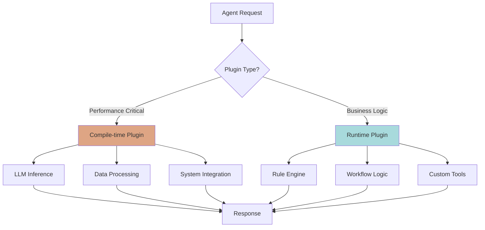

## The Performance vs Flexibility Dilemma

Traditional frameworks force you to choose:

- **Compiled languages** (C++, Rust): Fast but inflexible, requires recompilation
- **Scripting languages** (Python, JavaScript): Flexible but slow, runtime overhead

MoFA solves this with a **dual-layer plugin architecture** that delivers both:

<CardGroup cols={2}>
  <Card title="Compile-time Plugins" icon="microchip">
    **Rust/WASM**
    
    - Zero runtime overhead
    - Type safety
    - Native integration
    - 10-100x faster
  </Card>
  
  <Card title="Runtime Plugins" icon="bolt">
    **Rhai Scripts**
    
    - Hot reload
    - No recompilation
    - User-defined logic
    - Instant deployment
  </Card>
</CardGroup>

## Architecture Overview



## Compile-time Plugins (Rust/WASM)

### When to Use

Use compile-time plugins for:

- **Performance-Critical Paths**: LLM inference, embedding generation
- **System Integration**: Database connections, file I/O, network calls
- **Type Safety Required**: Financial calculations, cryptography
- **Native Libraries**: Bindings to C/C++ libraries

### Creating a Compile-time Plugin

<Steps>
  <Step title="Implement the AgentPlugin trait">
    ```rust mofa-plugins/src/my_plugin.rs
    use mofa_kernel::{
        AgentPlugin, PluginMetadata, PluginState, PluginType,
        PluginContext, PluginResult,
    };
    use async_trait::async_trait;
    
    pub struct MyCompileTimePlugin {
        metadata: PluginMetadata,
        state: PluginState,
        // Your plugin fields
    }
    
    impl MyCompileTimePlugin {
        pub fn new() -> Self {
            let metadata = PluginMetadata::new(
                "my_plugin",
                "My Plugin",
                PluginType::Custom("analytics".to_string())
            )
            .with_description("High-performance analytics plugin")
            .with_capability("data_analysis");
            
            Self {
                metadata,
                state: PluginState::Unloaded,
            }
        }
    }
    
    #[async_trait]
    impl AgentPlugin for MyCompileTimePlugin {
        fn metadata(&self) -> &PluginMetadata {
            &self.metadata
        }
        
        fn state(&self) -> PluginState {
            self.state.clone()
        }
        
        async fn load(&mut self, ctx: &PluginContext) -> PluginResult<()> {
            self.state = PluginState::Loading;
            // Initialize resources (DB connections, etc.)
            self.state = PluginState::Loaded;
            Ok(())
        }
        
        async fn init_plugin(&mut self) -> PluginResult<()> {
            // Plugin initialization logic
            Ok(())
        }
        
        async fn start(&mut self) -> PluginResult<()> {
            self.state = PluginState::Running;
            Ok(())
        }
        
        async fn stop(&mut self) -> PluginResult<()> {
            self.state = PluginState::Loaded;
            Ok(())
        }
        
        async fn unload(&mut self) -> PluginResult<()> {
            // Clean up resources
            self.state = PluginState::Unloaded;
            Ok(())
        }
        
        async fn execute(&mut self, input: String) -> PluginResult<String> {
            // Zero-cost execution
            Ok(format!("Processed: {}", input))
        }
        
        fn as_any(&self) -> &dyn Any { self }
        fn as_any_mut(&mut self) -> &mut dyn Any { self }
        fn into_any(self: Box<Self>) -> Box<dyn Any> { self }
    }
    ```
  </Step>
  
  <Step title="Register the plugin">
    ```rust
    use mofa_plugins::PluginManager;
    
    let manager = PluginManager::new("my-agent");
    let plugin = MyCompileTimePlugin::new();
    
    manager.register(plugin).await?;
    manager.load_all().await?;
    manager.start_all().await?;
    ```
  </Step>
  
  <Step title="Use the plugin">
    ```rust
    let result = manager.execute("my_plugin", "input data".to_string()).await?;
    println!("Result: {}", result);
    ```
  </Step>
</Steps>

### WASM Plugins

For **sandboxed security**, use WASM plugins:

```rust
use mofa_plugins::wasm_runtime::{WasmRuntime, WasmPlugin};

let runtime = WasmRuntime::new()?;
let plugin = WasmPlugin::from_file("plugin.wasm")?;

runtime.register(plugin).await?;
let result = runtime.execute("plugin_id", input).await?;
```

**Benefits of WASM**:
- **Sandboxed execution**: Cannot access host resources unless permitted
- **Memory safety**: Cannot corrupt memory outside sandbox
- **Language agnostic**: Write in Rust, C, AssemblyScript, etc.
- **Near-native performance**: ~95% of native speed

<Warning>
  WASM plugins have startup overhead (~1-10ms). Use for untrusted code or isolation requirements, not for hot paths.
</Warning>

## Runtime Plugins (Rhai Scripts)

### When to Use

Use runtime plugins for:

- **Business Rules**: Discount logic, approval workflows
- **Configurable Workflows**: User-defined data pipelines
- **A/B Testing**: Experiment logic without redeployment
- **Dynamic Tools**: Register new capabilities at runtime
- **Hot Fixes**: Emergency updates without downtime

### Rhai Script Engine

MoFA integrates the [Rhai](https://rhai.rs/) scripting language:

```rust
// Rhai script syntax (JavaScript-like)
fn calculate_discount(price, customer_tier) {
    if customer_tier == "gold" {
        return price * 0.8;  // 20% discount
    } else if customer_tier == "silver" {
        return price * 0.9;  // 10% discount
    } else {
        return price;        // No discount
    }
}
```

### Creating a Runtime Plugin

<Tabs>
  <Tab title="Script File">
    ```rust scripts/order_processor.rhai
    // Order processing logic
    fn process_order(order) {
        let total = order.quantity * order.price;
        
        // Apply business rules
        if total > 1000.0 {
            // Large order - requires approval
            return #{
                status: "pending_approval",
                reason: "High value order",
                next_agent: "manager"
            };
        }
        
        // Auto-approve
        return #{
            status: "approved",
            order_id: order.id,
            total: total
        };
    }
    
    // Entry point
    process_order
    ```
  </Tab>
  
  <Tab title="Load Script">
    ```rust
    use mofa_plugins::rhai_runtime::RhaiPlugin;
    
    let plugin = RhaiPlugin::from_file("scripts/order_processor.rhai")?;
    manager.register(plugin).await?;
    
    // Execute
    let order_json = json!({
        "id": "ORD-123",
        "quantity": 5,
        "price": 250.0
    });
    
    let result = manager.execute("order_processor", order_json.to_string()).await?;
    ```
  </Tab>
  
  <Tab title="Hot Reload">
    ```rust
    use mofa_plugins::hot_reload::HotReloadManager;
    
    let hot_reload = HotReloadManager::new(
        "./scripts",
        HotReloadConfig::default()
    );
    
    // Watch for changes
    hot_reload.start().await?;
    
    // Scripts automatically reload when modified
    // No restart required!
    ```
  </Tab>
</Tabs>

### Dynamic Tool Registration

Register tools at runtime using Rhai:

```rust tools/weather.rhai
// Tool metadata
let tool = #{
    name: "get_weather",
    description: "Get current weather for a city",
    parameters: #{
        type: "object",
        properties: #{
            city: #{
                type: "string",
                description: "City name"
            }
        },
        required: ["city"]
    }
};

// Tool implementation
fn execute(args) {
    let city = args.city;
    
    // In production, call real API
    // For demo, return mock data
    return #{
        city: city,
        temperature: 72,
        condition: "Sunny",
        humidity: 45
    };
}

// Export tool
#{ tool: tool, execute: execute }
```

**Register the tool**:

```rust
use mofa_plugins::rhai_runtime::RhaiToolRegistry;

let registry = RhaiToolRegistry::new();
registry.load_from_file("tools/weather.rhai").await?;

// Now LLM can call this tool
let tools = registry.get_all_tools();
```

### Rule Engine

Build decision engines with Rhai:

```rust rules/content_moderation.rhai
let rules = [
    #{
        name: "spam_filter",
        priority: "critical",
        condition: |msg| msg.contains("BUY NOW") || msg.contains("CLICK HERE"),
        action: |msg| #{ decision: "block", reason: "spam" }
    },
    #{
        name: "profanity_filter",
        priority: "high",
        condition: |msg| has_profanity(msg),
        action: |msg| #{ decision: "flag", reason: "profanity" }
    },
    #{
        name: "allow_default",
        priority: "low",
        condition: |msg| true,
        action: |msg| #{ decision: "allow" }
    }
];

fn evaluate(message) {
    // Check rules by priority
    for rule in rules {
        if (rule.condition)(message) {
            return (rule.action)(message);
        }
    }
}
```

## Performance Comparison

| Operation | Compile-time Plugin | Runtime Plugin | Pure Python |
|-----------|---------------------|----------------|-------------|
| **JSON Parsing** | 10 μs | 50 μs | 500 μs |
| **Regex Match** | 1 μs | 5 μs | 20 μs |
| **LLM Inference** | 100 ms | N/A | 120 ms |
| **Rule Evaluation** | 0.1 μs | 5 μs | 10 μs |
| **HTTP Request** | 5 ms | N/A | 10 ms |

<Tip>
  Use compile-time plugins for operations under 1ms. Use runtime plugins for business logic that changes frequently.
</Tip>

## Security Considerations

<AccordionGroup>
  <Accordion title="Compile-time Plugin Security" icon="shield-halved">
    **Rust Plugins**:
    - ✅ Memory safe (no buffer overflows)
    - ✅ Type safe (compile-time checks)
    - ⚠️ Full system access (must trust code)
    
    **WASM Plugins**:
    - ✅ Sandboxed execution
    - ✅ Capability-based security
    - ✅ Memory isolation
    - ✅ Can run untrusted code
  </Accordion>
  
  <Accordion title="Runtime Plugin Security" icon="lock">
    **Rhai Script Sandbox**:
    ```rust
    use mofa_plugins::rhai_runtime::RhaiConfig;
    
    let config = RhaiConfig::default()
        .max_operations(10_000)           // Limit CPU
        .max_call_stack_depth(32)         // Prevent stack overflow
        .max_string_size(1_000_000)       // Limit memory
        .max_array_size(10_000)
        .max_map_size(10_000);
    ```
    
    **Built-in Protections**:
    - ✅ No file system access (unless explicitly allowed)
    - ✅ No network access
    - ✅ No process spawning
    - ✅ Operation limits prevent DoS
  </Accordion>
</AccordionGroup>

## Interoperability Between Layers

Compile-time and runtime plugins can work together:

```rust
// Compile-time plugin provides capability
pub struct DatabasePlugin {
    pool: sqlx::PgPool,
}

#[async_trait]
impl AgentPlugin for DatabasePlugin {
    async fn execute(&mut self, query: String) -> PluginResult<String> {
        // Execute SQL with native performance
        let result = sqlx::query(&query)
            .fetch_all(&self.pool)
            .await?;
        Ok(serde_json::to_string(&result)?)
    }
}

// Runtime plugin uses it
// scripts/data_analyzer.rhai
fn analyze_sales() {
    // Call compile-time plugin
    let data = call_plugin("database", "SELECT * FROM sales WHERE date > '2024-01-01'");
    let parsed = parse_json(data);
    
    // Process with Rhai (business logic)
    let total = 0.0;
    for row in parsed {
        total += row.amount;
    }
    
    return #{ total_sales: total };
}
```

## Hot Reload Configuration

```rust
use mofa_plugins::hot_reload::{
    HotReloadManager, HotReloadConfig, ReloadStrategy
};

let config = HotReloadConfig::new()
    .with_strategy(ReloadStrategy::Debounced(
        std::time::Duration::from_secs(1)
    ))
    .with_preserve_state(true)      // Keep plugin state
    .with_auto_rollback(true)       // Rollback on failure
    .with_max_attempts(3);          // Retry limit

let manager = HotReloadManager::new("./plugins", config);
manager.start().await?;

// Listen for reload events
let mut events = manager.events();
while let Some(event) = events.recv().await {
    match event {
        ReloadEvent::ReloadCompleted { plugin_id, .. } => {
            println!("✅ Reloaded: {}", plugin_id);
        }
        ReloadEvent::ReloadFailed { plugin_id, error, .. } => {
            eprintln!("❌ Failed to reload {}: {}", plugin_id, error);
        }
        _ => {}
    }
}
```

## Best Practices

<CardGroup cols={2}>
  <Card title="Performance" icon="gauge-high">
    - Use compile-time plugins for &lt;1ms operations
    - Use runtime plugins for &gt;10ms business logic
    - Cache compiled Rhai scripts
    - Profile before optimizing
  </Card>
  
  <Card title="Security" icon="shield">
    - Use WASM for untrusted code
    - Set resource limits on Rhai scripts
    - Validate all inputs
    - Audit plugin permissions
  </Card>
  
  <Card title="Maintainability" icon="wrench">
    - Keep plugins focused (single responsibility)
    - Version plugin APIs
    - Document hot reload behavior
    - Test both layers independently
  </Card>
  
  <Card title="Deployment" icon="truck">
    - Compile-time: Ship in binary
    - Runtime: Deploy as files
    - Use hot reload in staging first
    - Monitor reload success rates
  </Card>
</CardGroup>

## Example: Real-World Usage

```rust
// High-performance LLM inference (compile-time)
let llm_plugin = LLMPlugin::new("openai");
manager.register(llm_plugin).await?;

// Flexible business rules (runtime)
let rules_plugin = RhaiPlugin::from_file("rules/approval.rhai")?;
manager.register(rules_plugin).await?;

// Workflow combines both
async fn process_request(request: &str) -> Result<String> {
    // Fast LLM call (compile-time plugin)
    let analysis = manager.execute("llm", request.to_string()).await?;
    
    // Business logic (runtime plugin, hot-reloadable)
    let decision = manager.execute("rules", analysis).await?;
    
    Ok(decision)
}
```

## Next Steps

<CardGroup cols={2}>
  <Card title="Agent Coordination" href="/concepts/agent-coordination" icon="users">
    Learn multi-agent collaboration patterns
  </Card>
  
  <Card title="Workflow Engine" href="/concepts/workflow-engine" icon="diagram-project">
    Build stateful workflows with plugins
  </Card>
</CardGroup>
