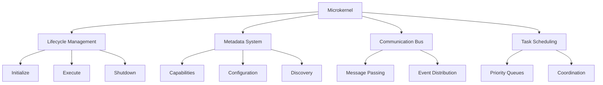
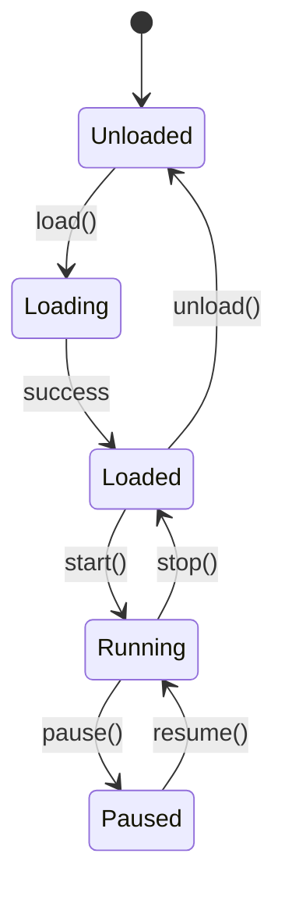

## What is a Microkernel?

MoFA's microkernel is a **minimalist core** that provides only the essential building blocks for agent systems. Unlike monolithic frameworks that bundle everything together, the microkernel philosophy is:

<Note>
  **Core Principle**: Keep the kernel simple, stable, and unchanging. All features are extensions built on top.
</Note>

### Microkernel vs Traditional Frameworks

| Aspect | Traditional Framework | MoFA Microkernel |
|--------|----------------------|------------------|
| **Core Size** | Large, batteries-included | Minimal, trait-based |
| **Stability** | Breaking changes in features affect core | Core remains stable, features evolve independently |
| **Extensibility** | Limited to framework's design | Unlimited via plugins |
| **Performance** | Often compromised for features | Zero-cost abstractions |
| **Testing** | Complex integration tests | Simple unit tests for traits |

## Microkernel Responsibilities

The `mofa-kernel` crate contains **only four core responsibilities**:



### 1. Lifecycle Management

The `MoFAAgent` trait defines the core lifecycle:

```rust mofa-kernel/src/agent/core.rs
#[async_trait]
pub trait MoFAAgent: Send + Sync {
    /// Unique agent identifier
    fn id(&self) -> &str;
    
    /// Human-readable name
    fn name(&self) -> &str;
    
    /// Agent capabilities for discovery
    fn capabilities(&self) -> &AgentCapabilities;
    
    /// Initialize agent with context
    async fn initialize(&mut self, ctx: &CoreAgentContext) -> AgentResult<()>;
    
    /// Execute agent logic
    async fn execute(
        &mut self, 
        input: AgentInput, 
        ctx: &CoreAgentContext
    ) -> AgentResult<AgentOutput>;
    
    /// Graceful shutdown
    async fn shutdown(&mut self) -> AgentResult<()>;
    
    /// Current agent state
    fn state(&self) -> AgentState;
    
    /// Handle interrupt signal
    async fn interrupt(&mut self) -> AgentResult<InterruptResult>;
}
```

<Accordion title="Lifecycle State Machine">
  Agents follow a strict state machine:
  
  ```mermaid
  stateDiagram-v2
      [*] --> Uninitialized
      Uninitialized --> Initializing: initialize()
      Initializing --> Ready: success
      Initializing --> Error: failure
      Ready --> Running: execute()
      Running --> Ready: complete
      Running --> Error: failure
      Ready --> Shutdown: shutdown()
      Error --> Shutdown: shutdown()
      Shutdown --> [*]
  ```
  
  **State Definitions**:
  ```rust
  #[derive(Debug, Clone, PartialEq, Eq)]
  #[non_exhaustive]
  pub enum AgentState {
      Uninitialized,
      Initializing,
      Ready,
      Running,
      Paused,
      Error(String),
      Shutdown,
  }
  ```
</Accordion>

### 2. Metadata System

Every agent declares its capabilities for discovery and routing:

```rust mofa-kernel/src/agent/capabilities.rs
pub struct AgentCapabilities {
    /// Capability tags (e.g., "llm", "coding", "search")
    pub tags: Vec<String>,
    
    /// Supported input types
    pub input_types: Vec<InputType>,
    
    /// Supported output types
    pub output_types: Vec<OutputType>,
    
    /// Supports streaming responses
    pub supports_streaming: bool,
    
    /// Supports tool calling
    pub supports_tools: bool,
    
    /// Custom metadata
    pub metadata: HashMap<String, String>,
}
```

**Builder Pattern**:

```rust
let capabilities = AgentCapabilities::builder()
    .tag("llm")
    .tag("code-generation")
    .input_type(InputType::Text)
    .output_type(OutputType::Text)
    .supports_streaming(true)
    .supports_tools(true)
    .build();
```

<Tip>
  Capabilities enable **dynamic agent discovery**. The runtime can find suitable agents based on required capabilities without hardcoding.
</Tip>

### 3. Communication Bus

The kernel provides a minimal message bus abstraction:

```rust mofa-kernel/src/bus/mod.rs
#[async_trait]
pub trait MessageBus: Send + Sync {
    /// Send message to specific agent
    async fn send(&self, to: &str, msg: Message) -> Result<(), BusError>;
    
    /// Broadcast to all agents
    async fn broadcast(&self, msg: Message) -> Result<(), BusError>;
    
    /// Subscribe to topic
    async fn subscribe(&self, topic: &str) -> Result<Receiver<Message>, BusError>;
    
    /// Publish to topic
    async fn publish(&self, topic: &str, msg: Message) -> Result<(), BusError>;
}
```

**Message Structure**:

```rust
pub struct Message {
    pub id: String,
    pub from: String,
    pub to: Option<String>,
    pub content: MessageContent,
    pub metadata: MessageMetadata,
    pub timestamp: u64,
}

pub enum MessageContent {
    Text(String),
    Binary(Vec<u8>),
    Json(serde_json::Value),
    Event(GlobalEvent),
}
```

### 4. Task Scheduling

Priority-based task coordination:

```rust mofa-kernel/src/agent/components/coordinator.rs
pub struct Task {
    pub id: String,
    pub task_type: TaskType,
    pub content: String,
    pub priority: TaskPriority,
    pub target_agent: Option<String>,
    pub timeout_ms: Option<u64>,
}

#[derive(Debug, Clone, Copy, PartialEq, Eq, PartialOrd, Ord)]
pub enum TaskPriority {
    Low = 0,
    Normal = 1,
    High = 2,
    Urgent = 3,
}
```

## Component Traits

The microkernel defines modular component traits:

<AccordionGroup>
  <Accordion title="Tool Trait" icon="wrench">
    ```rust mofa-kernel/src/agent/components/tool.rs
    #[async_trait]
    pub trait Tool: Send + Sync {
        fn name(&self) -> &str;
        fn description(&self) -> &str;
        fn metadata(&self) -> &ToolMetadata;
        
        async fn execute(
            &self,
            input: ToolInput,
        ) -> Result<ToolResult, ToolError>;
        
        fn descriptor(&self) -> ToolDescriptor {
            ToolDescriptor {
                name: self.name().to_string(),
                description: self.description().to_string(),
                metadata: self.metadata().clone(),
            }
        }
    }
    ```
    
    **Purpose**: Define external capabilities agents can use (API calls, file operations, etc.)
  </Accordion>
  
  <Accordion title="Memory Trait" icon="database">
    ```rust mofa-kernel/src/agent/components/memory.rs
    #[async_trait]
    pub trait Memory: Send + Sync {
        async fn store(&self, key: String, value: MemoryValue) -> AgentResult<()>;
        async fn retrieve(&self, key: &str) -> AgentResult<Option<MemoryValue>>;
        async fn search(&self, query: &str, limit: usize) -> AgentResult<Vec<MemoryItem>>;
        async fn delete(&self, key: &str) -> AgentResult<bool>;
        
        fn stats(&self) -> MemoryStats;
    }
    ```
    
    **Purpose**: Stateful agent memory for conversation history and context
  </Accordion>
  
  <Accordion title="Reasoner Trait" icon="brain">
    ```rust mofa-kernel/src/agent/components/reasoner.rs
    #[async_trait]
    pub trait Reasoner: Send + Sync {
        async fn reason(
            &self,
            context: &str,
            options: &ReasoningOptions,
        ) -> AgentResult<ReasoningResult>;
        
        fn strategy(&self) -> ReasoningStrategy;
    }
    
    pub enum ReasoningStrategy {
        ChainOfThought,
        TreeOfThought,
        ReAct,
        ReflexionReAct,
    }
    ```
    
    **Purpose**: LLM-powered reasoning strategies
  </Accordion>
  
  <Accordion title="Coordinator Trait" icon="users">
    ```rust mofa-kernel/src/agent/components/coordinator.rs
    #[async_trait]
    pub trait Coordinator: Send + Sync {
        async fn dispatch(
            &self,
            task: Task,
            ctx: &AgentContext,
        ) -> AgentResult<Vec<DispatchResult>>;
        
        async fn aggregate(
            &self,
            results: Vec<AgentOutput>,
        ) -> AgentResult<AgentOutput>;
        
        fn pattern(&self) -> CoordinationPattern;
    }
    ```
    
    **Purpose**: Multi-agent collaboration patterns (parallel, sequential, debate, etc.)
  </Accordion>
</AccordionGroup>

## Plugin System Integration

The microkernel defines the **plugin trait** that all extensions implement:

```rust mofa-kernel/src/plugin/mod.rs
#[async_trait]
pub trait AgentPlugin: Send + Sync {
    fn metadata(&self) -> &PluginMetadata;
    fn state(&self) -> PluginState;
    
    // Lifecycle hooks
    async fn load(&mut self, ctx: &PluginContext) -> PluginResult<()>;
    async fn init_plugin(&mut self) -> PluginResult<()>;
    async fn start(&mut self) -> PluginResult<()>;
    async fn pause(&mut self) -> PluginResult<()>;
    async fn resume(&mut self) -> PluginResult<()>;
    async fn stop(&mut self) -> PluginResult<()>;
    async fn unload(&mut self) -> PluginResult<()>;
    
    // Execution
    async fn execute(&mut self, input: String) -> PluginResult<String>;
    
    // Observability
    async fn health_check(&self) -> PluginResult<bool>;
    fn stats(&self) -> HashMap<String, serde_json::Value>;
}
```

**Plugin State Machine**:



<Note>
  **Important**: The microkernel defines the plugin interface but contains **zero concrete plugin implementations**. All actual plugins live in `mofa-plugins` or `mofa-foundation`.
</Note>

## Architecture Rules

MoFA enforces strict architectural boundaries:

<Steps>
  <Step title="Kernel defines only traits">
    `mofa-kernel` contains **zero concrete implementations** (except test code). Only interfaces.
  </Step>
  
  <Step title="Foundation provides implementations">
    `mofa-foundation` contains all concrete types that implement kernel traits.
  </Step>
  
  <Step title="No circular dependencies">
    Foundation can depend on kernel. Kernel **never** depends on foundation.
  </Step>
  
  <Step title="Plugins extend via traits">
    All plugins implement `AgentPlugin` and register via the plugin system.
  </Step>
</Steps>

```rust
// ✅ CORRECT: Kernel defines trait
// mofa-kernel/src/agent/components/tool.rs
pub trait Tool: Send + Sync {
    fn name(&self) -> &str;
}

// ✅ CORRECT: Foundation implements trait
// mofa-foundation/src/tools/calculator.rs
pub struct Calculator;

impl Tool for Calculator {
    fn name(&self) -> &str { "calculator" }
}

// ❌ WRONG: Kernel should NOT contain implementations
// mofa-kernel/src/agent/components/tool.rs
pub struct CalculatorTool { /* ... */ }
impl Tool for CalculatorTool { /* ... */ }
```

## Error Handling

The microkernel defines a unified error hierarchy:

```rust mofa-kernel/src/error.rs
#[derive(Debug, thiserror::Error)]
#[non_exhaustive]
pub enum KernelError {
    #[error("Agent error: {0}")]
    Agent(#[from] AgentError),
    
    #[error("Plugin error: {0}")]
    Plugin(#[from] PluginError),
    
    #[error("Bus error: {0}")]
    Bus(#[from] BusError),
    
    #[error("Configuration error: {0}")]
    Config(String),
}

pub type KernelResult<T> = Result<T, KernelError>;
```

<Tip>
  Use `thiserror` for typed errors, **not** `anyhow`. This maintains type safety across API boundaries.
</Tip>

## Type Safety Guarantees

The microkernel leverages Rust's type system for safety:

**1. Non-exhaustive enums for forward compatibility**:

```rust
#[derive(Debug, Clone)]
#[non_exhaustive]  // New variants can be added without breaking changes
pub enum AgentState {
    Idle,
    Running,
    // Future: can add new states here
}
```

**2. Trait bounds for capability requirements**:

```rust
pub trait Coordinator: Send + Sync {
    // Guarantees thread-safe coordination
}
```

**3. Async traits for non-blocking operations**:

```rust
#[async_trait]
pub trait MoFAAgent: Send + Sync {
    async fn execute(&mut self, input: AgentInput) -> AgentResult<AgentOutput>;
}
```

## Performance Optimizations

The microkernel is designed for zero-cost abstractions:

- **No dynamic dispatch where avoidable**: Use generics instead of `dyn Trait`
- **Inline hints**: `#[inline]` on hot path methods
- **Zero-copy where possible**: References and `Cow<str>` for strings
- **Compile-time polymorphism**: Generic constraints instead of runtime checks

```rust
// Zero-cost generic dispatch
pub fn register_tool<T: Tool + 'static>(tool: T) {
    // Monomorphized at compile time
}

// vs slower dynamic dispatch
pub fn register_tool_dyn(tool: Box<dyn Tool>) {
    // Runtime vtable lookup
}
```

## Next Steps

<CardGroup cols={2}>
  <Card title="Dual-Layer Plugins" href="/concepts/dual-layer-plugins" icon="plug">
    Learn how plugins extend the microkernel
  </Card>
  
  <Card title="Agent Coordination" href="/concepts/agent-coordination" icon="users">
    Multi-agent collaboration patterns
  </Card>
  
  <Card title="Quick Start" href="/quickstart" icon="rocket">
    Build your first agent
  </Card>
</CardGroup>
