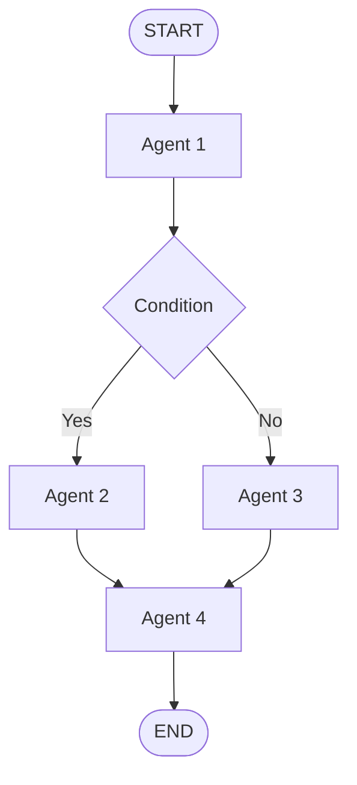
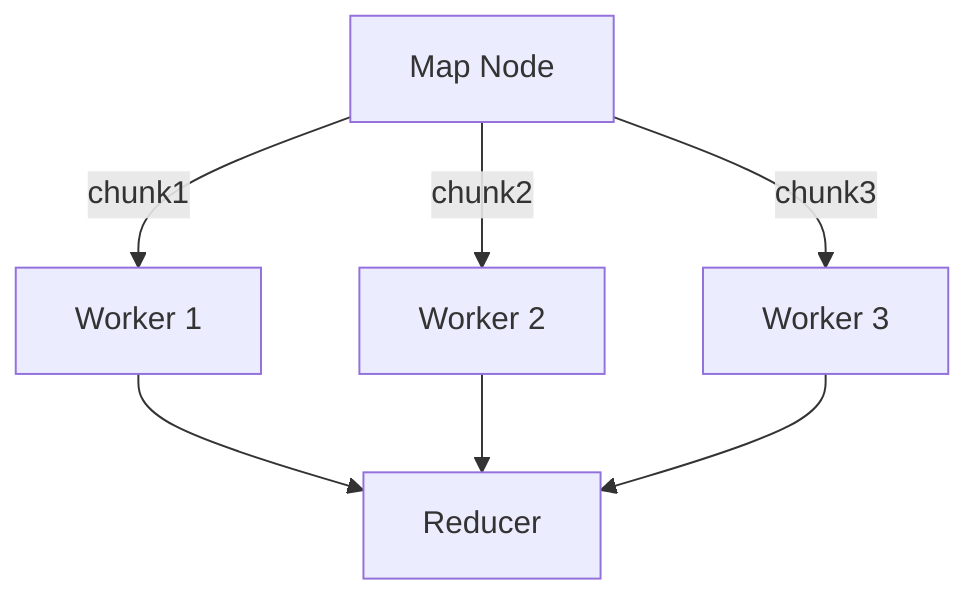
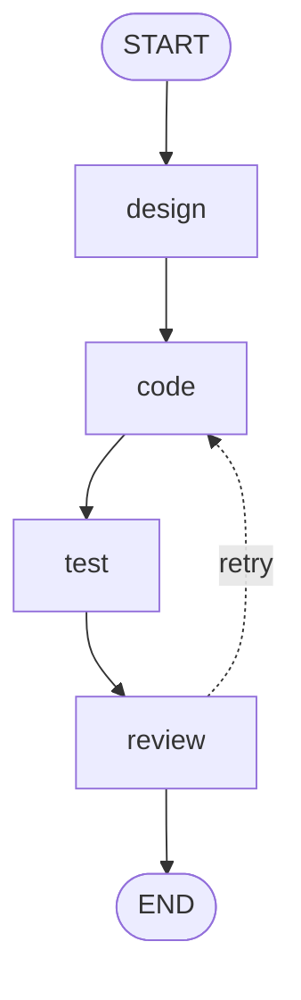

## Overview

MoFA's workflow engine is inspired by [LangGraph](https://github.com/langchain-ai/langgraph) and provides a **stateful, graph-based workflow system** for orchestrating complex agent processes.

**Key Features**:
- **State Management**: Reducers for configurable state updates
- **Control Flow**: Conditional edges, loops, branching
- **Persistence**: Checkpoint/restore workflow state
- **Telemetry**: Debug sessions with step-by-step replay
- **MapReduce**: Dynamic edge creation for parallel tasks



## Core Concepts

### StateGraph

The `StateGraph` is the main abstraction for building workflows:

```rust
use mofa_kernel::workflow::{StateGraph, START, END};
use serde::{Serialize, Deserialize};

#[derive(Clone, Serialize, Deserialize)]
struct MyState {
    messages: Vec<String>,
    step_count: u32,
}

let graph = StateGraphImpl::<MyState>::new("my_workflow")
    .add_node("process", Box::new(ProcessNode))
    .add_node("validate", Box::new(ValidateNode))
    .add_edge(START, "process")
    .add_edge("process", "validate")
    .add_edge("validate", END)
    .compile()?;
```

### Graph State Trait

All workflow states must implement `GraphState`:

```rust mofa-kernel/src/workflow/state.rs
pub trait GraphState: Clone + Send + Sync + 'static {
    /// Schema for state validation
    fn schema() -> StateSchema;
    
    /// Apply an update to the state
    fn update(&mut self, update: StateUpdate) -> Result<(), WorkflowError>;
    
    /// Serialize to JSON
    fn to_json(&self) -> serde_json::Value;
    
    /// Deserialize from JSON
    fn from_json(value: serde_json::Value) -> Result<Self, WorkflowError>;
}
```

### Node Functions

Nodes are async functions that process state:

```rust
use mofa_kernel::workflow::{NodeFunc, RuntimeContext, Command};

struct ProcessNode;

#[async_trait]
impl NodeFunc<MyState> for ProcessNode {
    async fn call(
        &self,
        state: MyState,
        ctx: &RuntimeContext,
    ) -> Result<Command<MyState>, WorkflowError> {
        // Process the state
        let mut new_state = state.clone();
        new_state.messages.push("Processed".to_string());
        new_state.step_count += 1;
        
        // Return update command
        Ok(Command::Update(new_state))
    }
}
```

## Reducer System

Reducers control **how state updates are merged**:

<Tabs>
  <Tab title="Overwrite">
    Replace the entire field:
    
    ```rust
    use mofa_kernel::workflow::{Reducer, ReducerType};
    
    let reducer = Reducer::new(ReducerType::Overwrite);
    
    // Old state: { messages: ["A", "B"] }
    // Update: { messages: ["C"] }
    // Result: { messages: ["C"] }
    ```
  </Tab>
  
  <Tab title="Append">
    Append to array/list:
    
    ```rust
    let reducer = Reducer::new(ReducerType::Append);
    
    // Old state: { messages: ["A", "B"] }
    // Update: { messages: ["C"] }
    // Result: { messages: ["A", "B", "C"] }
    ```
  </Tab>
  
  <Tab title="Prepend">
    Prepend to array/list:
    
    ```rust
    let reducer = Reducer::new(ReducerType::Prepend);
    
    // Old state: { messages: ["B", "C"] }
    // Update: { messages: ["A"] }
    // Result: { messages: ["A", "B", "C"] }
    ```
  </Tab>
  
  <Tab title="Merge">
    Deep merge objects:
    
    ```rust
    let reducer = Reducer::new(ReducerType::Merge);
    
    // Old state: { user: { name: "Alice", age: 30 } }
    // Update: { user: { age: 31, city: "NYC" } }
    // Result: { user: { name: "Alice", age: 31, city: "NYC" } }
    ```
  </Tab>
  
  <Tab title="Custom">
    User-defined merge logic:
    
    ```rust
    let reducer = Reducer::new(ReducerType::Custom(Box::new(
        |old: &serde_json::Value, new: &serde_json::Value| {
            // Custom merge logic
            Ok(new.clone())
        }
    )));
    ```
  </Tab>
</Tabs>

**Configure per field**:

```rust
impl GraphState for MyState {
    fn schema() -> StateSchema {
        StateSchema::new()
            .add_field("messages", ReducerType::Append)
            .add_field("step_count", ReducerType::Overwrite)
    }
}
```

## Command Pattern

Nodes return `Command` objects for control flow:

```rust mofa-kernel/src/workflow/command.rs
pub enum Command<S: GraphState> {
    /// Update state and continue
    Update(S),
    
    /// Update state and specify next node(s)
    UpdateAndGoto {
        state: S,
        next: ControlFlow,
    },
    
    /// End workflow
    End(S),
    
    /// Create dynamic edges (MapReduce)
    Send(SendCommand<S>),
}

pub enum ControlFlow {
    /// Single next node
    Next(String),
    
    /// Multiple parallel nodes
    Parallel(Vec<String>),
    
    /// Conditional routing
    Branch(HashMap<String, bool>),
}
```

**Example: Conditional routing**

```rust
#[async_trait]
impl NodeFunc<MyState> for RouterNode {
    async fn call(
        &self,
        state: MyState,
        ctx: &RuntimeContext,
    ) -> Result<Command<MyState>, WorkflowError> {
        if state.step_count > 5 {
            Ok(Command::UpdateAndGoto {
                state,
                next: ControlFlow::Next("finalize".to_string()),
            })
        } else {
            Ok(Command::UpdateAndGoto {
                state,
                next: ControlFlow::Next("continue_processing".to_string()),
            })
        }
    }
}
```

## Send Pattern (MapReduce)

Dynamically create edges for parallel task distribution:

```rust
use mofa_kernel::workflow::{Command, SendCommand};

#[async_trait]
impl NodeFunc<MyState> for MapNode {
    async fn call(
        &self,
        state: MyState,
        ctx: &RuntimeContext,
    ) -> Result<Command<MyState>, WorkflowError> {
        // Split task into chunks
        let chunks = vec!["chunk1", "chunk2", "chunk3"];
        
        Ok(Command::Send(SendCommand {
            state,
            sends: chunks.into_iter().map(|chunk| {
                Send::new("worker")
                    .with_data("chunk", json!(chunk))
            }).collect(),
            next: Some("reducer".to_string()),
        }))
    }
}
```



## Recursion Limit

Prevent infinite loops with `RemainingSteps`:

```rust
use mofa_kernel::workflow::{GraphConfig, RemainingSteps};

let config = GraphConfig {
    recursion_limit: Some(100),  // Max 100 steps
    ..Default::default()
};

let graph = StateGraphImpl::<MyState>::new("workflow")
    .with_config(config)
    .compile()?;
```

**Behavior**:
- Each step decrements the counter
- When counter reaches 0, workflow stops
- Prevents runaway loops

```rust
// Inside a node
if ctx.remaining_steps().is_exhausted() {
    return Ok(Command::End(state));
}
```

## Telemetry & Debug Sessions

Record workflow execution for debugging:

```rust
use mofa_kernel::workflow::{
    SessionRecorder, DebugSession, DebugEvent
};

let recorder = SessionRecorder::new();
let session_id = recorder.start_session("my-workflow").await;

// Execute workflow with recording
let result = graph.invoke_with_recorder(
    initial_state,
    Some(&recorder),
).await?;

// Replay session
let session = recorder.get_session(&session_id).await?;
for event in session.events() {
    match event {
        DebugEvent::NodeEnter { node, state, .. } => {
            println!("Entered: {}, State: {:?}", node, state);
        }
        DebugEvent::NodeExit { node, result, .. } => {
            println!("Exited: {}, Result: {:?}", node, result);
        }
        _ => {}
    }
}
```

**Recorded Events**:
- `NodeEnter`: Node execution started
- `NodeExit`: Node execution completed
- `StateUpdate`: State changed
- `EdgeTraversal`: Graph edge followed
- `Error`: Execution error

## Streaming Execution

Stream intermediate steps during execution:

```rust
let mut stream = graph.stream(initial_state, None).await?;

while let Some(event) = stream.next().await {
    match event {
        StreamEvent::NodeStarted { node } => {
            println!("Starting: {}", node);
        }
        StreamEvent::NodeCompleted { node, state } => {
            println!("Completed: {}", node);
            println!("State: {:?}", state);
        }
        StreamEvent::WorkflowComplete { state } => {
            println!("Done: {:?}", state);
        }
    }
}
```

## Persistence (Checkpointing)

Save and restore workflow state:

```rust
use mofa_kernel::workflow::Checkpointer;

// Save checkpoint
let checkpoint = graph.checkpoint(&state)?;
storage.save("checkpoint-1", &checkpoint).await?;

// Restore and resume
let checkpoint = storage.load("checkpoint-1").await?;
let restored_state = graph.restore_checkpoint(checkpoint)?;
let result = graph.invoke(restored_state, None).await?;
```

**Use Cases**:
- Long-running workflows (resume after crash)
- Human-in-the-loop (wait for approval, resume later)
- Time travel debugging (restore to previous state)

## Workflow DSL

Define workflows in YAML/JSON:

```yaml workflow.yaml
name: data_pipeline
version: "1.0"

nodes:
  - id: fetch
    type: script
    script: |
      fn execute(state) {
        state.data = fetch_from_api();
        state
      }
  
  - id: process
    type: script
    script: |
      fn execute(state) {
        state.data = transform(state.data);
        state
      }
  
  - id: save
    type: script
    script: |
      fn execute(state) {
        save_to_db(state.data);
        state
      }

edges:
  - from: __start__
    to: fetch
  
  - from: fetch
    to: process
  
  - from: process
    to: save
  
  - from: save
    to: __end__
```

**Load and execute**:

```rust
use mofa_foundation::workflow::dsl::WorkflowLoader;

let loader = WorkflowLoader::new();
let graph = loader.from_file("workflow.yaml").await?;
let result = graph.invoke(initial_state, None).await?;
```

## Complete Example

**Scenario**: Multi-step code generation workflow

```rust
use mofa_kernel::workflow::*;
use serde::{Serialize, Deserialize};

#[derive(Clone, Serialize, Deserialize, Debug)]
struct CodeGenState {
    requirement: String,
    design: Option<String>,
    code: Option<String>,
    tests: Option<String>,
    review_passed: bool,
}

impl GraphState for CodeGenState {
    fn schema() -> StateSchema {
        StateSchema::new()
            .add_field("requirement", ReducerType::Overwrite)
            .add_field("design", ReducerType::Overwrite)
            .add_field("code", ReducerType::Overwrite)
            .add_field("tests", ReducerType::Append)
    }
    
    // ... implement other required methods
}

// Nodes
struct DesignNode;
struct CodeNode;
struct TestNode;
struct ReviewNode;

#[async_trait]
impl NodeFunc<CodeGenState> for DesignNode {
    async fn call(
        &self,
        mut state: CodeGenState,
        ctx: &RuntimeContext,
    ) -> Result<Command<CodeGenState>, WorkflowError> {
        // Call LLM to generate design
        state.design = Some("System design document...".to_string());
        Ok(Command::Update(state))
    }
}

#[async_trait]
impl NodeFunc<CodeGenState> for ReviewNode {
    async fn call(
        &self,
        mut state: CodeGenState,
        ctx: &RuntimeContext,
    ) -> Result<Command<CodeGenState>, WorkflowError> {
        // Review the code
        let passed = true;  // Simulate review
        state.review_passed = passed;
        
        if passed {
            Ok(Command::UpdateAndGoto {
                state,
                next: ControlFlow::Next(END.to_string()),
            })
        } else {
            // Loop back to code generation
            Ok(Command::UpdateAndGoto {
                state,
                next: ControlFlow::Next("code".to_string()),
            })
        }
    }
}

// Build workflow
let graph = StateGraphImpl::<CodeGenState>::new("codegen")
    .add_node("design", Box::new(DesignNode))
    .add_node("code", Box::new(CodeNode))
    .add_node("test", Box::new(TestNode))
    .add_node("review", Box::new(ReviewNode))
    .add_edge(START, "design")
    .add_edge("design", "code")
    .add_edge("code", "test")
    .add_edge("test", "review")
    // Review -> END or Review -> code (conditional)
    .compile()?;

// Execute
let initial = CodeGenState {
    requirement: "Build a REST API for user management".to_string(),
    design: None,
    code: None,
    tests: None,
    review_passed: false,
};

let result = graph.invoke(initial, None).await?;
println!("Final state: {:?}", result);
```

## Workflow Visualization

Generate Mermaid diagrams from workflows:

```rust
let mermaid = graph.to_mermaid();
println!("{}", mermaid);
```

**Output**:


## Performance Tips

<CardGroup cols={2}>
  <Card title="Minimize State Size" icon="database">
    Large states slow serialization. Keep only necessary data.
  </Card>
  
  <Card title="Use Parallel Edges" icon="bolt">
    When nodes are independent, use `ControlFlow::Parallel`.
  </Card>
  
  <Card title="Batch Updates" icon="layer-group">
    Update state once per node instead of incrementally.
  </Card>
  
  <Card title="Async All The Way" icon="rocket">
    Ensure all node functions are truly async for concurrency.
  </Card>
</CardGroup>

## Next Steps

<CardGroup cols={2}>
  <Card title="Examples" href="/examples" icon="code">
    See workflow examples in action
  </Card>
  
  <Card title="API Reference" href="/api" icon="book">
    Complete workflow API documentation
  </Card>
</CardGroup>
