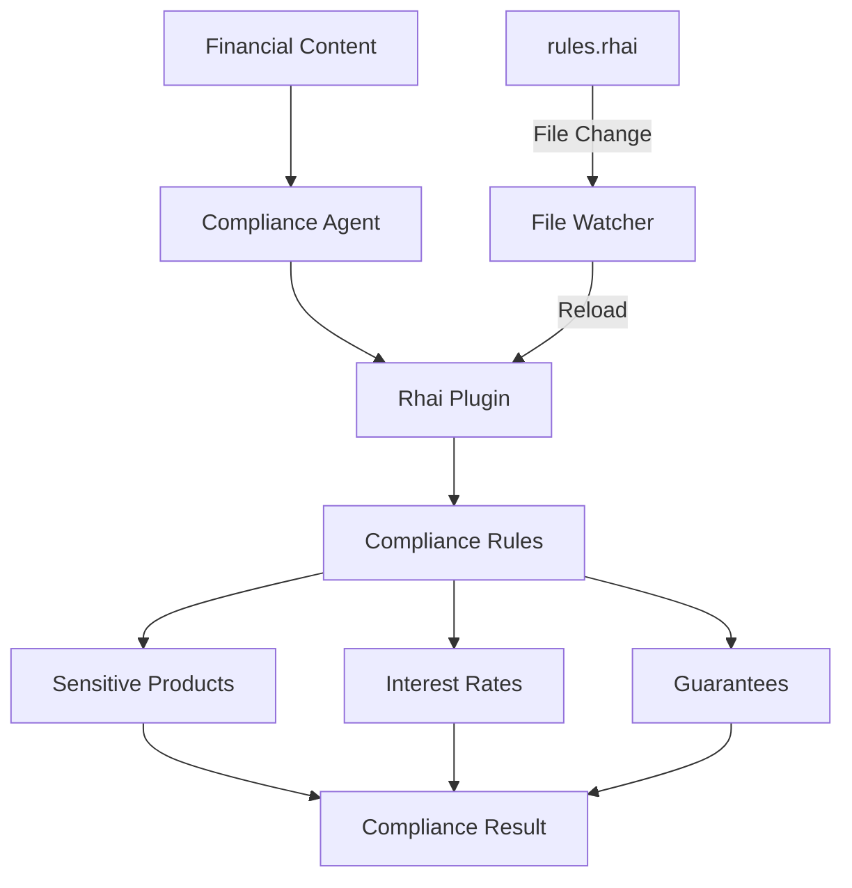

## Overview

This example demonstrates a production-ready financial compliance agent that enforces regulatory rules in real-time. It showcases:

- Runtime compliance rule engine using Rhai
- Hot-reloading of regulatory rules without restart
- File watching for automatic rule updates
- Multi-layered compliance checking
- Audit trail and decision tracking

## What You'll Learn

- Building compliance agents for financial services
- Implementing hot-reloadable business rules
- File watching with the `notify` crate
- Rhai scripting for rule engines
- Handling regulatory updates dynamically

## Prerequisites

- Rust 1.75 or higher
- Understanding of compliance requirements
- Basic knowledge of Rhai syntax

## Use Case

Financial institutions must enforce ever-changing compliance rules. This agent:

1. Checks content against forbidden products/keywords
2. Validates interest rate disclosures
3. Prevents misleading guarantee promises
4. Updates rules dynamically when regulations change

## Architecture



## Source Code

<CodeGroup>
```rust main.rs
use mofa_sdk::plugins::rhai_runtime::{RhaiPlugin, RhaiPluginConfig};
use mofa_sdk::plugins::{AgentPlugin, PluginContext};
use notify::{
    Config, EventKind, RecommendedWatcher, RecursiveMode, Watcher
};
use std::path::Path;
use std::sync::Arc;
use tokio::sync::Mutex;
use tokio::time::Duration;
use tracing::{info, warn};

#[tokio::main]
async fn main() -> Result<(), Box<dyn std::error::Error>> {
    tracing_subscriber::fmt()
        .with_max_level(tracing::Level::INFO)
        .init();

    info!("=== Financial Compliance Agent Demo ===");

    // Define rule file path
    let plugin_dir = Path::new("./compliance_rules");
    let rules_file = plugin_dir.join("financial_rules.rhai");

    // Create initial rules file
    create_initial_rules_file(plugin_dir, &rules_file).await?;

    // Create plugin context
    let ctx = PluginContext::new("financial_compliance_agent");

    // Create and load compliance plugin
    let config = RhaiPluginConfig::new_file(
        "financial_compliance",
        &rules_file
    );
    let mut rhai_plugin = RhaiPlugin::new(config).await?;
    rhai_plugin.load(&ctx).await?;
    rhai_plugin.init_plugin().await?;
    rhai_plugin.start().await?;

    let plugin_arc = Arc::new(Mutex::new(rhai_plugin));

    // Initialize file watcher
    let (tx, mut rx) = tokio::sync::mpsc::channel(10);

    let mut watcher = RecommendedWatcher::new(
        move |res| {
            let _ = tx.blocking_send(res);
        },
        Config::default()
    )?;

    watcher.watch(&rules_file, RecursiveMode::NonRecursive)?;
    info!("Started monitoring rule file: {:?}", rules_file);

    // Clone for file change handler
    let plugin_arc_clone = Arc::clone(&plugin_arc);

    // Start file change handler
    let watcher_task = tokio::spawn(async move {
        loop {
            match rx.recv().await {
                Some(Ok(event)) => {
                    if matches!(event.kind, EventKind::Modify(_)) {
                        info!("Rule file changed, reloading...");
                        let mut plugin = plugin_arc_clone.lock().await;
                        match plugin.reload().await {
                            Ok(_) => info!("Rule plugin reloaded"),
                            Err(e) => warn!("Reload failed: {}", e),
                        }
                    }
                },
                _ => break,
            }
        }
    });

    // Test initial compliance rules
    info!("\n--- Testing Initial Compliance Rules ---");

    let test_contents = vec![
        "We offer 10% annual return products",     // Compliant
        "We offer 10% return products",            // Non-compliant
        "Guaranteed principal and returns",        // Non-compliant
        "Crypto investment services",              // Non-compliant
        "High-risk investment projects",           // Non-compliant
    ];

    let mut plugin = plugin_arc.lock().await;
    for content in test_contents {
        match plugin.execute(content.to_string()).await {
            Ok(result) => {
                info!("Content: {}", content);
                info!("Result: {}", result);
            },
            Err(e) => {
                warn!("Check failed: {}", e);
            }
        }
        println!();
    }

    // Demonstrate rule updates
    info!("\n--- Demonstrating Dynamic Rule Updates ---");
    info!("Modify file: {:?}", rules_file);
    info!("Suggested: Add 'forex margin' to sensitive words");
    info!("\nWaiting 30 seconds for manual modification...\n");

    tokio::time::sleep(Duration::from_secs(30)).await;

    // Test updated rules
    info!("\n--- Testing Updated Rules ---");
    let updated_tests = vec![
        "We offer 10% annual return products",
        "We provide forex margin trading",
    ];

    for content in updated_tests {
        match plugin.execute(content.to_string()).await {
            Ok(result) => {
                info!("Content: {}", content);
                info!("Result: {}", result);
            },
            Err(e) => {
                warn!("Check failed: {}", e);
            }
        }
        println!();
    }

    // Cleanup
    plugin.stop().await?;
    plugin.unload().await?;
    watcher_task.abort();

    tokio::fs::remove_file(rules_file).await?;
    tokio::fs::remove_dir(plugin_dir).await?;

    info!("\n=== Financial Compliance Agent Demo Complete ===");
    Ok(())
}

async fn create_initial_rules_file(
    plugin_dir: &Path,
    rules_file: &Path,
) -> Result<(), Box<dyn std::error::Error>> {
    tokio::fs::create_dir_all(plugin_dir).await?;

    let initial_rules = r#"
// Financial Compliance Rules Engine
// @name: FinancialComplianceRules
// @version: 1.0.0

fn execute(content) {
    // Rule 1: Forbidden sensitive products
    let sensitive_products = [
        "high-risk", "illegal fundraising", 
        "cryptocurrency", "pyramid scheme"
    ];
    for product in sensitive_products {
        if content.contains(product) {
            return #{
                compliant: false,
                reason: "Contains forbidden product: " + product,
                rule_id: "FIN-001",
                content: content
            };
        }
    }

    // Rule 2: Interest rate disclosure
    let interest_keywords = ["rate", "annual", "monthly", "return"];
    let has_interest = interest_keywords.some(|k| content.contains(k));
    let has_period = content.contains("annual") || content.contains("monthly");

    if has_interest && !has_period {
        return #{
            compliant: false,
            reason: "Interest rate must specify annual/monthly",
            rule_id: "FIN-002",
            content: content
        };
    }

    // Rule 3: No guarantee promises
    let guarantee_words = ["guaranteed", "principal", "risk-free"];
    for word in guarantee_words {
        if content.contains(word) {
            return #{
                compliant: false,
                reason: "Cannot promise guarantees",
                rule_id: "FIN-003",
                content: content
            };
        }
    }

    // All rules passed
    return #{
        compliant: true,
        reason: "Compliance check passed",
        rule_id: "PASS",
        content: content
    };
}
"#;

    tokio::fs::write(rules_file, initial_rules).await?;
    info!("Created initial compliance rules: {:?}", rules_file);
    Ok(())
}
```

```toml Cargo.toml
[package]
name = "financial_compliance_agent"
version = "0.1.0"
edition = "2021"

[dependencies]
mofa-sdk = { path = "../../crates/mofa-sdk" }
notify = "6"
tracing = "0.1"
tracing-subscriber = "0.3"
tokio = { version = "1", features = ["full"] }
serde_json = "1.0"
```
</CodeGroup>

## Running the Example

<Steps>

### Run the Example
```bash
cd examples/financial_compliance_agent
cargo run
```

### Modify Rules (Optional)
While the program is running, edit `compliance_rules/financial_rules.rhai`:

```rhai
let sensitive_products = [
    "high-risk", "illegal fundraising",
    "cryptocurrency", "pyramid scheme",
    "forex margin"  // Add new restriction
];
```

Save the file and see the rules reload automatically!

</Steps>

## Expected Output

```
=== Financial Compliance Agent Demo ===

Created initial compliance rules: "./compliance_rules/financial_rules.rhai"
Started monitoring rule file: "./compliance_rules/financial_rules.rhai"

--- Testing Initial Compliance Rules ---

Content: We offer 10% annual return products
Result: {"compliant":true,"reason":"Compliance check passed","rule_id":"PASS"}

Content: We offer 10% return products
Result: {"compliant":false,"reason":"Interest rate must specify annual/monthly","rule_id":"FIN-002"}

Content: Guaranteed principal and returns
Result: {"compliant":false,"reason":"Cannot promise guarantees","rule_id":"FIN-003"}

Content: Crypto investment services
Result: {"compliant":false,"reason":"Contains forbidden product: cryptocurrency","rule_id":"FIN-001"}

--- Demonstrating Dynamic Rule Updates ---
Modify file: "./compliance_rules/financial_rules.rhai"
Suggested: Add 'forex margin' to sensitive words

Waiting 30 seconds for manual modification...

Rule file changed, reloading...
Rule plugin reloaded

--- Testing Updated Rules ---

Content: We offer 10% annual return products
Result: {"compliant":true,"reason":"Compliance check passed","rule_id":"PASS"}

Content: We provide forex margin trading
Result: {"compliant":false,"reason":"Contains forbidden product: forex margin","rule_id":"FIN-001"}

=== Financial Compliance Agent Demo Complete ===
```

## Compliance Rules

The example implements three key compliance rules:

<AccordionGroup>
  <Accordion title="FIN-001: Sensitive Products">
    **Rule**: Forbid mentioning sensitive financial products
    
    **Keywords**: 
    - High-risk
    - Illegal fundraising
    - Cryptocurrency
    - Pyramid scheme
    - Forex margin (can be added)
    
    **Action**: Reject content
  </Accordion>

  <Accordion title="FIN-002: Interest Rate Disclosure">
    **Rule**: Interest rates must specify period (annual/monthly)
    
    **Triggers**: Content mentions "rate", "return", etc.
    
    **Requires**: Must include "annual" or "monthly"
    
    **Example Violation**: "10% return" (missing period)
  </Accordion>

  <Accordion title="FIN-003: Guarantee Promises">
    **Rule**: Cannot promise principal or return guarantees
    
    **Forbidden Words**:
    - Guaranteed
    - Principal protection
    - Risk-free
    
    **Action**: Reject content
  </Accordion>
</AccordionGroup>

## Key Features

### Hot-Reload Capability

```rust
// File watcher detects changes
if matches!(event.kind, EventKind::Modify(_)) {
    info!("Rule file changed, reloading...");
    plugin.reload().await?;
}
```

**Benefits**:
- Update rules without service restart
- Immediate regulatory compliance
- Zero downtime for rule changes
- Audit trail of rule versions

### Rule Engine Design

```rhai
fn execute(content) {
    // Check multiple rules
    for rule in all_rules {
        let result = check_rule(content, rule);
        if !result.compliant {
            return result;  // Fail fast
        }
    }
    
    return #{ compliant: true };
}
```

### Audit Trail

```rust
let result = plugin.execute(content).await?;
let compliance_record = ComplianceRecord {
    timestamp: Utc::now(),
    content: content.to_string(),
    rule_id: result["rule_id"],
    compliant: result["compliant"],
    reason: result["reason"],
};

audit_log.record(compliance_record).await?;
```

## Advanced Patterns

### Multi-Jurisdiction Rules

```rhai
fn execute(content, jurisdiction) {
    if jurisdiction == "US" {
        return check_us_rules(content);
    } else if jurisdiction == "EU" {
        return check_eu_rules(content);
    } else if jurisdiction == "APAC" {
        return check_apac_rules(content);
    }
}
```

### Risk Scoring

```rhai
fn execute(content) {
    let risk_score = 0;
    
    // Calculate risk based on multiple factors
    if content.contains("high-return") {
        risk_score += 20;
    }
    if content.contains("limited-time") {
        risk_score += 15;
    }
    if !content.contains("risk-disclosure") {
        risk_score += 30;
    }
    
    return #{
        compliant: risk_score < 50,
        risk_score: risk_score,
        risk_level: if risk_score > 70 { "high" } 
                    else if risk_score > 40 { "medium" } 
                    else { "low" }
    };
}
```

### Contextual Rules

```rhai
fn execute(content, context) {
    let product_type = context["product_type"];
    let target_audience = context["target_audience"];
    
    // Apply different rules based on context
    if product_type == "investment" {
        return check_investment_rules(content, target_audience);
    } else if product_type == "insurance" {
        return check_insurance_rules(content);
    }
}
```

## Real-World Integration

### API Endpoint

```rust
#[post("/check-compliance")]
async fn check_compliance(
    content: Json<ComplianceRequest>,
    agent: Data<ComplianceAgent>,
) -> Result<Json<ComplianceResponse>> {
    let result = agent.check(content.text.clone()).await?;
    Ok(Json(result))
}
```

### Kafka Integration

```rust
// Consume messages from Kafka
while let Some(message) = consumer.next().await {
    let content = message.payload_str()?;
    let result = agent.check(content).await?;
    
    if !result.compliant {
        // Alert compliance team
        alert_system.notify(result).await?;
    }
}
```

## Common Use Cases

<CardGroup cols={2}>
  <Card title="Financial Services" icon="building-columns">
    Banking, investment, insurance compliance
  </Card>
  <Card title="Healthcare" icon="heart-pulse">
    HIPAA, patient data privacy rules
  </Card>
  <Card title="E-Commerce" icon="cart-shopping">
    Product listing, pricing regulations
  </Card>
  <Card title="Advertising" icon="bullhorn">
    Marketing claims, disclosure requirements
  </Card>
</CardGroup>

## Troubleshooting

<AccordionGroup>
  <Accordion title="Rule Not Reloading">
    **Problem**: File changes not detected
    
    **Solution**: Check file watcher:
    ```rust
    watcher.watch(&rules_file, RecursiveMode::NonRecursive)?;
    ```
  </Accordion>

  <Accordion title="False Positives">
    **Problem**: Valid content flagged as non-compliant
    
    **Solution**: Refine rules with context:
    ```rhai
    if content.contains("guaranteed") && 
       !content.contains("not guaranteed") {
        return non_compliant();
    }
    ```
  </Accordion>

  <Accordion title="Performance Issues">
    **Problem**: Compliance checks are slow
    
    **Solution**: Cache compiled rules:
    ```rust
    let compiled_rules = Arc::new(plugin.compile().await?);
    ```
  </Accordion>
</AccordionGroup>

## Best Practices

<Check>
  **Version Control**: Track all rule changes in git
</Check>

<Check>
  **Testing**: Write comprehensive tests for each rule
</Check>

<Check>
  **Audit Logs**: Record all compliance decisions
</Check>

<Check>
  **Gradual Rollout**: Test new rules in staging first
</Check>

<Warning>
  **Legal Review**: Have compliance rules reviewed by legal team
</Warning>

## Next Steps

<CardGroup cols={2}>
  <Card title="Medical Diagnosis" icon="stethoscope" href="/examples/medical-diagnosis">
    Similar pattern for healthcare
  </Card>
  <Card title="Rhai Hot Reload" icon="fire" href="/examples/rhai-hot-reload">
    Deep dive into hot-reload
  </Card>
  <Card title="Compliance Guide" icon="book" href="/guides/compliance-agents">
    Build compliance systems
  </Card>
  <Card title="Rule Engine" icon="gavel" href="/guides/rule-engines">
    Advanced rule engine patterns
  </Card>
</CardGroup>
