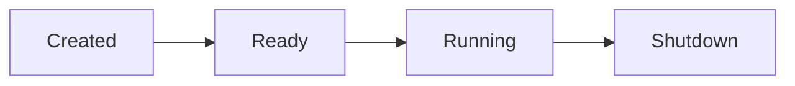

## Overview

This basic example demonstrates the simplest possible MoFA agent - an echo agent that receives input and produces output. It's the perfect starting point for understanding the MoFA framework's core concepts.

## What You'll Learn

- Creating a basic agent using `MoFAAgent` trait
- Implementing agent lifecycle methods (initialize, execute, shutdown)
- Using `AgentInput` and `AgentOutput` types
- Working with agent state management

## Prerequisites

- Rust 1.75 or higher
- Basic understanding of async/await in Rust

## Source Code

<CodeGroup>
```rust main.rs
use async_trait::async_trait;
use mofa_sdk::kernel::{
    AgentConfig, AgentInput, AgentOutput, AgentResult,
    AgentState, AgentContext, MoFAAgent, AgentCapabilities
};
use std::collections::HashMap;
use tracing::info;

/// Simple Echo Agent - Returns the input it receives
pub struct EchoAgent {
    id: String,
    name: String,
    state: AgentState,
    capabilities: AgentCapabilities,
}

impl EchoAgent {
    pub fn new(id: impl Into<String>, name: impl Into<String>) -> Self {
        let capabilities = AgentCapabilities::builder()
            .tag("echo")
            .tag("demo")
            .build();

        Self {
            id: id.into(),
            name: name.into(),
            state: AgentState::Created,
            capabilities,
        }
    }
}

#[async_trait]
impl MoFAAgent for EchoAgent {
    fn id(&self) -> &str {
        &self.id
    }

    fn name(&self) -> &str {
        &self.name
    }

    fn capabilities(&self) -> &AgentCapabilities {
        &self.capabilities
    }

    async fn initialize(&mut self, _ctx: &AgentContext) -> AgentResult<()> {
        info!("Echo Agent '{}' initializing...", self.name);
        self.state = AgentState::Ready;
        Ok(())
    }

    async fn execute(
        &mut self,
        input: AgentInput,
        _ctx: &AgentContext,
    ) -> AgentResult<AgentOutput> {
        info!("Echo Agent received: {:?}", input);
        
        // Simply echo back the input as output
        let text = input.to_text();
        let output = AgentOutput::text(format!("Echo: {}", text));
        
        Ok(output)
    }

    async fn shutdown(&mut self) -> AgentResult<()> {
        info!("Echo Agent '{}' shutting down...", self.name);
        self.state = AgentState::Shutdown;
        Ok(())
    }

    fn state(&self) -> AgentState {
        self.state.clone()
    }
}

#[tokio::main]
async fn main() -> Result<(), Box<dyn std::error::Error>> {
    // Initialize logging
    tracing_subscriber::fmt()
        .with_env_filter("info")
        .init();

    info!("=== MoFA Hello World Example ===");

    // Create echo agent
    let mut agent = EchoAgent::new("echo_001", "My First Agent");
    
    // Create agent context
    let config = AgentConfig {
        agent_id: agent.id().to_string(),
        name: agent.name().to_string(),
        node_config: HashMap::new(),
    };
    let ctx = AgentContext::new(config);

    // Initialize the agent
    agent.initialize(&ctx).await?;

    // Execute with sample input
    let input = AgentInput::text("Hello, MoFA!");
    let output = agent.execute(input, &ctx).await?;

    info!("Agent response: {}", output.to_text());

    // Shutdown the agent
    agent.shutdown().await?;

    info!("=== Example completed ===");
    Ok(())
}
```

```toml Cargo.toml
[package]
name = "hello-world"
version = "0.1.0"
edition = "2021"

[dependencies]
mofa-sdk = { path = "../../crates/mofa-sdk" }
tokio = { version = "1", features = ["full"] }
tracing = "0.1"
tracing-subscriber = { version = "0.3", features = ["env-filter"] }
async-trait = "0.1"
```
</CodeGroup>

## Running the Example

<Steps>

### Clone the Repository
```bash
git clone https://github.com/your-org/mofa.git
cd mofa
```

### Create the Example
Create a new directory and add the files above:
```bash
mkdir -p examples/hello-world/src
# Add main.rs and Cargo.toml from above
```

### Run the Example
```bash
cd examples/hello-world
cargo run
```

</Steps>

## Expected Output

```
INFO mofa: === MoFA Hello World Example ===
INFO mofa: Echo Agent 'My First Agent' initializing...
INFO mofa: Echo Agent received: AgentInput { ... }
INFO mofa: Agent response: Echo: Hello, MoFA!
INFO mofa: Echo Agent 'My First Agent' shutting down...
INFO mofa: === Example completed ===
```

## Key Concepts

### MoFAAgent Trait

The `MoFAAgent` trait is the core abstraction in MoFA. Every agent must implement:

- **`id()`** - Unique identifier for the agent
- **`name()`** - Human-readable name
- **`capabilities()`** - Tags and features the agent supports
- **`initialize()`** - Setup logic before execution
- **`execute()`** - Main processing logic
- **`shutdown()`** - Cleanup logic
- **`state()`** - Current agent state

### Agent Lifecycle



### AgentInput and AgentOutput

MoFA uses structured input/output types:
- **AgentInput::text()** - Text input
- **AgentInput::json()** - Structured JSON data
- **AgentOutput::text()** - Text response
- **AgentOutput::json()** - Structured response

## Next Steps

<CardGroup cols={2}>
  <Card title="Chat Stream Example" icon="comments" href="/examples/chat-stream">
    Learn streaming chat interactions
  </Card>
  <Card title="ReAct Agent" icon="brain" href="/examples/react-agent">
    Build reasoning + acting agents
  </Card>
  <Card title="Core Concepts" icon="book" href="/core-concepts/agents">
    Deep dive into agent concepts
  </Card>
  <Card title="API Reference" icon="code" href="/api-reference/mofa-sdk">
    Explore the full SDK
  </Card>
</CardGroup>
