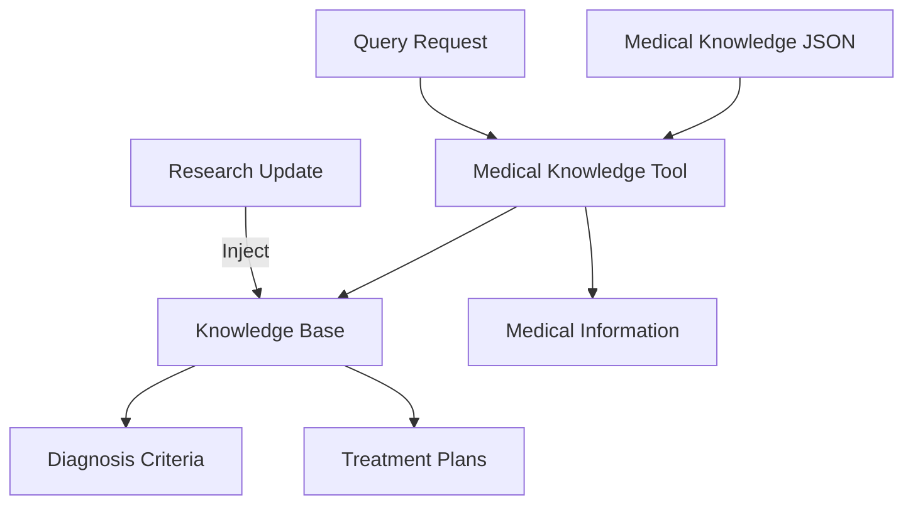

## Overview

This example demonstrates a medical diagnosis agent that dynamically injects and updates medical knowledge. It showcases:

- Domain-specific knowledge management
- Dynamic knowledge injection from JSON
- Medical diagnosis criteria querying
- Treatment plan retrieval
- Runtime knowledge updates (simulating research paper updates)

## What You'll Learn

- Building domain-specific knowledge agents
- Dynamic knowledge base management
- Tool-based knowledge queries
- Simulating medical decision support systems
- Updating knowledge from external sources

## Prerequisites

- Rust 1.75 or higher
- Understanding of agent tool patterns
- Basic medical knowledge concepts

<Warning>
  **Medical Disclaimer**: This is a demonstration example only. Not for actual medical use. Always consult qualified healthcare professionals.
</Warning>

## Architecture



## Source Code

<CodeGroup>
```rust main.rs
use mofa_plugins::{
    tools::{
        medical_knowledge::MedicalKnowledgeTool,
        ToolPlugin,
    },
    ToolCall, ToolResult,
};

#[tokio::main]
async fn main() -> Result<(), Box<dyn std::error::Error>> {
    // Create and configure tool plugin
    let mut tool_plugin = ToolPlugin::new("medical_tool_plugin");

    // Register medical knowledge tool
    tool_plugin.register_tool(MedicalKnowledgeTool::new());

    // Initialize the plugin
    tool_plugin.init_plugin().await?;
    tool_plugin.start().await?;

    println!("Medical Diagnosis Agent - Knowledge Injection Demo");
    println!("=================================================");

    // 1. Inject knowledge from JSON file
    println!("\n1. Injecting medical knowledge from JSON file...");
    let inject_call = ToolCall {
        tool_name: "medical_knowledge".to_string(),
        arguments: serde_json::json!({
            "action": "inject_knowledge",
            "file_path": "../test_medical_knowledge.json"
        }),
    };

    let result: ToolResult = serde_json::from_str(
        &tool_plugin.execute(
            serde_json::to_string(&inject_call)?
        ).await?
    )?;
    println!("Injection result: {}", result.result);

    // 2. Query diabetes diagnostic criteria
    println!("\n2. Querying diagnostic criteria for diabetes...");
    let query_diabetes = ToolCall {
        tool_name: "medical_knowledge".to_string(),
        arguments: serde_json::json!({
            "action": "query_diagnosis",
            "disease": "diabetes"
        }),
    };

    let result: ToolResult = serde_json::from_str(
        &tool_plugin.execute(
            serde_json::to_string(&query_diabetes)?
        ).await?
    )?;
    println!("Diagnostic criteria: {:?}", result.result);

    // 3. Query hypertension treatment
    println!("\n3. Querying treatment plan for hypertension...");
    let query_hypertension = ToolCall {
        tool_name: "medical_knowledge".to_string(),
        arguments: serde_json::json!({
            "action": "query_treatment",
            "disease": "hypertension"
        }),
    };

    let result: ToolResult = serde_json::from_str(
        &tool_plugin.execute(
            serde_json::to_string(&query_hypertension)?
        ).await?
    )?;
    println!("Treatment plan: {:?}", result.result);

    // 4. Demonstrate dynamic knowledge update
    println!("\n4. Dynamic update (simulating research paper)...");
    let update_knowledge = ToolCall {
        tool_name: "medical_knowledge".to_string(),
        arguments: serde_json::json!({
            "action": "inject_knowledge",
            "knowledge": {
                "diagnoses": [
                    {
                        "disease_name": "diabetes",
                        "criteria": [
                            "Fasting glucose ≥ 7.0 mmol/L",
                            "2-hour glucose ≥ 11.1 mmol/L",
                            "HbA1c ≥ 6.5%"
                        ],
                        "update_date": "2025-12-31",
                        "source": "Latest research (Dec 2025)"
                    }
                ],
                "treatments": []
            }
        }),
    };

    let result: ToolResult = serde_json::from_str(
        &tool_plugin.execute(
            serde_json::to_string(&update_knowledge)?
        ).await?
    )?;
    println!("Update result: {}", result.result);

    // 5. Query updated diabetes criteria
    println!("\n5. Querying updated diabetes criteria...");
    let query_diabetes_updated = ToolCall {
        tool_name: "medical_knowledge".to_string(),
        arguments: serde_json::json!({
            "action": "query_diagnosis",
            "disease": "diabetes"
        }),
    };

    let result: ToolResult = serde_json::from_str(
        &tool_plugin.execute(
            serde_json::to_string(&query_diabetes_updated)?
        ).await?
    )?;
    println!("Updated criteria: {:?}", result.result);

    // Stop plugin
    tool_plugin.stop().await?;

    Ok(())
}
```

```json test_medical_knowledge.json
{
  "diagnoses": [
    {
      "disease_name": "diabetes",
      "criteria": [
        "Fasting blood glucose ≥ 7.0 mmol/L",
        "2-hour postprandial glucose ≥ 11.1 mmol/L",
        "Random blood glucose ≥ 11.1 mmol/L with symptoms"
      ],
      "update_date": "2024-01-15",
      "source": "WHO Diabetes Guidelines 2024"
    },
    {
      "disease_name": "hypertension",
      "criteria": [
        "Systolic BP ≥ 140 mmHg",
        "Diastolic BP ≥ 90 mmHg",
        "Measured on two separate occasions"
      ],
      "update_date": "2024-01-15",
      "source": "AHA Hypertension Guidelines 2024"
    }
  ],
  "treatments": [
    {
      "disease_name": "hypertension",
      "medications": [
        "ACE inhibitors",
        "Calcium channel blockers",
        "Diuretics"
      ],
      "lifestyle": [
        "Reduce sodium intake to < 2g/day",
        "Regular aerobic exercise (30 min, 5x/week)",
        "Maintain healthy BMI (18.5-24.9)"
      ],
      "monitoring": "Blood pressure every 3-6 months",
      "update_date": "2024-01-15"
    },
    {
      "disease_name": "diabetes",
      "medications": [
        "Metformin (first-line)",
        "Insulin (if needed)",
        "GLP-1 agonists"
      ],
      "lifestyle": [
        "Carbohydrate management",
        "Regular exercise",
        "Weight management"
      ],
      "monitoring": "HbA1c every 3 months",
      "update_date": "2024-01-15"
    }
  ]
}
```

```toml Cargo.toml
[package]
name = "medical_diagnosis_agent"
version = "0.1.0"
edition = "2021"

[dependencies]
mofa-plugins = { path = "../../crates/mofa-plugins" }
tokio = { version = "1", features = ["full"] }
serde = { version = "1.0", features = ["derive"] }
serde_json = "1.0"
```
</CodeGroup>

## Running the Example

<Steps>

### Create Knowledge File
Create `test_medical_knowledge.json` with the medical data above.

### Run the Example
```bash
cd examples/medical_diagnosis_agent
cargo run
```

</Steps>

## Expected Output

```
Medical Diagnosis Agent - Knowledge Injection Demo
=================================================

1. Injecting medical knowledge from JSON file...
Injection result: Successfully injected knowledge for 2 diseases

2. Querying diagnostic criteria for diabetes...
Diagnostic criteria: {
  "disease": "diabetes",
  "criteria": [
    "Fasting blood glucose ≥ 7.0 mmol/L",
    "2-hour postprandial glucose ≥ 11.1 mmol/L",
    "Random blood glucose ≥ 11.1 mmol/L with symptoms"
  ],
  "source": "WHO Diabetes Guidelines 2024",
  "last_updated": "2024-01-15"
}

3. Querying treatment plan for hypertension...
Treatment plan: {
  "disease": "hypertension",
  "medications": ["ACE inhibitors", "Calcium channel blockers", "Diuretics"],
  "lifestyle": [
    "Reduce sodium intake to < 2g/day",
    "Regular aerobic exercise (30 min, 5x/week)",
    "Maintain healthy BMI (18.5-24.9)"
  ],
  "monitoring": "Blood pressure every 3-6 months"
}

4. Dynamic update (simulating research paper)...
Update result: Updated diabetes diagnostic criteria

5. Querying updated diabetes criteria...
Updated criteria: {
  "disease": "diabetes",
  "criteria": [
    "Fasting glucose ≥ 7.0 mmol/L",
    "2-hour glucose ≥ 11.1 mmol/L",
    "HbA1c ≥ 6.5%"
  ],
  "source": "Latest research (Dec 2025)",
  "last_updated": "2025-12-31"
}
```

## Key Features

### Knowledge Base Structure

```json
{
  "diagnoses": [
    {
      "disease_name": "string",
      "criteria": ["criterion1", "criterion2"],
      "update_date": "ISO-8601",
      "source": "string"
    }
  ],
  "treatments": [
    {
      "disease_name": "string",
      "medications": ["med1", "med2"],
      "lifestyle": ["advice1", "advice2"],
      "monitoring": "string",
      "update_date": "ISO-8601"
    }
  ]
}
```

### Tool Actions

<Tabs>
  <Tab title="inject_knowledge">
    Load knowledge from file or JSON:
    
    ```json
    {
      "action": "inject_knowledge",
      "file_path": "knowledge.json"
    }
    ```
    
    or
    
    ```json
    {
      "action": "inject_knowledge",
      "knowledge": { /* inline data */ }
    }
    ```
  </Tab>
  
  <Tab title="query_diagnosis">
    Get diagnostic criteria:
    
    ```json
    {
      "action": "query_diagnosis",
      "disease": "diabetes"
    }
    ```
  </Tab>
  
  <Tab title="query_treatment">
    Get treatment plan:
    
    ```json
    {
      "action": "query_treatment",
      "disease": "hypertension"
    }
    ```
  </Tab>
  
  <Tab title="list_diseases">
    List all known diseases:
    
    ```json
    {
      "action": "list_diseases"
    }
    ```
  </Tab>
</Tabs>

### Dynamic Updates

Simulate knowledge updates from research:

```rust
// Update based on new research
let update = serde_json::json!({
    "action": "inject_knowledge",
    "knowledge": {
        "diagnoses": [{
            "disease_name": "diabetes",
            "criteria": ["Updated criterion"],
            "update_date": "2025-12-31",
            "source": "New research paper"
        }]
    }
});
```

## Advanced Use Cases

### Clinical Decision Support

```rust
// Check patient symptoms against knowledge base
let symptoms = vec!["fatigue", "increased thirst", "frequent urination"];

for disease in knowledge_base.diseases() {
    let criteria = query_diagnosis(disease).await?;
    let match_score = calculate_match(symptoms, &criteria);
    
    if match_score > 0.7 {
        let treatment = query_treatment(disease).await?;
        recommendations.push((disease, treatment, match_score));
    }
}
```

### Drug Interaction Checking

```json
{
  "interactions": [
    {
      "drug_a": "warfarin",
      "drug_b": "aspirin",
      "severity": "high",
      "effect": "Increased bleeding risk",
      "recommendation": "Avoid combination or monitor closely"
    }
  ]
}
```

### Personalized Treatment Plans

```rust
fn generate_treatment_plan(
    diagnosis: &str,
    patient: &PatientProfile,
) -> TreatmentPlan {
    let base_treatment = query_treatment(diagnosis).await?;
    
    // Adjust for patient factors
    if patient.age > 65 {
        base_treatment.adjust_for_elderly();
    }
    if !patient.allergies.is_empty() {
        base_treatment.remove_allergens(&patient.allergies);
    }
    if patient.comorbidities.contains("kidney_disease") {
        base_treatment.adjust_for_renal();
    }
    
    base_treatment
}
```

## Integration Patterns

### With LLM Agent

```rust
use mofa_sdk::llm::LLMAgent;

let llm_agent = LLMAgentBuilder::new()
    .with_tools(vec![Box::new(medical_knowledge_tool)])
    .build();

// LLM can now query medical knowledge
let response = llm_agent.chat(
    "What are the diagnostic criteria for diabetes?"
).await?;
```

### With ReAct Agent

```rust
use mofa_sdk::react::ReActAgent;

let react_agent = ReActAgent::builder()
    .with_llm(llm)
    .with_tool(Arc::new(MedicalKnowledgeTool::new()))
    .build_async()
    .await?;

let result = react_agent.run(
    "Check if the patient with fasting glucose of 7.5 mmol/L \
     meets diabetes criteria and suggest treatment"
).await?;
```

### REST API

```rust
#[get("/diagnosis/{disease}")]
async fn get_diagnosis(
    disease: Path<String>,
    tool: Data<MedicalKnowledgeTool>,
) -> Result<Json<DiagnosisCriteria>> {
    let criteria = tool.query_diagnosis(&disease).await?;
    Ok(Json(criteria))
}

#[post("/knowledge/update")]
async fn update_knowledge(
    knowledge: Json<MedicalKnowledge>,
    tool: Data<MedicalKnowledgeTool>,
) -> Result<HttpResponse> {
    tool.inject_knowledge(knowledge.into_inner()).await?;
    Ok(HttpResponse::Ok().finish())
}
```

## Common Use Cases

<CardGroup cols={2}>
  <Card title="Clinical Support" icon="stethoscope">
    Real-time diagnostic assistance for clinicians
  </Card>
  <Card title="Medical Education" icon="graduation-cap">
    Interactive learning for medical students
  </Card>
  <Card title="Telemedicine" icon="laptop-medical">
    Remote diagnostic support systems
  </Card>
  <Card title="Research" icon="flask">
    Medical knowledge aggregation and analysis
  </Card>
</CardGroup>

## Best Practices

<Check>
  **Evidence-Based**: Use peer-reviewed sources only
</Check>

<Check>
  **Version Control**: Track knowledge base versions
</Check>

<Check>
  **Audit Trail**: Log all diagnostic queries
</Check>

<Check>
  **Validation**: Verify medical data before injection
</Check>

<Warning>
  **Regulatory Compliance**: Ensure compliance with medical device regulations (FDA, CE, etc.)
</Warning>

<Warning>
  **Privacy**: Implement HIPAA/GDPR compliance for patient data
</Warning>

## Troubleshooting

<AccordionGroup>
  <Accordion title="Knowledge Not Found">
    **Problem**: Query returns no results
    
    **Solution**: Check disease name spelling:
    ```rust
    // Use fuzzy matching
    let similar = find_similar_diseases("diabetis");
    // Returns ["diabetes"]
    ```
  </Accordion>

  <Accordion title="Outdated Information">
    **Problem**: Knowledge base contains old data
    
    **Solution**: Implement automatic updates:
    ```rust
    // Check for updates daily
    tokio::spawn(async move {
        let mut interval = tokio::time::interval(Duration::from_days(1));
        loop {
            interval.tick().await;
            update_from_sources().await?;
        }
    });
    ```
  </Accordion>

  <Accordion title="Conflicting Information">
    **Problem**: Multiple sources provide different criteria
    
    **Solution**: Track source priority:
    ```json
    {
      "source": "WHO Guidelines",
      "priority": 1,
      "date": "2025-01-15"
    }
    ```
  </Accordion>
</AccordionGroup>

## Next Steps

<CardGroup cols={2}>
  <Card title="Financial Compliance" icon="building-columns" href="/examples/financial-compliance">
    Similar dynamic knowledge pattern
  </Card>
  <Card title="ReAct Agent" icon="brain" href="/examples/react-agent">
    Integrate with reasoning agents
  </Card>
  <Card title="Tool Development" icon="wrench" href="/guides/custom-tools">
    Build domain-specific tools
  </Card>
  <Card title="Knowledge Management" icon="database" href="/guides/knowledge-bases">
    Advanced knowledge base patterns
  </Card>
</CardGroup>
