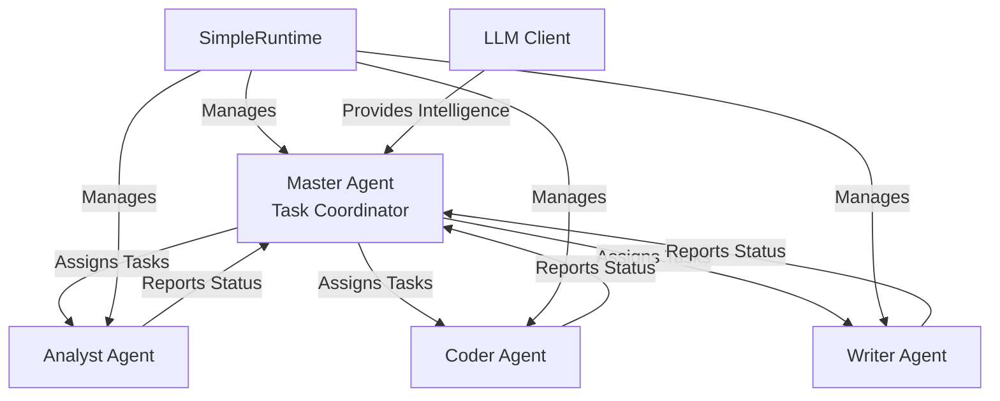

## Overview

This example demonstrates a complete multi-agent system built on MoFA's microkernel architecture. It showcases:

- Master-worker coordination pattern
- LLM-powered intelligent task assignment
- Worker agents with different specialties (Analyst, Coder, Writer)
- Runtime agent registration and lifecycle management
- Message bus communication between agents
- Real-time workload balancing

## What You'll Learn

- Implementing `MoFAAgent` trait for custom agents
- Using `SimpleRuntime` for agent lifecycle management
- LLM-based decision making for task routing
- Agent capability matching and workload optimization
- Message bus pattern for inter-agent communication

## Prerequisites

- Rust 1.75 or higher
- OpenAI API key
- Understanding of async patterns and message passing

## Architecture



## Source Code

<CodeGroup>
```rust Master Agent
use mofa_sdk::kernel::{AgentConfig, MoFAAgent, AgentState};
use mofa_sdk::llm::LLMClient;
use std::sync::Arc;

pub struct MasterAgent {
    id: String,
    name: String,
    state: AgentState,
    llm_client: Arc<LLMClient>,
    worker_states: Arc<RwLock<HashMap<String, WorkerState>>>,
}

impl MasterAgent {
    pub fn new(config: AgentConfig, llm_client: Arc<LLMClient>) -> Self {
        // Implementation...
    }

    /// Register a worker with specialty
    pub async fn register_worker(
        &self, 
        worker_id: String, 
        specialty: WorkerSpecialty
    ) {
        let state = WorkerState {
            specialty,
            load: 0,
            tasks_completed: 0,
            tasks_failed: 0,
        };
        self.worker_states.write().await.insert(worker_id, state);
    }

    /// Use LLM to intelligently assign tasks
    async fn assign_task_with_llm(
        &self, 
        task: &TaskRequest
    ) -> Result<String, Box<dyn std::error::Error>> {
        let workers_map = self.worker_states.read().await;
        
        // Build worker description
        let worker_info: Vec<String> = workers_map
            .iter()
            .map(|(id, state)| {
                format!(
                    "- {}: {} (load: {}, completed: {})",
                    id, state.specialty, state.load, state.tasks_completed
                )
            })
            .collect();

        // Ask LLM to select best worker
        let prompt = format!(
            "Available workers:\n{}\n\n\
             Task: {}\nPriority: {:?}\n\n\
             Select the best worker based on specialty and load.",
            worker_info.join("\n"), task.content, task.priority
        );

        let response = self.llm_client
            .chat()
            .system("You are a task dispatcher")
            .user(&prompt)
            .temperature(0.3)
            .send()
            .await?;

        let worker_id = self.parse_worker_id(
            response.content().unwrap_or(""),
            &workers_map
        ).await?;

        Ok(worker_id)
    }
}
```

```rust Worker Agent
pub struct WorkerAgent {
    id: String,
    name: String,
    state: AgentState,
    specialty: WorkerSpecialty,
    llm_client: Arc<LLMClient>,
    stats: WorkerState,
}

#[derive(Debug, Clone, Copy)]
pub enum WorkerSpecialty {
    Analyst,  // Code review, analysis
    Coder,    // Code generation
    Writer,   // Documentation
}

impl WorkerAgent {
    pub fn new(
        config: AgentConfig,
        specialty: WorkerSpecialty,
        llm_client: Arc<LLMClient>,
    ) -> Self {
        // Set capabilities based on specialty
        let capabilities = match specialty {
            WorkerSpecialty::Analyst => AgentCapabilities::builder()
                .tag("code_analysis")
                .tag("security_audit")
                .build(),
            WorkerSpecialty::Coder => AgentCapabilities::builder()
                .tag("code_generation")
                .tag("refactoring")
                .build(),
            WorkerSpecialty::Writer => AgentCapabilities::builder()
                .tag("documentation")
                .tag("report_generation")
                .build(),
        };
        
        // Create worker...
    }

    async fn process_task(
        &mut self, 
        task: &TaskRequest
    ) -> Result<TaskExecutionResult, Box<dyn std::error::Error>> {
        let start_time = std::time::Instant::now();

        let response = self.llm_client
            .chat()
            .system(self.get_specialty_prompt())
            .user(&task.content)
            .temperature(0.7)
            .send()
            .await?;

        let content = response.content().unwrap_or("").to_string();
        let processing_time_ms = start_time.elapsed().as_millis() as u64;

        Ok(TaskExecutionResult {
            task_id: task.task_id.clone(),
            worker_id: self.id.clone(),
            content,
            processing_time_ms,
            timestamp: Utc::now(),
        })
    }
}
```

```rust Main
use mofa_sdk::runtime::SimpleRuntime;
use mofa_sdk::llm::{openai_from_env, LLMClient};

#[tokio::main]
async fn main() -> Result<(), Box<dyn std::error::Error>> {
    tracing_subscriber::fmt()
        .with_env_filter("info")
        .init();

    // Create LLM provider
    let provider = openai_from_env()?;
    let llm_client = Arc::new(LLMClient::new(Arc::new(provider)));

    // Create runtime
    let runtime = SimpleRuntime::new();

    // Create Master Agent
    let master_config = AgentConfig {
        agent_id: "master_001".to_string(),
        name: "Master Agent".to_string(),
        node_config: HashMap::new(),
    };
    let mut master = MasterAgent::new(master_config.clone(), llm_client.clone());

    // Register master to runtime
    runtime.register_agent(
        master_metadata,
        master_config,
        "master"
    ).await?;

    // Create worker agents
    let specialties = [
        WorkerSpecialty::Analyst,
        WorkerSpecialty::Coder,
        WorkerSpecialty::Writer,
    ];

    for (i, specialty) in specialties.iter().enumerate() {
        let worker_id = format!("worker_{:03}", i + 1);
        let worker_config = AgentConfig {
            agent_id: worker_id.clone(),
            name: format!("{} Agent", specialty),
            node_config: HashMap::new(),
        };

        let worker = WorkerAgent::new(
            worker_config.clone(),
            *specialty,
            llm_client.clone(),
        );

        // Register worker to runtime
        runtime.register_agent(
            worker_metadata,
            worker_config,
            "worker"
        ).await?;

        // Register worker to master
        master.register_worker(worker_id.clone(), *specialty).await;
    }

    // Run scenarios
    scenario_code_review(&mut master, &runtime).await?;
    scenario_doc_generation(&mut master, &runtime).await?;
    scenario_diagnosis(&mut master, &runtime).await?;

    runtime.stop_all().await?;
    Ok(())
}
```

```toml Cargo.toml
[package]
name = "multi_agent_coordination"
version = "0.1.0"
edition = "2021"

[dependencies]
mofa-sdk = { path = "../../crates/mofa-sdk" }
tokio = { version = "1", features = ["full"] }
tracing = "0.1"
tracing-subscriber = { version = "0.3", features = ["env-filter"] }
async-trait = "0.1"
chrono = "0.4"
regex = "1"
serde = { version = "1.0", features = ["derive"] }
serde_json = "1.0"
```
</CodeGroup>

## Running the Example

<Steps>

### Set API Key
```bash
export OPENAI_API_KEY="your-api-key"
```

### Run All Scenarios
```bash
cd examples/multi_agent_coordination
cargo run
```

### Run Specific Scenario
```bash
# Code review
cargo run -- --scenario=code-review

# Documentation generation
cargo run -- --scenario=doc-generation

# Problem diagnosis
cargo run -- --scenario=diagnosis
```

</Steps>

## Demo Scenarios

<Tabs>
  <Tab title="Code Review">
    **Scenario**: Analyze code for security and performance issues
    
    ```rust
    let code_snippet = r#"
    fn process_data(input: &str) -> String {
        let mut result = String::new();
        for ch in input.chars() {
            if ch.is_ascii() {
                result.push(ch.to_ascii_uppercase());
            }
        }
        result
    }
    "#;
    
    let task = TaskRequest {
        task_id: "review_001".to_string(),
        content: format!("Analyze this code: {}", code_snippet),
        priority: TaskPriority::High,
    };
    ```
    
    **Master**: Assigns to Analyst worker based on capabilities
    
    **Analyst**: Reviews code and provides detailed feedback
  </Tab>
  
  <Tab title="Documentation">
    **Scenario**: Generate API documentation
    
    ```rust
    let api_definition = r#"
    API: User Management
    Endpoints:
    - POST /users - Create new user
    - GET /users/:id - Get user by ID
    - PUT /users/:id - Update user
    - DELETE /users/:id - Delete user
    "#;
    
    let task = TaskRequest {
        task_id: "doc_001".to_string(),
        content: format!("Create docs for: {}", api_definition),
        priority: TaskPriority::High,
    };
    ```
    
    **Master**: Routes to Writer worker
    
    **Writer**: Generates comprehensive documentation
  </Tab>
  
  <Tab title="Diagnosis">
    **Scenario**: Diagnose error logs
    
    ```rust
    let error_log = r#"
    [ERROR] 2024-01-15 10:23:45
    Thread: main
    Panic: called `Result::unwrap()` on an `Err` value
    "#;
    
    let task = TaskRequest {
        task_id: "diag_001".to_string(),
        content: format!("Diagnose: {}", error_log),
        priority: TaskPriority::Critical,
    };
    ```
    
    **Master**: Assigns to Analyst based on priority
    
    **Analyst**: Provides root cause analysis
  </Tab>
</Tabs>

## Expected Output

```
======================================================================
 MoFA Multi-Agent Coordination - Microkernel Architecture
======================================================================

LLM Provider initialized
SimpleRuntime initialized
Master Agent registered to runtime
Worker Pool initialized with 3 workers

======================================================================
Scenario 1: Code Review Collaboration
======================================================================

Master: Assigned task 'review_001' to worker 'worker_001'
Worker Agent (worker_001): Processing task 'review_001'
Worker Agent (worker_001): Completed task 'review_001' in 2341ms

Final Statistics:
worker_001: 1 tasks completed, 0 failed, load 0
worker_002: 0 tasks completed, 0 failed, load 0
worker_003: 0 tasks completed, 0 failed, load 0

======================================================================
 Demo completed successfully!
======================================================================
```

## Key Concepts

### Master-Worker Pattern

The Master Agent:
- Receives task requests
- Analyzes worker capabilities and load
- Uses LLM to make intelligent routing decisions
- Tracks task completion and worker statistics

Worker Agents:
- Specialize in specific domains
- Process assigned tasks using LLM
- Report status back to master
- Maintain performance metrics

### LLM-Based Task Routing

```rust
// Master uses LLM to decide worker assignment
let prompt = format!(
    "Available workers:\n{}\n\nTask: {}\n\n\
     Select the best worker based on:\
     1. Specialty match\n\
     2. Current workload\n\
     3. Past performance",
    worker_list, task.content
);

let response = llm_client.chat()
    .system("You are an intelligent task dispatcher")
    .user(&prompt)
    .send()
    .await?;
```

### Runtime Management

```rust
// Register agents to runtime
let runtime = SimpleRuntime::new();

runtime.register_agent(
    metadata,
    config,
    agent_type
).await?;

// Broadcast events
runtime.broadcast(AgentEvent::Custom(
    "task_request",
    task_data
)).await?;

// Cleanup
runtime.stop_all().await?;
```

## Advanced Features

<AccordionGroup>
  <Accordion title="Dynamic Worker Registration">
    Workers can be added/removed at runtime:
    
    ```rust
    // Add new worker
    master.register_worker(
        "worker_004".to_string(),
        WorkerSpecialty::Analyst
    ).await;
    
    // Remove worker
    master.unregister_worker("worker_001").await;
    ```
  </Accordion>

  <Accordion title="Load Balancing">
    Master tracks and balances workload:
    
    ```rust
    let worker_id = workers
        .iter()
        .min_by_key(|(_, state)| state.load)
        .map(|(id, _)| id.clone())
        .unwrap();
    ```
  </Accordion>

  <Accordion title="Priority Queuing">
    Tasks are prioritized:
    
    ```rust
    pub enum TaskPriority {
        Low,
        Medium,
        High,
        Critical,
    }
    ```
  </Accordion>

  <Accordion title="Performance Tracking">
    Each worker maintains metrics:
    
    ```rust
    pub struct WorkerState {
        pub specialty: WorkerSpecialty,
        pub load: usize,
        pub tasks_completed: usize,
        pub tasks_failed: usize,
    }
    ```
  </Accordion>
</AccordionGroup>

## Common Use Cases

<CardGroup cols={2}>
  <Card title="Code Analysis" icon="magnifying-glass-code">
    Distribute code review across specialized agents
  </Card>
  <Card title="Content Pipeline" icon="file-lines">
    Research → Writing → Editing workflow
  </Card>
  <Card title="Customer Support" icon="headset">
    Route tickets to specialized support agents
  </Card>
  <Card title="Data Processing" icon="database">
    Parallel data transformation and analysis
  </Card>
</CardGroup>

## Troubleshooting

<AccordionGroup>
  <Accordion title="Worker Overload">
    **Problem**: All tasks go to one worker
    
    **Solution**: Improve LLM prompt or add load balancing:
    ```rust
    if state.load > MAX_LOAD {
        continue; // Skip overloaded workers
    }
    ```
  </Accordion>

  <Accordion title="Task Timeout">
    **Problem**: Tasks take too long
    
    **Solution**: Add timeout and retry logic:
    ```rust
    tokio::time::timeout(
        Duration::from_secs(30),
        worker.process_task(task)
    ).await??;
    ```
  </Accordion>

  <Accordion title="Communication Failure">
    **Problem**: Messages not reaching agents
    
    **Solution**: Check runtime registration:
    ```rust
    let agents = runtime.list_agents().await;
    println!("Registered: {:?}", agents);
    ```
  </Accordion>
</AccordionGroup>

## Next Steps

<CardGroup cols={2}>
  <Card title="Secretary Agent" icon="user-tie" href="/examples/secretary-agent">
    Add human-in-the-loop workflows
  </Card>
  <Card title="Workflow Orchestration" icon="diagram-project" href="/examples/workflow-orchestration">
    Build complex multi-stage workflows
  </Card>
  <Card title="Coordination Guide" icon="book" href="/guides/coordination-patterns">
    Learn all coordination patterns
  </Card>
  <Card title="Runtime API" icon="code" href="/api-reference/runtime">
    Runtime system reference
  </Card>
</CardGroup>
