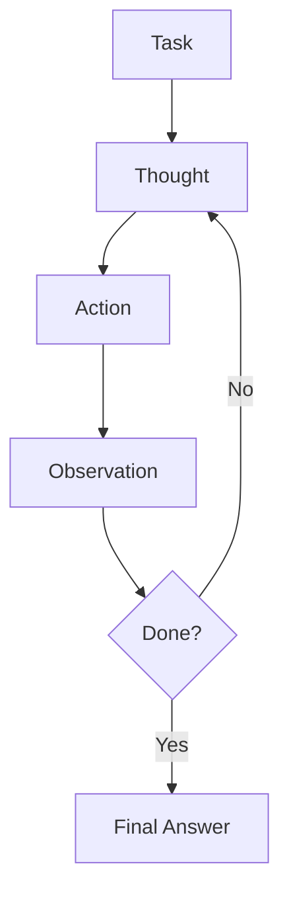

## Overview

The ReAct (Reasoning + Acting) pattern combines LLM reasoning with tool execution. This comprehensive example demonstrates:

- Creating ReAct agents with custom tools
- Using built-in tools (calculator, datetime, string, JSON)
- Chain agents for sequential workflows
- Parallel agents for concurrent execution
- MapReduce patterns for distributed processing
- AutoAgent for automatic strategy selection

## What You'll Learn

- Building custom tools with `ReActTool` trait
- Configuring ReAct agents with `ReActAgent::builder()`
- Implementing tool execution logic
- Chaining multiple agents together
- Parallel multi-agent execution
- Using the Actor model for concurrent agents

## Prerequisites

- Rust 1.75 or higher
- OpenAI API key
- Understanding of async/await

## Source Code Overview

This is a large example with 960+ lines. Here are the key components:

<CodeGroup>
```rust Custom Tool
use async_trait::async_trait;
use mofa_sdk::react::ReActTool;
use serde_json::Value;

/// Web search tool (mock implementation)
struct WebSearchTool;

#[async_trait]
impl ReActTool for WebSearchTool {
    fn name(&self) -> &str {
        "web_search"
    }

    fn description(&self) -> &str {
        "Search the web for information. Input should be a search query."
    }

    fn parameters_schema(&self) -> Option<Value> {
        Some(serde_json::json!({
            "type": "object",
            "properties": {
                "query": {
                    "type": "string",
                    "description": "The search query"
                }
            },
            "required": ["query"]
        }))
    }

    async fn execute(&self, input: &str) -> Result<String, String> {
        let query = if let Ok(json) = serde_json::from_str::<Value>(input) {
            json.get("query")
                .and_then(|v| v.as_str())
                .unwrap_or(input)
                .to_owned()
        } else {
            input.to_owned()
        };

        // Mock search results
        let results = match query.to_lowercase().as_str() {
            q if q.contains("rust") => {
                "Rust is a systems programming language focused on safety..."
            }
            _ => "Search results found..."
        };

        Ok(results.to_string())
    }
}
```

```rust Basic ReAct Agent
use mofa_sdk::react::{ReActAgent, prelude::*};
use std::sync::Arc;

// Create ReAct Agent
let react_agent = ReActAgent::builder()
    .with_llm(llm_agent)
    .with_tool(Arc::new(WebSearchTool))
    .with_tool(Arc::new(WikipediaTool))
    .with_tool(calculator())
    .with_max_iterations(5)
    .with_temperature(0.7)
    .with_verbose(true)
    .build_async()
    .await?;

// Execute task
let task = "What is Rust programming language?";
let result = react_agent.run(task).await?;

println!("Answer: {}", result.answer);
println!("Steps: {}", result.steps.len());
println!("Duration: {}ms", result.duration_ms);
```

```rust Chain Agents
use mofa_sdk::react::chain_agents;

// Create specialized agents
let researcher = Arc::new(
    ReActAgent::builder()
        .with_llm(llm.clone())
        .with_tool(Arc::new(WebSearchTool))
        .with_system_prompt("You are a researcher...")
        .build_async()
        .await?
);

let writer = Arc::new(
    ReActAgent::builder()
        .with_llm(llm.clone())
        .with_tools(all_builtin_tools())
        .with_system_prompt("You are a writer...")
        .build_async()
        .await?
);

// Chain them together
let chain = chain_agents(vec![
    ("researcher", researcher),
    ("writer", writer),
])
.with_transform(|prev_output, next_name| {
    format!("Previous: {}\n\nNow, {}, continue...", prev_output, next_name)
})
.with_verbose(true);

let result = chain.run("Research and write about Rust").await?;
```

```rust Parallel Agents
use mofa_sdk::react::{ParallelAgent, AggregationStrategy};

// Create expert agents
let tech_expert = Arc::new(build_tech_agent().await?);
let business_expert = Arc::new(build_business_agent().await?);
let user_expert = Arc::new(build_user_agent().await?);

// Run in parallel
let parallel = ParallelAgent::new()
    .add("tech_expert", tech_expert)
    .add("business_expert", business_expert)
    .add("user_expert", user_expert)
    .with_aggregation(AggregationStrategy::Concatenate)
    .with_verbose(true);

let result = parallel.run("Analyze Rust language impact").await?;
```

```toml Cargo.toml
[package]
name = "react_agent"
version = "0.1.0"
edition = "2021"

[dependencies]
mofa-sdk = { path = "../../crates/mofa-sdk" }
tokio = { version = "1", features = ["full"] }
tracing = "0.1"
tracing-subscriber = { version = "0.3", features = ["env-filter"] }
async-trait = "0.1"
serde_json = "1.0"
```
</CodeGroup>

## Running the Example

<Steps>

### Set API Key
```bash
export OPENAI_API_KEY="your-api-key"

# Optional: Custom endpoint
export OPENAI_BASE_URL="http://localhost:11434/v1"
export OPENAI_MODEL="gpt-4"
```

### Run All Examples
```bash
cd examples/react_agent
cargo run
```

### Run Specific Example
```bash
# Run basic example
cargo run -- 1

# Run actor model example
cargo run -- 2

# Run chain example
cargo run -- chain

# Run parallel example
cargo run -- parallel
```

</Steps>

## Example Scenarios

The example includes 10 different scenarios:

<AccordionGroup>
  <Accordion title="1. Basic ReAct Agent">
    Simple agent with web search and calculator tools.
    
    **Demonstrates**: Tool selection, reasoning steps, final answer
  </Accordion>

  <Accordion title="2. Actor Model">
    ReAct agent running in an actor system.
    
    **Demonstrates**: Concurrent execution, status monitoring, message passing
  </Accordion>

  <Accordion title="3. AutoAgent">
    Automatically selects between direct response and ReAct reasoning.
    
    **Demonstrates**: Strategy selection, performance optimization
  </Accordion>

  <Accordion title="4. Built-in Tools">
    Using calculator, string, JSON, datetime tools.
    
    **Demonstrates**: Tool ecosystem, composition
  </Accordion>

  <Accordion title="5. Streaming Output">
    Stream reasoning steps in real-time.
    
    **Demonstrates**: Async streaming, progress updates
  </Accordion>

  <Accordion title="6. Custom Tools">
    Combining custom and built-in tools.
    
    **Demonstrates**: Tool integration, extensibility
  </Accordion>

  <Accordion title="7. Chain Agent">
    Sequential pipeline: Researcher → Writer → Editor.
    
    **Demonstrates**: Multi-stage processing, data flow
  </Accordion>

  <Accordion title="8. Parallel Agent">
    Concurrent expert analysis from multiple perspectives.
    
    **Demonstrates**: Parallel execution, result aggregation
  </Accordion>

  <Accordion title="9. LLM Summarizer">
    Parallel agents with LLM-based result synthesis.
    
    **Demonstrates**: Intelligent aggregation, synthesis
  </Accordion>

  <Accordion title="10. MapReduce">
    Distribute tasks, process in parallel, reduce results.
    
    **Demonstrates**: Distributed processing, scalability
  </Accordion>
</AccordionGroup>

## Key Concepts

### ReAct Loop

The ReAct agent follows a reasoning loop:



### Built-in Tools

MoFA provides several ready-to-use tools:

<CardGroup cols={2}>
  <Card title="Calculator" icon="calculator">
    Evaluate mathematical expressions
    ```rust
    calculator()
    ```
  </Card>
  <Card title="DateTime" icon="clock">
    Get current time and date
    ```rust
    datetime_tool()
    ```
  </Card>
  <Card title="String" icon="text">
    String manipulation operations
    ```rust
    string_tool()
    ```
  </Card>
  <Card title="JSON" icon="brackets-curly">
    Parse and manipulate JSON
    ```rust
    json_tool()
    ```
  </Card>
</CardGroup>

### Tool Implementation

To create a custom tool:

```rust
use async_trait::async_trait;
use mofa_sdk::react::ReActTool;

struct MyTool;

#[async_trait]
impl ReActTool for MyTool {
    fn name(&self) -> &str {
        "my_tool"
    }

    fn description(&self) -> &str {
        "Description of what the tool does"
    }

    fn parameters_schema(&self) -> Option<Value> {
        Some(serde_json::json!({
            "type": "object",
            "properties": {
                "param": {"type": "string"}
            },
            "required": ["param"]
        }))
    }

    async fn execute(&self, input: &str) -> Result<String, String> {
        // Tool logic here
        Ok(format!("Result: {}", input))
    }
}
```

## Configuration Options

### Agent Builder

```rust
let agent = ReActAgent::builder()
    .with_llm(llm)                    // LLM for reasoning
    .with_tools(tools)                 // Available tools
    .with_max_iterations(8)            // Max reasoning steps
    .with_temperature(0.7)             // LLM temperature
    .with_system_prompt(prompt)        // Custom instructions
    .with_verbose(true)                // Log reasoning steps
    .build_async()
    .await?;
```

### Chain Configuration

```rust
let chain = chain_agents(agents)
    .with_transform(|output, next| {
        format!("Previous: {}\nNext: {}", output, next)
    })
    .with_verbose(true);
```

### Parallel Configuration

```rust
let parallel = ParallelAgent::new()
    .add("agent1", agent1)
    .add("agent2", agent2)
    .with_aggregation(AggregationStrategy::Concatenate)
    .with_verbose(true);
```

## Expected Output

```
==========================================================
Example 1: Basic ReAct Agent
==========================================================

Task: What is Rust programming language and when was it first released?

[Step 1] Thought: I need to search for information about Rust
[Step 2] Action: web_search("Rust programming language")
[Step 3] Observation: Rust is a systems programming language...
[Step 4] Thought: Now I have enough information
[Step 5] Final Answer: Rust is a systems programming language that...

--- Result ---
Success: true
Iterations: 5
Duration: 3421ms

Final Answer:
Rust is a systems programming language focused on safety, concurrency, 
and performance. It was first released in stable version 1.0 on May 15, 2015.
```

## Common Use Cases

<CardGroup cols={2}>
  <Card title="Research Assistant" icon="magnifying-glass">
    Search, analyze, and summarize information
  </Card>
  <Card title="Code Analysis" icon="code">
    Analyze codebases and suggest improvements
  </Card>
  <Card title="Data Processing" icon="database">
    Transform and analyze data with tools
  </Card>
  <Card title="Task Automation" icon="robot">
    Automate complex multi-step workflows
  </Card>
</CardGroup>

## Troubleshooting

<AccordionGroup>
  <Accordion title="Tool Execution Failure">
    **Problem**: Tool returns an error
    
    **Solution**: Implement error handling in tools:
    ```rust
    async fn execute(&self, input: &str) -> Result<String, String> {
        match self.do_work(input) {
            Ok(result) => Ok(result),
            Err(e) => Err(format!("Tool error: {}", e))
        }
    }
    ```
  </Accordion>

  <Accordion title="Max Iterations Reached">
    **Problem**: Agent hits iteration limit
    
    **Solution**: Increase max_iterations or improve prompts:
    ```rust
    .with_max_iterations(10)
    .with_system_prompt("Be concise and direct")
    ```
  </Accordion>

  <Accordion title="Slow Performance">
    **Problem**: Agent takes too long
    
    **Solution**: Use AutoAgent or reduce iterations:
    ```rust
    let auto_agent = AutoAgent::new(llm, react_agent)
        .with_auto_mode(true);
    ```
  </Accordion>
</AccordionGroup>

## Next Steps

<CardGroup cols={2}>
  <Card title="Multi-Agent" icon="users" href="/examples/multi-agent-coordination">
    Coordinate multiple ReAct agents
  </Card>
  <Card title="Workflow" icon="diagram-project" href="/examples/workflow-orchestration">
    Orchestrate complex workflows
  </Card>
  <Card title="Custom Tools" icon="wrench" href="/guides/custom-tools">
    Build advanced custom tools
  </Card>
  <Card title="ReAct Guide" icon="book" href="/guides/react-pattern">
    Deep dive into ReAct pattern
  </Card>
</CardGroup>
