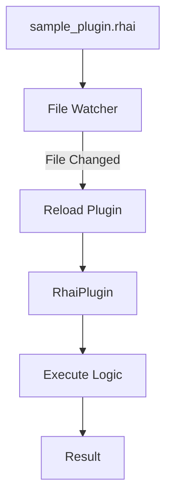

## Overview

This example demonstrates MoFA's runtime plugin system using Rhai scripts. It showcases:

- Loading Rhai plugins from external files
- Hot-reloading scripts when files change
- Executing updated plugins without restart
- Plugin lifecycle management
- File watching and automatic reload

## What You'll Learn

- Creating Rhai plugins for runtime logic
- Implementing hot-reload functionality
- Plugin lifecycle (load, init, execute, unload)
- File watching patterns
- Dynamic business logic updates

## Prerequisites

- Rust 1.75 or higher
- Understanding of plugin patterns
- Basic knowledge of Rhai syntax

## Architecture



## Source Code

<CodeGroup>
```rust main.rs
use mofa_sdk::plugins::{AgentPlugin, PluginContext, RhaiPlugin};
use std::path::PathBuf;
use tokio::time;
use tracing::{info, warn, Level};

#[tokio::main]
async fn main() -> Result<(), Box<dyn std::error::Error>> {
    // Initialize logging
    tracing_subscriber::fmt()
        .with_max_level(Level::INFO)
        .init();

    info!("=== Rhai Plugin Hot Reload Example ===\n");

    // Path to plugin
    let plugin_path = PathBuf::from("sample_plugin.rhai");
    if !plugin_path.exists() {
        warn!("⚠️  Run from examples/rhai_hot_reload directory!");
        warn!("Directory: {}", std::env::current_dir()?.display());
        return Ok(());
    }

    // Create plugin from file
    let mut plugin = RhaiPlugin::from_file(
        "my_hot_plugin", 
        &plugin_path
    ).await?;

    // Initialize plugin
    let ctx = PluginContext::new("test_agent");
    plugin.load(&ctx).await?;
    plugin.init_plugin().await?;

    // Example input
    let input = "Test message from agent";

    // Execute plugin multiple times with reload checks
    for i in 0..10 {
        // Check if file changed and reload
        match check_and_reload(&mut plugin, &plugin_path).await {
            Ok(true) => info!("🔄 Plugin reloaded!"),
            Ok(false) => info!("✅ Plugin unchanged"),
            Err(e) => warn!("⚠️  Error checking/reloading: {}", e),
        }

        // Execute the plugin
        let result = plugin.execute(input.to_string()).await?;
        info!("Execution result {}: {}", i + 1, result);

        // Wait for 2 seconds
        time::sleep(time::Duration::from_secs(2)).await;
    }

    // Cleanup
    plugin.unload().await?;

    info!("\n=== Example Complete ===");
    Ok(())
}

async fn check_and_reload(
    plugin: &mut RhaiPlugin,
    path: &PathBuf,
) -> Result<bool, Box<dyn std::error::Error>> {
    // Get current file modification time
    let current_mod = std::fs::metadata(path)?
        .modified()?
        .duration_since(std::time::UNIX_EPOCH)?
        .as_secs();

    // Check if plugin needs reload
    if plugin.last_modified() != current_mod {
        plugin.reload().await?;
        Ok(true)
    } else {
        Ok(false)
    }
}
```

```rhai sample_plugin.rhai
// Rhai Plugin Example
// This plugin can be modified at runtime

fn execute(input) {
    // Version 1: Simple echo
    "Echo: " + input
}

// You can update this file while the program runs!
// Try changing the execute function to:
//
// fn execute(input) {
//     "[UPDATED] Modified: " + input.to_upper()
// }
```

```toml Cargo.toml
[package]
name = "rhai_hot_reload"
version = "0.1.0"
edition = "2021"

[dependencies]
mofa-sdk = { path = "../../crates/mofa-sdk" }
tokio = { version = "1", features = ["full"] }
tracing = "0.1"
tracing-subscriber = { version = "0.3", features = ["env-filter"] }
```
</CodeGroup>

## Running the Example

<Steps>

### Navigate to Directory
```bash
cd examples/rhai_hot_reload
```

### Run the Example
```bash
cargo run
```

### Modify the Plugin
While the program is running, edit `sample_plugin.rhai`:

```rhai
fn execute(input) {
    "[UPDATED] Modified: " + input.to_upper()
}
```

Save the file and watch the output change!

</Steps>

## Expected Output

```
=== Rhai Plugin Hot Reload Example ===

✅ Plugin unchanged
Execution result 1: Echo: Test message from agent
✅ Plugin unchanged
Execution result 2: Echo: Test message from agent
🔄 Plugin reloaded!
Execution result 3: [UPDATED] Modified: TEST MESSAGE FROM AGENT
✅ Plugin unchanged
Execution result 4: [UPDATED] Modified: TEST MESSAGE FROM AGENT

=== Example Complete ===
```

## Key Concepts

### Rhai Plugin System

Rhai plugins provide runtime programmability:

```rust
// Create from file
let plugin = RhaiPlugin::from_file("plugin_id", path).await?;

// Create from string
let script = r#"
    fn execute(input) {
        "Result: " + input
    }
"#;
let plugin = RhaiPlugin::from_string("plugin_id", script).await?;
```

### Plugin Lifecycle

<Steps>

### Load
```rust
plugin.load(&ctx).await?;
```
Load plugin into memory

### Initialize
```rust
plugin.init_plugin().await?;
```
Prepare plugin for execution

### Execute
```rust
let result = plugin.execute(input).await?;
```
Run plugin logic

### Reload
```rust
plugin.reload().await?;
```
Reload from file (hot reload)

### Unload
```rust
plugin.unload().await?;
```
Cleanup and free resources

</Steps>

### Hot Reload Pattern

```rust
// Check file modification time
let metadata = fs::metadata(&path)?;
let modified = metadata.modified()?
    .duration_since(UNIX_EPOCH)?
    .as_secs();

// Compare with plugin's last modified time
if plugin.last_modified() != modified {
    // Reload plugin
    plugin.reload().await?;
    info!("Plugin reloaded!");
}
```

## Rhai Scripting Guide

### Basic Syntax

<Tabs>
  <Tab title="Variables">
    ```rhai
    let x = 42;
    let name = "MoFA";
    let is_active = true;
    ```
  </Tab>
  
  <Tab title="Functions">
    ```rhai
    fn process(input) {
        let result = input.to_upper();
        "Processed: " + result
    }
    ```
  </Tab>
  
  <Tab title="Control Flow">
    ```rhai
    if value > 100 {
        "high"
    } else if value > 50 {
        "medium"
    } else {
        "low"
    }
    ```
  </Tab>
  
  <Tab title="Loops">
    ```rhai
    let sum = 0;
    for i in 0..10 {
        sum += i;
    }
    sum
    ```
  </Tab>
</Tabs>

### Built-in Functions

```rhai
// String operations
let upper = text.to_upper();
let lower = text.to_lower();
let len = text.len();
let contains = text.contains("search");

// Array operations
let arr = [1, 2, 3, 4, 5];
let filtered = arr.filter(|x| x > 2);
let mapped = arr.map(|x| x * 2);
let sum = arr.reduce(|sum, x| sum + x, 0);

// JSON operations
let obj = #{ name: "MoFA", version: 1 };
let json_str = to_json(obj);
let parsed = parse_json(json_str);
```

## Advanced Examples

### Complex Plugin Logic

```rhai
// Advanced processing plugin
fn execute(input) {
    // Parse JSON input
    let data = parse_json(input);
    
    // Extract fields
    let action = data["action"];
    let params = data["params"];
    
    // Route based on action
    if action == "process" {
        process_data(params)
    } else if action == "analyze" {
        analyze_data(params)
    } else {
        "Unknown action: " + action
    }
}

fn process_data(params) {
    let items = params["items"];
    let results = [];
    
    for item in items {
        if item > 0 {
            results.push(item * 2);
        }
    }
    
    to_json(#{ 
        status: "success",
        results: results,
        count: results.len()
    })
}

fn analyze_data(params) {
    let values = params["values"];
    let sum = values.reduce(|s, v| s + v, 0);
    let avg = sum / values.len();
    
    to_json(#{
        sum: sum,
        average: avg,
        count: values.len()
    })
}
```

### Stateful Plugin

```rhai
// Global state (persists across executions)
let counter = 0;
let history = [];

fn execute(input) {
    counter += 1;
    history.push(input);
    
    to_json(#{
        execution: counter,
        input: input,
        history_size: history.len()
    })
}
```

## Common Use Cases

<CardGroup cols={2}>
  <Card title="Business Rules" icon="gavel">
    Hot-reload business logic without restarts
  </Card>
  <Card title="Compliance Rules" icon="shield">
    Update regulatory rules dynamically
  </Card>
  <Card title="Feature Flags" icon="flag">
    Control features via scripts
  </Card>
  <Card title="Data Transformation" icon="shuffle">
    Modify transformation logic on-the-fly
  </Card>
</CardGroup>

## File Watching

For production use, implement proper file watching:

```rust
use notify::{Config, Event, RecommendedWatcher, RecursiveMode, Watcher};
use tokio::sync::mpsc;

let (tx, mut rx) = mpsc::channel(10);

let mut watcher = RecommendedWatcher::new(
    move |res: Result<Event, _>| {
        if let Ok(event) = res {
            let _ = tx.blocking_send(event);
        }
    },
    Config::default()
)?;

watcher.watch(&plugin_path, RecursiveMode::NonRecursive)?;

tokio::spawn(async move {
    while let Some(event) = rx.recv().await {
        if matches!(event.kind, EventKind::Modify(_)) {
            info!("File changed, reloading...");
            if let Err(e) = plugin.reload().await {
                warn!("Reload failed: {}", e);
            }
        }
    }
});
```

## Troubleshooting

<AccordionGroup>
  <Accordion title="Syntax Error After Reload">
    **Problem**: Plugin fails after hot reload
    
    **Solution**: Validate Rhai syntax before reload:
    ```rust
    let script_content = fs::read_to_string(&path)?;
    if rhai::Engine::new().compile(&script_content).is_err() {
        warn!("Syntax error, keeping old version");
        return Ok(false);
    }
    plugin.reload().await?;
    ```
  </Accordion>

  <Accordion title="State Loss on Reload">
    **Problem**: Plugin loses state after reload
    
    **Solution**: Persist state externally:
    ```rust
    // Before reload
    let state = plugin.get_state().await?;
    
    // Reload
    plugin.reload().await?;
    
    // Restore state
    plugin.set_state(state).await?;
    ```
  </Accordion>

  <Accordion title="File Not Found">
    **Problem**: Plugin file path incorrect
    
    **Solution**: Use absolute paths:
    ```rust
    let path = std::env::current_dir()?
        .join("sample_plugin.rhai");
    ```
  </Accordion>
</AccordionGroup>

## Best Practices

<Warning>
  **Security Consideration**: Rhai scripts run with full access. Only load trusted scripts in production.
</Warning>

<Check>
  **Performance**: Rhai is interpreted. For performance-critical paths, use compiled plugins (Rust/WASM).
</Check>

<Info>
  **Version Control**: Keep plugin scripts in version control alongside your codebase.
</Info>

## Next Steps

<CardGroup cols={2}>
  <Card title="WASM Plugins" icon="cube" href="/examples/wasm-plugin">
    Compile-time plugins for performance
  </Card>
  <Card title="Financial Compliance" icon="building-columns" href="/examples/financial-compliance">
    Real-world hot-reload use case
  </Card>
  <Card title="Plugin Guide" icon="book" href="/guides/plugin-system">
    Complete plugin system guide
  </Card>
  <Card title="Rhai Reference" icon="code" href="/api-reference/rhai-api">
    Rhai scripting API reference
  </Card>
</CardGroup>
