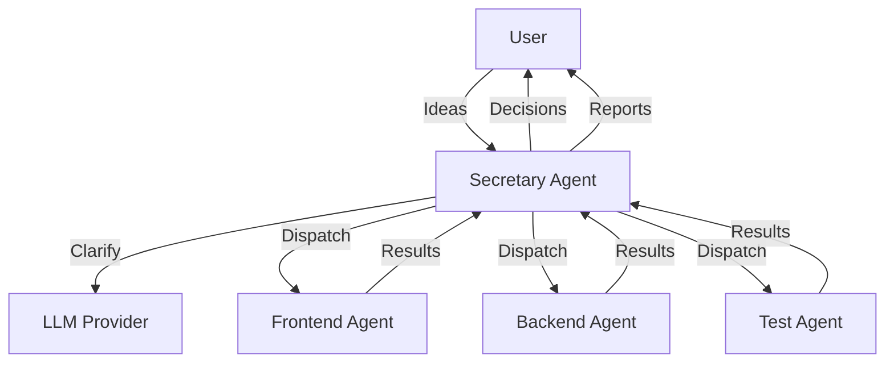

## Overview

The Secretary Agent pattern implements a human-in-the-loop workflow system where an AI secretary manages tasks, clarifies requirements, dispatches work to execution agents, and escalates key decisions to humans.

## What You'll Learn

- Building secretary agents for workflow management
- Registering and managing execution agents
- Automatic task clarification and dispatch
- Human decision escalation patterns
- LLM integration for intelligent coordination

## Prerequisites

- Rust 1.75 or higher
- OpenAI API key (for LLM integration)
- Understanding of async channels

## Architecture



## Source Code

<CodeGroup>
```rust main.rs
use mofa_sdk::secretary::{
    AgentInfo, ChannelConnection, DefaultInput, DefaultOutput,
    DefaultSecretaryBuilder, DispatchStrategy, SecretaryCore
};
use tracing::info;

mod llm_integration;

#[tokio::main]
async fn main() -> Result<(), Box<dyn std::error::Error>> {
    tracing_subscriber::fmt()
        .with_env_filter("info")
        .init();

    info!("╔══════════════════════════════════════════════════════════════╗");
    info!("║   Secretary Agent Mode - LLM-based Work Cycle Demonstration  ║");
    info!("╚══════════════════════════════════════════════════════════════╝\n");

    // Create LLM provider
    let llm_provider = llm_integration::create_llm_provider();
    info!("✅ LLM provider created: {}\n", llm_provider.name());

    // Create execution agent information
    let mut frontend_agent = AgentInfo::new(
        "frontend_agent", 
        "Frontend Development Agent"
    );
    frontend_agent.capabilities = vec![
        "frontend".to_string(),
        "ui_design".to_string(),
        "react".to_string(),
    ];
    frontend_agent.current_load = 20;
    frontend_agent.available = true;
    frontend_agent.performance_score = 0.85;

    let mut backend_agent = AgentInfo::new(
        "backend_agent", 
        "Backend Development Agent"
    );
    backend_agent.capabilities = vec![
        "backend".to_string(),
        "api_design".to_string(),
        "database".to_string(),
    ];
    backend_agent.current_load = 30;
    backend_agent.available = true;
    backend_agent.performance_score = 0.9;

    let mut test_agent = AgentInfo::new("test_agent", "Testing Agent");
    test_agent.capabilities = vec!["testing".to_string(), "qa".to_string()];
    test_agent.current_load = 10;
    test_agent.available = true;
    test_agent.performance_score = 0.88;

    // Create secretary agent
    let secretary_behavior = DefaultSecretaryBuilder::new()
        .with_name("LLM-based Development Project Secretary")
        .with_dispatch_strategy(DispatchStrategy::CapabilityFirst)
        .with_auto_clarify(true)   // Auto clarification
        .with_auto_dispatch(true)  // Auto dispatch
        .with_llm(llm_provider)
        .with_executor(frontend_agent)
        .with_executor(backend_agent)
        .with_executor(test_agent)
        .build();

    info!("✅ Secretary Agent created\n");

    // Create channel connection
    let (connection, input_tx, mut output_rx) = 
        ChannelConnection::new_pair(32);

    // Create and start core engine
    let (handle, join_handle) = SecretaryCore::new(secretary_behavior)
        .start(connection)
        .await;

    info!("✅ Secretary Agent core engine started\n");

    // Send test idea
    info!("📥 Sending idea to Secretary Agent:");
    info!("   'Develop a user management system...'");

    let idea = DefaultInput::Idea {
        content: "Develop a user management system with \
                  registration, login, and role-based access control"
            .to_string(),
        priority: None,
        metadata: None,
    };

    input_tx.send(idea).await?;

    // Receive responses
    info!("📤 Receiving Secretary Agent response:\n");

    let mut interval = tokio::time::interval(
        tokio::time::Duration::from_millis(100)
    );
    let timeout = tokio::time::sleep(
        tokio::time::Duration::from_secs(10)
    );
    tokio::pin!(timeout);

    let mut received_welcome = false;
    let mut received_response = false;

    loop {
        tokio::select! {
            _ = &mut timeout => {
                info!("   ⏰ Timeout reached");
                break;
            },
            _ = interval.tick() => {
                match output_rx.try_recv() {
                    Ok(result) => {
                        match result {
                            DefaultOutput::Message { content } => {
                                if content.contains("Welcome") {
                                    info!("   💬 Welcome: {}", content);
                                    received_welcome = true;
                                } else {
                                    info!("   💬 Message: {}", content);
                                }
                            },
                            DefaultOutput::Acknowledgment { message } => {
                                info!("   ✅ Ack: {}", message);
                                received_response = true;
                            },
                            DefaultOutput::DecisionRequired { decision } => {
                                info!("   ⏸️  Decision: {}", 
                                    decision.description);
                                received_response = true;
                            },
                            _ => {}
                        }
                    },
                    Err(tokio::sync::mpsc::error::TryRecvError::Disconnected) => {
                        break;
                    },
                    _ => {}
                }

                if received_welcome && received_response {
                    break;
                }
            }
        }
    }

    // Stop agent
    handle.stop().await;
    join_handle.abort();

    info!("\n✅ Example completed!");
    Ok(())
}
```

```rust llm_integration.rs
use mofa_sdk::llm::{OpenAIProvider, LLMProvider};
use std::sync::Arc;

pub fn create_llm_provider() -> Arc<dyn LLMProvider> {
    let provider = OpenAIProvider::from_env();
    Arc::new(provider)
}
```

```toml Cargo.toml
[package]
name = "secretary_agent"
version = "0.1.0"
edition = "2021"

[dependencies]
mofa-sdk = { path = "../../crates/mofa-sdk" }
tokio = { version = "1", features = ["full"] }
tracing = "0.1"
tracing-subscriber = { version = "0.3", features = ["env-filter"] }
serde_json = "1.0"
async-trait = "0.1"
```
</CodeGroup>

## Running the Example

<Steps>

### Set Environment Variables
```bash
export OPENAI_API_KEY="your-api-key"
```

### Run the Example
```bash
cd examples/secretary_agent
cargo run
```

</Steps>

## Expected Output

```
╔══════════════════════════════════════════════════════════════╗
║   Secretary Agent Mode - LLM-based Work Cycle Demonstration  ║
╚══════════════════════════════════════════════════════════════╝

✅ LLM provider created: OpenAIProvider

✅ Secretary Agent created

✅ Secretary Agent core engine started

📥 Sending idea to Secretary Agent:
   'Develop a user management system...'

📤 Receiving Secretary Agent response:

   💬 Welcome: Hello! I'm your project secretary...
   ✅ Ack: I've recorded your idea and will create a project plan
   ⏸️  Decision: Should we prioritize security or ease of use?

✅ Example completed!
```

## Secretary Workflow Phases

<Steps>

### Phase 1: Receive Ideas
Secretary records todos and ideas from the user.

```rust
let idea = DefaultInput::Idea {
    content: "Build a new feature".to_string(),
    priority: Some(Priority::High),
    metadata: None,
};
```

### Phase 2: Clarify Requirements
Secretary uses LLM to ask clarifying questions and create project documents.

```rust
.with_auto_clarify(true)  // Enable automatic clarification
```

### Phase 3: Schedule & Dispatch
Secretary assigns tasks to execution agents based on capabilities.

```rust
.with_dispatch_strategy(DispatchStrategy::CapabilityFirst)
```

### Phase 4: Monitor Feedback
Secretary tracks progress and escalates key decisions to humans.

```rust
DefaultOutput::DecisionRequired { decision }
```

### Phase 5: Acceptance Report
Secretary updates todos and provides completion reports.

```rust
DefaultOutput::Report { report }
```

</Steps>

## Dispatch Strategies

<Tabs>
  <Tab title="CapabilityFirst">
    Match tasks to agents based on capabilities:
    
    ```rust
    .with_dispatch_strategy(DispatchStrategy::CapabilityFirst)
    ```
    
    Best for: Task-agent matching by skills
  </Tab>
  
  <Tab title="LoadBalanced">
    Distribute tasks evenly across agents:
    
    ```rust
    .with_dispatch_strategy(DispatchStrategy::LoadBalanced)
    ```
    
    Best for: High-throughput scenarios
  </Tab>
  
  <Tab title="PriorityBased">
    Route high-priority tasks first:
    
    ```rust
    .with_dispatch_strategy(DispatchStrategy::PriorityBased)
    ```
    
    Best for: Time-sensitive work
  </Tab>
  
  <Tab title="RoundRobin">
    Simple rotating assignment:
    
    ```rust
    .with_dispatch_strategy(DispatchStrategy::RoundRobin)
    ```
    
    Best for: Equal task distribution
  </Tab>
</Tabs>

## Agent Configuration

### Execution Agent Setup

```rust
let mut agent = AgentInfo::new("agent_id", "Agent Name");

// Set capabilities
agent.capabilities = vec![
    "skill1".to_string(),
    "skill2".to_string(),
];

// Set availability
agent.available = true;

// Set current workload (0-100)
agent.current_load = 25;

// Set performance score (0.0-1.0)
agent.performance_score = 0.85;
```

### Secretary Builder Options

```rust
let secretary = DefaultSecretaryBuilder::new()
    .with_name("My Secretary")                // Secretary name
    .with_llm(llm_provider)                    // LLM for intelligence
    .with_auto_clarify(true)                   // Auto clarification
    .with_auto_dispatch(true)                  // Auto task dispatch
    .with_dispatch_strategy(strategy)          // Routing strategy
    .with_executor(agent1)                     // Register agent 1
    .with_executor(agent2)                     // Register agent 2
    .with_max_clarifications(3)                // Max clarify rounds
    .with_decision_threshold(0.7)              // Human escalation threshold
    .build();
```

## Input Types

<Tabs>
  <Tab title="Idea">
    Submit new ideas or tasks:
    
    ```rust
    DefaultInput::Idea {
        content: "Build feature X".to_string(),
        priority: Some(Priority::High),
        metadata: Some(metadata),
    }
    ```
  </Tab>
  
  <Tab title="Clarification">
    Respond to secretary questions:
    
    ```rust
    DefaultInput::Clarification {
        question_id: "q1".to_string(),
        answer: "Yes, prioritize security".to_string(),
    }
    ```
  </Tab>
  
  <Tab title="Decision">
    Make escalated decisions:
    
    ```rust
    DefaultInput::Decision {
        decision_id: "d1".to_string(),
        choice: "option_a".to_string(),
        rationale: Some("Better for users".to_string()),
    }
    ```
  </Tab>
  
  <Tab title="Feedback">
    Provide feedback on results:
    
    ```rust
    DefaultInput::Feedback {
        task_id: "task_001".to_string(),
        approved: true,
        comments: Some("Looks good!".to_string()),
    }
    ```
  </Tab>
</Tabs>

## Output Types

<AccordionGroup>
  <Accordion title="Message">
    General messages from secretary:
    ```rust
    DefaultOutput::Message { content }
    ```
  </Accordion>

  <Accordion title="Acknowledgment">
    Task receipt confirmation:
    ```rust
    DefaultOutput::Acknowledgment { message }
    ```
  </Accordion>

  <Accordion title="Question">
    Clarifying question:
    ```rust
    DefaultOutput::Question { question }
    ```
  </Accordion>

  <Accordion title="DecisionRequired">
    Escalated decision:
    ```rust
    DefaultOutput::DecisionRequired { decision }
    ```
  </Accordion>

  <Accordion title="Report">
    Status or completion report:
    ```rust
    DefaultOutput::Report { report }
    ```
  </Accordion>

  <Accordion title="Error">
    Error message:
    ```rust
    DefaultOutput::Error { message }
    ```
  </Accordion>
</AccordionGroup>

## Common Use Cases

<CardGroup cols={2}>
  <Card title="Project Management" icon="list-check">
    Coordinate development tasks across teams
  </Card>
  <Card title="Customer Support" icon="headset">
    Triage and route support tickets
  </Card>
  <Card title="Content Pipeline" icon="file-lines">
    Manage content creation workflows
  </Card>
  <Card title="DevOps Automation" icon="server">
    Coordinate deployment and operations
  </Card>
</CardGroup>

## Advanced Features

### Custom Behaviors

Implement your own secretary behavior:

```rust
use mofa_sdk::secretary::SecretaryBehavior;

struct CustomSecretary {
    // Your fields
}

#[async_trait]
impl SecretaryBehavior for CustomSecretary {
    async fn handle_idea(&mut self, idea: Idea) -> Result<Vec<Output>> {
        // Custom idea handling
    }
    
    async fn handle_clarification(&mut self, clarif: Clarification) 
        -> Result<Vec<Output>> {
        // Custom clarification logic
    }
    
    // Implement other methods...
}
```

### State Persistence

Persist secretary state:

```rust
let secretary = secretary_builder
    .with_persistence(Box::new(PostgresStore::new(pool)))
    .build();
```

## Troubleshooting

<AccordionGroup>
  <Accordion title="No Available Agents">
    **Problem**: All agents busy or unavailable
    
    **Solution**: Set agent availability or add more agents:
    ```rust
    agent.available = true;
    agent.current_load = 50;  // Not at max capacity
    ```
  </Accordion>

  <Accordion title="Decision Not Escalated">
    **Problem**: Expected human decision but auto-handled
    
    **Solution**: Lower decision threshold:
    ```rust
    .with_decision_threshold(0.5)  // Lower = more escalations
    ```
  </Accordion>

  <Accordion title="Channel Disconnected">
    **Problem**: Communication channel closed
    
    **Solution**: Check channel buffer size:
    ```rust
    ChannelConnection::new_pair(128)  // Larger buffer
    ```
  </Accordion>
</AccordionGroup>

## Next Steps

<CardGroup cols={2}>
  <Card title="Workflow Orchestration" icon="diagram-project" href="/examples/workflow-orchestration">
    Build complex orchestration workflows
  </Card>
  <Card title="Multi-Agent" icon="users" href="/examples/multi-agent-coordination">
    Coordinate multiple agent types
  </Card>
  <Card title="Secretary Guide" icon="book" href="/guides/secretary-pattern">
    Deep dive into secretary pattern
  </Card>
  <Card title="HITL Patterns" icon="hand" href="/guides/human-in-loop">
    Human-in-the-loop best practices
  </Card>
</CardGroup>
