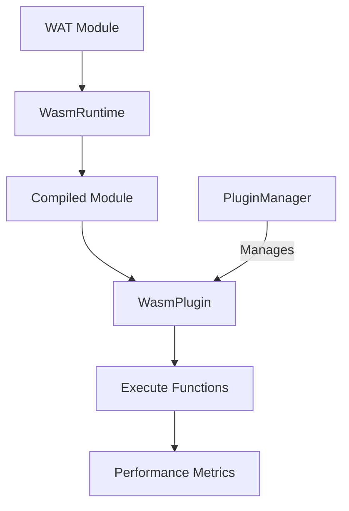

## Overview

This example demonstrates MoFA's WebAssembly plugin runtime for high-performance, sandboxed plugin execution. It showcases:

- Creating and compiling WASM modules
- Plugin lifecycle management
- Resource limits and sandboxing
- Math operations and recursive functions
- Plugin manager for multi-plugin coordination
- Performance metrics and monitoring

## What You'll Learn

- Using `WasmRuntime` for WASM execution
- Writing WAT (WebAssembly Text) modules
- Implementing resource limits
- Plugin manager patterns
- Memory management in WASM
- Performance optimization

## Prerequisites

- Rust 1.75 or higher
- Understanding of WebAssembly concepts
- Basic knowledge of WAT syntax

## Architecture



## Source Code

The example contains 393 lines with 4 different demonstrations. Here are the key parts:

<CodeGroup>
```rust Basic Runtime
use mofa_sdk::plugins::wasm_runtime::{
    RuntimeConfig, WasmRuntime, WasmPluginConfig
};

// Create runtime
let mut rt_config = RuntimeConfig::new();
rt_config.execution_config.fuel_metering = false;
rt_config.execution_config.epoch_interruption = false;
let runtime = WasmRuntime::new(rt_config)?;

// Simple WAT module
let wat = r#"
    (module
        (func (export "answer") (result i32)
            i32.const 42
        )
        (func (export "double") (param i32) (result i32)
            local.get 0
            i32.const 2
            i32.mul
        )
    )
"#;

// Compile module
let compiled = runtime.compile_wat("basic-module", wat).await?;
info!("Compiled: {} bytes in {}ms", 
    compiled.size_bytes, 
    compiled.compile_time_ms
);

// Create plugin
let mut config = WasmPluginConfig::new("basic-plugin");
config.resource_limits.max_fuel = None;
let plugin = runtime.create_plugin(&compiled, config).await?;

// Initialize and execute
plugin.initialize().await?;
let result = plugin.call_i32("answer", &[]).await?;
info!("Result: {}", result);  // 42

let result = plugin.call_i32("double", &[Val::I32(21)]).await?;
info!("Result: {}", result);  // 42
```

```rust Math Operations
let wat = r#"
    (module
        ;; Add two integers
        (func (export "add") (param i32 i32) (result i32)
            local.get 0
            local.get 1
            i32.add
        )

        ;; Factorial (recursive)
        (func $factorial (export "factorial") (param i32) (result i32)
            (if (result i32) (i32.le_s (local.get 0) (i32.const 1))
                (then (i32.const 1))
                (else
                    (i32.mul
                        (local.get 0)
                        (call $factorial 
                            (i32.sub (local.get 0) (i32.const 1))
                        )
                    )
                )
            )
        )

        ;; Fibonacci
        (func $fib (export "fibonacci") (param i32) (result i32)
            (if (result i32) (i32.le_s (local.get 0) (i32.const 1))
                (then (local.get 0))
                (else
                    (i32.add
                        (call $fib (i32.sub (local.get 0) (i32.const 1)))
                        (call $fib (i32.sub (local.get 0) (i32.const 2)))
                    )
                )
            )
        )
    )
"#;

let plugin = runtime.create_plugin_from_wat(wat, config).await?;
plugin.initialize().await?;

// Test functions
let result = plugin.call_i32("add", &[Val::I32(10), Val::I32(20)]).await?;
assert_eq!(result, 30);

let result = plugin.call_i32("factorial", &[Val::I32(5)]).await?;
assert_eq!(result, 120);

let result = plugin.call_i32("fibonacci", &[Val::I32(10)]).await?;
assert_eq!(result, 55);
```

```rust Plugin Manager
use mofa_sdk::plugins::wasm_runtime::WasmPluginManager;
use std::sync::Arc;

let runtime = Arc::new(WasmRuntime::new(rt_config)?);
let manager = WasmPluginManager::new(runtime);

// Subscribe to events
let mut event_rx = manager.subscribe();

// Load plugins
let greeter = manager.load_wat(greet_wat, Some(config)).await?;
let counter = manager.load_wat(counter_wat, Some(config)).await?;

info!("Loaded plugins: {:?}", 
    manager.list_plugins().await
        .iter()
        .map(|h| h.id())
        .collect::<Vec<_>>()
);

// Initialize all
manager.initialize(&greeter).await?;
manager.initialize(&counter).await?;

// Use plugins
let len = manager.call_i32(&greeter, "greet_len", &[]).await?;
info!("Greeting length: {}", len);

for i in 1..=5 {
    let count = manager.call_i32(&counter, "increment", &[]).await?;
    info!("Counter: {}", count);
}

// Get stats
let stats = manager.stats().await;
info!("Active plugins: {}", stats.active_plugins);
info!("Total calls: {}", stats.total_calls);

// Cleanup
manager.unload_all().await?;
```

```rust Resource Limits
use mofa_sdk::plugins::wasm_runtime::ResourceLimits;

let rt_config = RuntimeConfig::new()
    .with_resource_limits(ResourceLimits {
        max_memory_pages: 16,      // 1MB
        max_table_elements: 1000,
        max_instances: 5,
        max_execution_time_ms: 1000,
        max_fuel: None,
        max_call_depth: 100,
    });

let runtime = WasmRuntime::new(rt_config)?;

// Module with memory
let memory_wat = r#"
    (module
        (memory (export "memory") 1)

        (func (export "get_memory_size") (result i32)
            memory.size
        )

        (func (export "write_byte") (param i32 i32)
            local.get 0
            local.get 1
            i32.store8
        )

        (func (export "read_byte") (param i32) (result i32)
            local.get 0
            i32.load8_u
        )
    )
"#;

let plugin = runtime.create_plugin_from_wat(memory_wat, config).await?;
plugin.initialize().await?;

let size = plugin.call_i32("get_memory_size", &[]).await?;
info!("Memory: {} pages ({}KB)", size, size * 64);

plugin.call_void(
    "write_byte", 
    &[Val::I32(0), Val::I32(42)]
).await?;

let value = plugin.call_i32("read_byte", &[Val::I32(0)]).await?;
assert_eq!(value, 42);
```

```toml Cargo.toml
[package]
name = "wasm_plugin"
version = "0.1.0"
edition = "2021"

[dependencies]
mofa-sdk = { path = "../../crates/mofa-sdk" }
tokio = { version = "1", features = ["full"] }
tracing = "0.1"
tracing-subscriber = { version = "0.3", features = ["env-filter"] }
wasmtime = "40.0.0"
serde_json = "1.0"
```
</CodeGroup>

## Running the Example

<Steps>

### Run the Example
```bash
cd examples/wasm_plugin
cargo run
```

</Steps>

## Expected Output

```
╔══════════════════════════════════════════════════════════════╗
║           MoFA WASM Plugin Runtime Example                  ║
╚══════════════════════════════════════════════════════════════╝

📦 Example 1: Basic WASM Runtime
─────────────────────────────────────────────
  ✓ Compiled module: basic-module
    Size: 84 bytes
    Compile time: 15ms
  ✓ Created plugin: basic-plugin
    State: Ready
  ✓ Called 'answer' function
    Result: 42
  ✓ Called 'double' function with 21
    Result: 42
  📊 Plugin metrics:
    Calls: 2
    Success: 2
    Avg time: 125ns

🔢 Example 2: Math Operations Plugin
─────────────────────────────────────────────
  ✓ Math plugin initialized
    ✓ add(10, 20) = 30 (expected: 30)
    ✓ sub(50, 20) = 30 (expected: 30)
    ✓ mul(6, 7) = 42 (expected: 42)
    ✓ factorial(5) = 120 (expected: 120)
    ✓ fibonacci(10) = 55 (expected: 55)

🔌 Example 3: Plugin Manager
─────────────────────────────────────────────
  ✓ Loaded plugin: greeter
  ✓ Loaded plugin: counter
  📋 Loaded plugins: ["greeter", "counter"]
  ✓ All plugins initialized
  📢 Greeting length: 13
  🔢 Counter increment 1: 1
  🔢 Counter increment 2: 2
  🔢 Counter increment 3: 3
  🔢 Counter increment 4: 4
  🔢 Counter increment 5: 5
  📊 Manager stats:
      Active plugins: 2
      Total calls: 6
      Total execution time: 2ms

⚙️  Example 4: Resource Limits
─────────────────────────────────────────────
  ✓ Runtime created with restrictive limits
    Max memory: 1MB (16 pages)
    Max execution time: 1000ms
  📏 Initial memory size: 1 page(s) (64KB)
  ✓ Written 42 to address 0, read back: 42

╔══════════════════════════════════════════════════════════════╗
║                    All examples completed!                   ║
╚══════════════════════════════════════════════════════════════╝
```

## Key Concepts

### WAT vs Compiled Plugins

<Tabs>
  <Tab title="WAT Modules">
    Write plugins in WebAssembly Text format:
    
    ```wat
    (module
      (func (export "my_func") (param i32) (result i32)
        local.get 0
        i32.const 10
        i32.add
      )
    )
    ```
    
    **Pros**: Human-readable, easy to write
    **Cons**: Must be compiled at runtime
  </Tab>
  
  <Tab title="Pre-compiled WASM">
    Compile from Rust or other languages:
    
    ```rust
    // Rust code compiled to WASM
    #[no_mangle]
    pub extern "C" fn my_func(x: i32) -> i32 {
        x + 10
    }
    ```
    
    **Pros**: Better performance, use any language
    **Cons**: Requires build step
  </Tab>
</Tabs>

### Resource Limits

WASM plugins are sandboxed with configurable limits:

```rust
ResourceLimits {
    max_memory_pages: 16,           // Max 1MB memory
    max_table_elements: 1000,       // Max function table size
    max_instances: 5,               // Max plugin instances
    max_execution_time_ms: 1000,    // 1 second timeout
    max_fuel: Some(1_000_000),      // Instruction limit
    max_call_depth: 100,            // Max recursion depth
}
```

### Plugin Lifecycle

```rust
// Create
let plugin = runtime.create_plugin(&compiled, config).await?;

// Initialize
plugin.initialize().await?;
// State: Initialized

// Execute
let result = plugin.call_i32("func", &args).await?;
// State: Running

// Stop
plugin.stop().await?;
// State: Stopped
```

## Advanced Features

### Memory Management

```wat
(module
  (memory (export "memory") 2)  ; 2 pages = 128KB

  (func (export "alloc") (param $size i32) (result i32)
    ;; Simple bump allocator
    ;; Returns pointer to allocated memory
  )

  (func (export "free") (param $ptr i32)
    ;; Free allocated memory
  )
)
```

### Host Functions

```rust
// Define host function
let linker = wasmtime::Linker::new(&engine);
linker.func_wrap(
    "env",
    "log",
    |caller: Caller<'_, ()>, ptr: i32, len: i32| {
        // Read string from WASM memory
        let memory = caller.get_export("memory").unwrap();
        // Log the string
    }
)?;
```

### Plugin Events

```rust
let mut event_rx = manager.subscribe();

tokio::spawn(async move {
    while let Ok(event) = event_rx.recv().await {
        match event {
            PluginEvent::Loaded { id } => {
                info!("Plugin {} loaded", id);
            }
            PluginEvent::ExecutionCompleted { id, duration } => {
                info!("Plugin {} completed in {:?}", id, duration);
            }
            _ => {}
        }
    }
});
```

## Performance Comparison

| Plugin Type | Startup | Execution | Isolation | Hot Reload |
|------------|---------|-----------|-----------|------------|
| **Rhai** | Fast | Slow | Partial | Yes |
| **WASM** | Medium | Fast | Full | No |
| **Native** | Instant | Fastest | None | No |

<Info>
  Use **WASM** for: Performance-critical code, untrusted plugins, cross-platform compatibility
  
  Use **Rhai** for: Business logic, hot-reloadable rules, rapid iteration
</Info>

## Common Use Cases

<CardGroup cols={2}>
  <Card title="Image Processing" icon="image">
    High-performance image filters and transformations
  </Card>
  <Card title="Data Validation" icon="check-double">
    Fast validation rules with sandboxing
  </Card>
  <Card title="Cryptography" icon="lock">
    Secure cryptographic operations
  </Card>
  <Card title="Game Logic" icon="gamepad">
    Sandboxed game mechanics
  </Card>
</CardGroup>

## Troubleshooting

<AccordionGroup>
  <Accordion title="Compilation Failed">
    **Problem**: WAT module won't compile
    
    **Solution**: Validate WAT syntax:
    ```bash
    # Use wat2wasm to check syntax
    wat2wasm module.wat
    ```
  </Accordion>

  <Accordion title="Out of Memory">
    **Problem**: Plugin exceeds memory limit
    
    **Solution**: Increase memory pages:
    ```rust
    config.resource_limits.max_memory_pages = 32;  // 2MB
    ```
  </Accordion>

  <Accordion title="Function Not Found">
    **Problem**: Cannot call exported function
    
    **Solution**: Check export name:
    ```wat
    (func (export "exact_name") ...)
    ```
  </Accordion>

  <Accordion title="Slow Performance">
    **Problem**: Plugin execution is slow
    
    **Solution**: Disable fuel metering for production:
    ```rust
    rt_config.execution_config.fuel_metering = false;
    ```
  </Accordion>
</AccordionGroup>

## Best Practices

<Check>
  **Compile Once**: Cache compiled modules for reuse
</Check>

<Check>
  **Resource Limits**: Always set appropriate limits for security
</Check>

<Check>
  **Error Handling**: Trap WASM errors gracefully
</Check>

<Warning>
  **Memory Safety**: WASM memory is isolated but shared within the instance
</Warning>

## Next Steps

<CardGroup cols={2}>
  <Card title="Rhai Hot Reload" icon="fire" href="/examples/rhai-hot-reload">
    Compare with runtime plugins
  </Card>
  <Card title="Plugin System" icon="puzzle-piece" href="/guides/plugin-system">
    Complete plugin guide
  </Card>
  <Card title="WASM Guide" icon="book" href="/guides/wasm-plugins">
    Advanced WASM techniques
  </Card>
  <Card title="WASM API" icon="code" href="/api-reference/wasm-runtime">
    WASM runtime API reference
  </Card>
</CardGroup>
