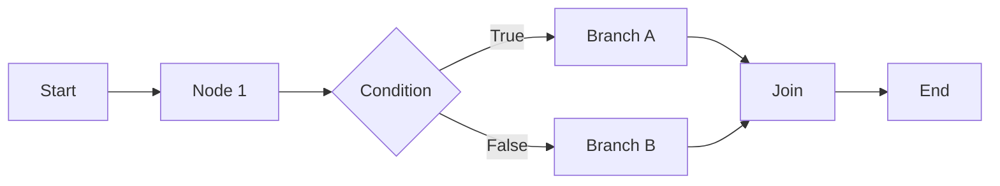

## Overview

This comprehensive example demonstrates MoFA's graph-based workflow orchestration system. It includes:

- Linear, conditional, and parallel workflow patterns
- ETL data pipelines
- LLM agent workflow integration (Dify-style)
- Event listening and monitoring
- ReAct agent workflow integration
- Multi-agent parallel analysis
- Intelligent data pipelines

## What You'll Learn

- Using `WorkflowBuilder` for fluent workflow construction
- Implementing conditional branching
- Parallel execution and result aggregation
- State management and data passing
- LLM integration in workflows
- Event monitoring and checkpoints

## Prerequisites

- Rust 1.75 or higher
- OpenAI API key (for LLM examples)
- Understanding of async/await and graph concepts

## Architecture



## Source Code Overview

The example contains 1061 lines with 10 different workflow scenarios:

<CodeGroup>
```rust Linear Workflow
use mofa_sdk::workflow::{WorkflowBuilder, WorkflowValue};

let graph = WorkflowBuilder::new("linear", "Linear Workflow")
    .description("Simple linear data processing")
    .start()
    .task("fetch", "Fetch Data", |_ctx, input| async move {
        info!("Fetching data...");
        let data = format!("Data: {}", input.as_str().unwrap_or("default"));
        Ok(WorkflowValue::String(data))
    })
    .task("process", "Process Data", |_ctx, input| async move {
        info!("Processing: {:?}", input);
        let processed = format!("Processed - {}", input.as_str().unwrap_or(""));
        Ok(WorkflowValue::String(processed))
    })
    .task("save", "Save Result", |_ctx, input| async move {
        info!("Saving: {:?}", input);
        Ok(WorkflowValue::String("Save successful".to_string()))
    })
    .end()
    .build();

let executor = WorkflowExecutor::new(ExecutorConfig::default());
let result = executor.execute(&graph, WorkflowValue::String("API".into())).await?;
```

```rust Conditional Workflow
let mut graph = WorkflowGraph::new("conditional", "Conditional Workflow");

graph.add_node(WorkflowNode::start("start"));
graph.add_node(WorkflowNode::condition(
    "check_value", 
    "Check Value", 
    |_ctx, input| async move {
        let value = input.as_i64().unwrap_or(0);
        value > 50
    }
));

graph.add_node(WorkflowNode::task(
    "high_path",
    "High Value",
    |_ctx, input| async move {
        Ok(WorkflowValue::String(format!("High: {}", input.as_i64().unwrap_or(0))))
    }
));

graph.add_node(WorkflowNode::task(
    "low_path",
    "Low Value",
    |_ctx, input| async move {
        Ok(WorkflowValue::String(format!("Low: {}", input.as_i64().unwrap_or(0))))
    }
));

graph.connect("start", "check_value");
graph.connect_conditional("check_value", "high_path", "true");
graph.connect_conditional("check_value", "low_path", "false");
```

```rust Parallel Workflow
let graph = WorkflowBuilder::new("parallel", "Parallel Workflow")
    .start()
    .parallel("fork", "Dispatch Tasks")
    .branch("task_a", "Task A", |_ctx, _input| async move {
        info!("Task A starting...");
        tokio::time::sleep(Duration::from_millis(100)).await;
        Ok(WorkflowValue::String("Result A".to_string()))
    })
    .branch("task_b", "Task B", |_ctx, _input| async move {
        info!("Task B starting...");
        tokio::time::sleep(Duration::from_millis(50)).await;
        Ok(WorkflowValue::String("Result B".to_string()))
    })
    .branch("task_c", "Task C", |_ctx, _input| async move {
        info!("Task C starting...");
        tokio::time::sleep(Duration::from_millis(75)).await;
        Ok(WorkflowValue::String("Result C".to_string()))
    })
    .join_with_transform("join", "Aggregate", |results| async move {
        let combined: Vec<String> = results
            .values()
            .filter_map(|v| v.as_str().map(|s| s.to_string()))
            .collect();
        WorkflowValue::String(format!("Combined: {:?}", combined))
    })
    .end()
    .build();
```

```rust LLM Agent Integration
use mofa_sdk::llm::LLMAgentBuilder;

// Create LLM agent for workflow
let synthesis_agent = create_workflow_llm(
    "synthesis-agent",
    "You are a synthesis expert..."
);

let graph = WorkflowBuilder::new("llm_workflow", "LLM Workflow")
    .start()
    .task("gather", "Gather Context", |_ctx, input| async move {
        let context = format!("Context: {}", input.as_str().unwrap_or(""));
        Ok(WorkflowValue::String(context))
    })
    .llm_agent("analyze", "LLM Analysis", synthesis_agent)
    .end()
    .build();
```

```toml Cargo.toml
[package]
name = "workflow_orchestration"
version = "0.1.0"
edition = "2021"

[dependencies]
mofa-sdk = { path = "../../crates/mofa-sdk" }
tokio = { version = "1", features = ["full"] }
tracing = "0.1"
tracing-subscriber = { version = "0.3", features = ["env-filter"] }
serde_json = "1.0"
```
</CodeGroup>

## Running the Example

<Steps>

### Run Basic Examples (1-5)
```bash
cd examples/workflow_orchestration
cargo run
```

### Run with LLM Examples (6-10)
```bash
export OPENAI_API_KEY="your-api-key"
cargo run
```

</Steps>

## Workflow Examples

<Tabs>
  <Tab title="1. Linear">
    **Pattern**: Start → Fetch → Process → Save → End
    
    Simple sequential processing pipeline.
    
    **Use Case**: ETL, data transformation
  </Tab>
  
  <Tab title="2. Conditional">
    **Pattern**: Start → Check → Branch A / Branch B → End
    
    Conditional routing based on data values.
    
    **Use Case**: Decision trees, rule engines
  </Tab>
  
  <Tab title="3. Parallel">
    **Pattern**: Start → Fork → [A, B, C] → Join → End
    
    Concurrent task execution with aggregation.
    
    **Use Case**: Batch processing, fan-out/fan-in
  </Tab>
  
  <Tab title="4. Data Pipeline">
    **Pattern**: Extract → Transform → Load
    
    ETL pipeline with state management.
    
    **Use Case**: Data warehousing, analytics
  </Tab>
  
  <Tab title="5. Event Monitoring">
    **Pattern**: Workflow with event listeners
    
    Monitor execution with checkpoints.
    
    **Use Case**: Observability, debugging
  </Tab>
  
  <Tab title="6. ReAct Agent">
    **Pattern**: Context → ReAct Agent → LLM Synthesis
    
    Integrate ReAct reasoning into workflows.
    
    **Use Case**: Complex problem solving
  </Tab>
  
  <Tab title="7. Multi-Agent">
    **Pattern**: Fork → [Tech, Business, User] → LLM Synthesis
    
    Parallel expert analysis with LLM aggregation.
    
    **Use Case**: Multi-perspective analysis
  </Tab>
  
  <Tab title="8. Conditional LLM">
    **Pattern**: LLM Classify → Simple / Complex → Decision
    
    LLM-driven conditional routing.
    
    **Use Case**: Dynamic task routing
  </Tab>
  
  <Tab title="9. Intelligent Pipeline">
    **Pattern**: Extract → Transform → LLM Analysis
    
    ETL + intelligent insights.
    
    **Use Case**: Business intelligence
  </Tab>
  
  <Tab title="10. Tool Chain">
    **Pattern**: [Calculator, DateTime] → LLM Summary
    
    Parallel tools with LLM synthesis.
    
    **Use Case**: Multi-tool orchestration
  </Tab>
</Tabs>

## Key Concepts

### WorkflowBuilder API

```rust
WorkflowBuilder::new(id, name)
    .description(desc)              // Workflow description
    .start()                        // Add start node
    .task(id, name, handler)        // Add task node
    .condition(id, name, predicate) // Add conditional node
    .parallel(id, name)             // Start parallel section
    .branch(id, name, handler)      // Add parallel branch
    .join(id, name)                 // Join parallel branches
    .llm_agent(id, name, agent)     // Add LLM node
    .end()                          // Add end node
    .build()                        // Build graph
```

### Node Types

<AccordionGroup>
  <Accordion title="Start Node">
    Entry point of the workflow:
    ```rust
    WorkflowNode::start("start")
    ```
  </Accordion>

  <Accordion title="Task Node">
    Executes custom logic:
    ```rust
    WorkflowNode::task("task_id", "Task Name", |ctx, input| async move {
        // Your logic
        Ok(WorkflowValue::String("result".to_string()))
    })
    ```
  </Accordion>

  <Accordion title="Condition Node">
    Routes based on predicate:
    ```rust
    WorkflowNode::condition("check", "Check", |ctx, input| async move {
        input.as_i64().unwrap_or(0) > 50
    })
    ```
  </Accordion>

  <Accordion title="LLM Agent Node">
    Integrates LLM agent:
    ```rust
    WorkflowNode::llm_agent("llm", "LLM Node", agent)
    ```
  </Accordion>

  <Accordion title="End Node">
    Workflow termination:
    ```rust
    WorkflowNode::end("end")
    ```
  </Accordion>
</AccordionGroup>

### Context and State

```rust
// Access workflow context
.task("process", "Process", |ctx, input| async move {
    // Set variable
    ctx.set_variable("count", WorkflowValue::Int(10)).await;
    
    // Get variable
    let count = ctx.get_variable("count").await
        .and_then(|v| v.as_i64())
        .unwrap_or(0);
    
    Ok(WorkflowValue::Int(count + 1))
})
```

### Event Monitoring

```rust
use mofa_sdk::workflow::ExecutionEvent;

let (event_tx, mut event_rx) = mpsc::channel(100);

let executor = WorkflowExecutor::new(config)
    .with_event_sender(event_tx);

tokio::spawn(async move {
    while let Some(event) = event_rx.recv().await {
        match event {
            ExecutionEvent::WorkflowStarted { workflow_id, .. } => {
                info!("Started: {}", workflow_id);
            }
            ExecutionEvent::NodeCompleted { node_id, result } => {
                info!("Completed: {} - {:?}", node_id, result.status);
            }
            _ => {}
        }
    }
});
```

## Expected Output

```
=== MoFA Workflow Orchestration Example ===

--- Example 1: Linear Workflow ---
  [fetch_data] Fetching data...
  [process] Processing data
  [save] Saving result
  Workflow status: Completed
  Number of executed nodes: 5

--- Example 2: Conditional Branch Workflow ---
  [check_value] Checking value: 75 (threshold: 50)
  [high_path] Executing high-value path
  Workflow status: Completed

--- Example 3: Parallel Execution Workflow ---
  [task_a] Starting Task A...
  [task_b] Starting Task B...
  [task_c] Starting Task C...
  [task_b] Task B complete
  [task_c] Task C complete
  [task_a] Task A complete
  [join] Aggregating all results
  Workflow status: Completed

=== Dify-style LLM/Agent Workflow Examples ===

--- Example 6: ReAct Agent Decision Workflow ---
  [gather_context] Gathering context information...
  [react_agent] Starting ReAct reasoning...
  [react_agent] Reasoning complete, iterations: 3
  [final_synthesis] LLM synthesizing results...
  Workflow status: Completed

=== All examples have finished executing ===
```

## Advanced Features

### Checkpoints and Recovery

```rust
let executor = WorkflowExecutor::new(ExecutorConfig {
    enable_checkpoints: true,
    checkpoint_interval: 3,  // Checkpoint every 3 nodes
    ..Default::default()
});

// Resume from checkpoint
let result = executor.resume_from_checkpoint(
    &checkpoint_data,
    &graph
).await?;
```

### Timeout and Retries

```rust
let config = ExecutorConfig {
    max_execution_time: Duration::from_secs(300),
    retry_on_failure: true,
    max_retries: 3,
    ..Default::default()
};
```

### Custom Aggregation

```rust
.join_with_transform("join", "Aggregate", |results| async move {
    // Custom aggregation logic
    let sum: i64 = results.values()
        .filter_map(|v| v.as_i64())
        .sum();
    WorkflowValue::Int(sum)
})
```

## Common Use Cases

<CardGroup cols={2}>
  <Card title="ETL Pipelines" icon="database">
    Extract, transform, load data workflows
  </Card>
  <Card title="ML Pipelines" icon="brain">
    Training, validation, deployment flows
  </Card>
  <Card title="CI/CD" icon="code-branch">
    Build, test, deploy automation
  </Card>
  <Card title="Business Process" icon="diagram-project">
    Multi-stage approval workflows
  </Card>
</CardGroup>

## Troubleshooting

<AccordionGroup>
  <Accordion title="Node Execution Failure">
    **Problem**: Node returns error
    
    **Solution**: Add error handling:
    ```rust
    .task("task", "Task", |ctx, input| async move {
        match process(input).await {
            Ok(result) => Ok(result),
            Err(e) => {
                // Log and return default
                warn!("Task failed: {}", e);
                Ok(WorkflowValue::String("default".into()))
            }
        }
    })
    ```
  </Accordion>

  <Accordion title="Workflow Deadlock">
    **Problem**: Workflow hangs
    
    **Solution**: Check for circular dependencies and add timeout:
    ```rust
    let config = ExecutorConfig {
        max_execution_time: Duration::from_secs(60),
        ..Default::default()
    };
    ```
  </Accordion>

  <Accordion title="Memory Issues">
    **Problem**: Large workflows consume too much memory
    
    **Solution**: Use streaming or chunking:
    ```rust
    .task("process", "Process", |ctx, input| async move {
        // Process in chunks
        for chunk in input.chunks(1000) {
            process_chunk(chunk).await?;
        }
        Ok(WorkflowValue::Null)
    })
    ```
  </Accordion>
</AccordionGroup>

## Next Steps

<CardGroup cols={2}>
  <Card title="ReAct Agent" icon="brain" href="/examples/react-agent">
    Integrate reasoning agents
  </Card>
  <Card title="Multi-Agent" icon="users" href="/examples/multi-agent-coordination">
    Multi-agent workflows
  </Card>
  <Card title="Workflow Guide" icon="book" href="/guides/workflow-patterns">
    Advanced workflow patterns
  </Card>
  <Card title="Workflow API" icon="code" href="/api-reference/workflow">
    Complete API reference
  </Card>
</CardGroup>
