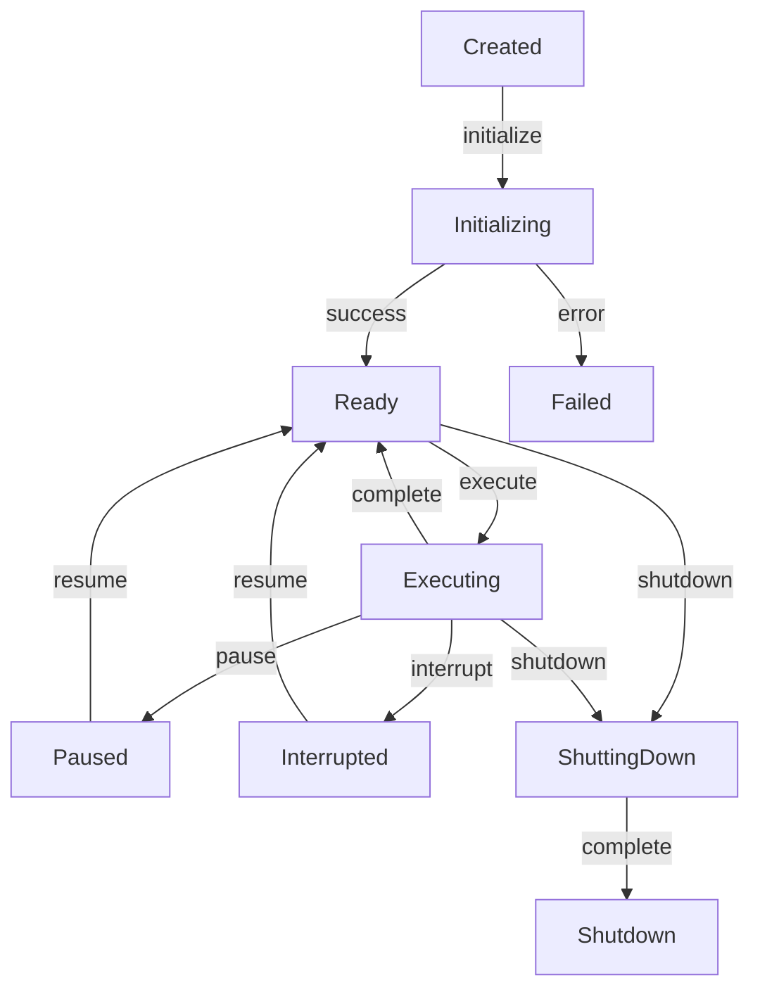

Understand how agents move through different states and how to manage their lifecycle effectively in the MoFA framework.

## Agent States

Every MoFA agent goes through a defined lifecycle with the following states:

```rust
#[derive(Debug, Clone, PartialEq, Eq)]
pub enum AgentState {
    Created,      // Agent instance created but not initialized
    Initializing, // Resources being loaded
    Ready,        // Ready to accept tasks
    Executing,    // Currently processing a task
    Paused,       // Execution paused, can be resumed
    Interrupted,  // Execution interrupted by external signal
    ShuttingDown, // Cleanup in progress
    Shutdown,     // Agent stopped, resources released
    Failed,       // Error state
}
```

## State Transitions



## Core Lifecycle Methods

The `MoFAAgent` trait defines the core lifecycle interface.

### Method Signatures

```rust
#[async_trait]
pub trait MoFAAgent: Send + Sync + 'static {
    // Identity
    fn id(&self) -> &str;
    fn name(&self) -> &str;
    fn capabilities(&self) -> &AgentCapabilities;
    fn state(&self) -> AgentState;

    // Core lifecycle
    async fn initialize(&mut self, ctx: &AgentContext) -> AgentResult<()>;
    async fn execute(&mut self, input: AgentInput, ctx: &AgentContext) -> AgentResult<AgentOutput>;
    async fn shutdown(&mut self) -> AgentResult<()>;
    async fn interrupt(&mut self) -> AgentResult<InterruptResult>;
}
```

### initialize

Prepare the agent for execution. Called once before the agent can process tasks.

```rust
async fn initialize(&mut self, ctx: &AgentContext) -> AgentResult<()> {
    // Load configuration
    self.config = ctx.get_config("agent.toml")?;
    
    // Establish database connection
    self.db = Database::connect(&self.config.db_url).await?;
    
    // Load ML model
    self.model = Model::load(&self.config.model_path)?;
    
    // Update state
    self.state = AgentState::Ready;
    
    Ok(())
}
```

**Use cases:**
- Load configuration files
- Establish database/network connections  
- Initialize ML models
- Allocate resources
- Validate prerequisites

### execute

The main task execution method. Processes input and returns output.

```rust
async fn execute(
    &mut self,
    input: AgentInput,
    ctx: &AgentContext
) -> AgentResult<AgentOutput> {
    self.state = AgentState::Executing;
    
    // Check for interrupts
    if ctx.is_interrupted() {
        return Err(AgentError::Interrupted);
    }
    
    // Process input
    let query = input.to_text();
    let result = self.model.predict(&query).await?;
    
    // Emit progress events
    ctx.emit_event(AgentEvent::progress(50));
    
    // Return result
    self.state = AgentState::Ready;
    Ok(AgentOutput::text(result))
}
```

**Key points:**
- Always update state to `Executing` at start
- Check for interrupts periodically for long-running tasks
- Emit events to report progress
- Return state to `Ready` on success
- Handle errors gracefully

### shutdown

Gracefully terminate the agent and release resources.

```rust
async fn shutdown(&mut self) -> AgentResult<()> {
    self.state = AgentState::ShuttingDown;
    
    // Save state to disk
    self.save_checkpoint().await?;
    
    // Close database connection
    self.db.close().await?;
    
    // Release ML model
    drop(self.model);
    
    // Final cleanup
    self.state = AgentState::Shutdown;
    
    Ok(())
}
```

**Use cases:**
- Save state/checkpoints
- Close database connections
- Flush buffers
- Release memory
- Clean up temporary files

### interrupt

Handle interrupt signals during execution.

```rust
async fn interrupt(&mut self) -> AgentResult<InterruptResult> {
    match self.state {
        AgentState::Executing => {
            // Save current progress
            self.save_checkpoint().await?;
            
            self.state = AgentState::Interrupted;
            Ok(InterruptResult::Acknowledged)
        }
        _ => Ok(InterruptResult::Ignored)
    }
}
```

**Interrupt results:**
- `Acknowledged`: Interrupt accepted, execution stopped
- `Deferred`: Will stop after current step
- `Ignored`: Agent cannot be interrupted

## Extended Lifecycle (Optional)

The `AgentLifecycle` trait provides additional control methods.

### pause

Temporarily suspend execution while preserving state.

```rust
#[async_trait]
pub trait AgentLifecycle: MoFAAgent {
    async fn pause(&mut self) -> AgentResult<()>;
    async fn resume(&mut self) -> AgentResult<()>;
}
```

**Implementation example:**

```rust
#[async_trait]
impl AgentLifecycle for MyAgent {
    async fn pause(&mut self) -> AgentResult<()> {
        if self.state != AgentState::Executing {
            return Err(AgentError::InvalidState(
                "Can only pause during execution".into()
            ));
        }
        
        // Save execution context
        self.checkpoint = Some(self.current_context.clone());
        self.state = AgentState::Paused;
        
        Ok(())
    }
    
    async fn resume(&mut self) -> AgentResult<()> {
        if self.state != AgentState::Paused {
            return Err(AgentError::InvalidState(
                "Can only resume from paused state".into()
            ));
        }
        
        // Restore execution context
        if let Some(checkpoint) = self.checkpoint.take() {
            self.current_context = checkpoint;
        }
        
        self.state = AgentState::Ready;
        Ok(())
    }
}
```

## Complete Lifecycle Example

Here's a complete agent with full lifecycle management:

```rust
use mofa_sdk::kernel::agent::prelude::*;
use mofa_sdk::llm::{LLMClient, openai_from_env};
use std::sync::Arc;

struct ProductionAgent {
    id: String,
    name: String,
    capabilities: AgentCapabilities,
    state: AgentState,
    client: LLMClient,
    checkpoint: Option<String>,
    execution_count: u64,
}

impl ProductionAgent {
    fn new(client: LLMClient) -> Self {
        Self {
            id: uuid::Uuid::new_v4().to_string(),
            name: "Production Agent".to_string(),
            capabilities: AgentCapabilities::builder()
                .tag("production")
                .supports_streaming(true)
                .supports_tools(true)
                .build(),
            state: AgentState::Created,
            client,
            checkpoint: None,
            execution_count: 0,
        }
    }
}

#[async_trait]
impl MoFAAgent for ProductionAgent {
    fn id(&self) -> &str {
        &self.id
    }
    
    fn name(&self) -> &str {
        &self.name
    }
    
    fn capabilities(&self) -> &AgentCapabilities {
        &self.capabilities
    }
    
    fn state(&self) -> AgentState {
        self.state.clone()
    }
    
    async fn initialize(&mut self, ctx: &AgentContext) -> AgentResult<()> {
        tracing::info!("[{}] Initializing agent", self.id);
        self.state = AgentState::Initializing;
        
        // Simulate resource loading
        tokio::time::sleep(tokio::time::Duration::from_millis(100)).await;
        
        // Verify LLM connection
        self.client.provider().health_check().await
            .map_err(|e| AgentError::InitializationFailed(e.to_string()))?;
        
        self.state = AgentState::Ready;
        tracing::info!("[{}] Agent ready", self.id);
        
        Ok(())
    }
    
    async fn execute(
        &mut self,
        input: AgentInput,
        ctx: &AgentContext
    ) -> AgentResult<AgentOutput> {
        tracing::info!("[{}] Executing task", self.id);
        self.state = AgentState::Executing;
        self.execution_count += 1;
        
        // Check for interrupt
        if ctx.is_interrupted() {
            self.state = AgentState::Interrupted;
            return Err(AgentError::Interrupted);
        }
        
        // Process task
        let result = self.client
            .ask(&input.to_text())
            .await
            .map_err(|e| AgentError::ExecutionFailed(e.to_string()))?;
        
        // Emit completion event
        ctx.emit_event(AgentEvent::execution_completed(
            &self.id,
            self.execution_count
        ));
        
        self.state = AgentState::Ready;
        Ok(AgentOutput::text(result))
    }
    
    async fn shutdown(&mut self) -> AgentResult<()> {
        tracing::info!("[{}] Shutting down", self.id);
        self.state = AgentState::ShuttingDown;
        
        // Save metrics
        tracing::info!(
            "[{}] Total executions: {}",
            self.id,
            self.execution_count
        );
        
        self.state = AgentState::Shutdown;
        Ok(())
    }
    
    async fn interrupt(&mut self) -> AgentResult<InterruptResult> {
        match self.state {
            AgentState::Executing => {
                tracing::warn!("[{}] Interrupt received", self.id);
                self.state = AgentState::Interrupted;
                Ok(InterruptResult::Acknowledged)
            }
            _ => Ok(InterruptResult::Ignored)
        }
    }
}

#[async_trait]
impl AgentLifecycle for ProductionAgent {
    async fn pause(&mut self) -> AgentResult<()> {
        if self.state != AgentState::Executing {
            return Err(AgentError::InvalidState(
                "Can only pause during execution".into()
            ));
        }
        
        tracing::info!("[{}] Pausing execution", self.id);
        self.checkpoint = Some(format!("checkpoint_{}", self.execution_count));
        self.state = AgentState::Paused;
        
        Ok(())
    }
    
    async fn resume(&mut self) -> AgentResult<()> {
        if self.state != AgentState::Paused {
            return Err(AgentError::InvalidState(
                "Can only resume from paused state".into()
            ));
        }
        
        tracing::info!("[{}] Resuming execution", self.id);
        self.checkpoint = None;
        self.state = AgentState::Ready;
        
        Ok(())
    }
}

#[tokio::main]
async fn main() -> Result<(), Box<dyn std::error::Error>> {
    tracing_subscriber::fmt::init();
    
    let provider = openai_from_env()?;
    let client = LLMClient::new(Arc::new(provider));
    
    let mut agent = ProductionAgent::new(client);
    let ctx = AgentContext::new("prod-001");
    
    // Initialize
    agent.initialize(&ctx).await?;
    assert_eq!(agent.state(), AgentState::Ready);
    
    // Execute
    let output = agent.execute(
        AgentInput::text("What is Rust?"),
        &ctx
    ).await?;
    
    println!("Result: {}", output.as_text().unwrap());
    
    // Shutdown
    agent.shutdown().await?;
    assert_eq!(agent.state(), AgentState::Shutdown);
    
    Ok(())
}
```

## Best Practices

<AccordionGroup>
  <Accordion title="Always transition states correctly">
    Update `self.state` at appropriate points to reflect the agent's current status. This is crucial for monitoring and debugging.
    
    ```rust
    async fn execute(&mut self, input: AgentInput, ctx: &AgentContext) -> AgentResult<AgentOutput> {
        self.state = AgentState::Executing;  // Start
        
        // ... do work ...
        
        self.state = AgentState::Ready;      // Success
        Ok(output)
    }
    ```
  </Accordion>

  <Accordion title="Handle errors in initialization">
    If initialization fails, set state to `Failed` and return a descriptive error.
    
    ```rust
    async fn initialize(&mut self, ctx: &AgentContext) -> AgentResult<()> {
        match Database::connect(&url).await {
            Ok(db) => self.db = db,
            Err(e) => {
                self.state = AgentState::Failed;
                return Err(AgentError::InitializationFailed(e.to_string()));
            }
        }
        Ok(())
    }
    ```
  </Accordion>

  <Accordion title="Support interrupts for long-running tasks">
    Check for interrupts periodically and respond appropriately.
    
    ```rust
    async fn execute(&mut self, input: AgentInput, ctx: &AgentContext) -> AgentResult<AgentOutput> {
        for i in 0..100 {
            if ctx.is_interrupted() {
                return Err(AgentError::Interrupted);
            }
            
            // Process chunk
            process_chunk(i).await?;
        }
        Ok(output)
    }
    ```
  </Accordion>

  <Accordion title="Graceful shutdown with cleanup">
    Always clean up resources in the shutdown method, even if errors occur.
    
    ```rust
    async fn shutdown(&mut self) -> AgentResult<()> {
        self.state = AgentState::ShuttingDown;
        
        // Try to save state, but don't fail shutdown
        let _ = self.save_checkpoint().await;
        
        // Close connections
        self.db.close().await?;
        
        self.state = AgentState::Shutdown;
        Ok(())
    }
    ```
  </Accordion>

  <Accordion title="Emit lifecycle events">
    Use the event bus to communicate state changes for monitoring.
    
    ```rust
    async fn initialize(&mut self, ctx: &AgentContext) -> AgentResult<()> {
        ctx.emit_event(AgentEvent::lifecycle_event(
            &self.id,
            "initializing"
        ));
        
        // ... initialization ...
        
        ctx.emit_event(AgentEvent::lifecycle_event(
            &self.id,
            "ready"
        ));
        Ok(())
    }
    ```
  </Accordion>
</AccordionGroup>

## Next Steps

<CardGroup cols={2}>
  <Card title="Capabilities & State" icon="sliders" href="/guides/capabilities-and-state">
    Learn how to define and manage agent capabilities
  </Card>
  <Card title="API Reference" icon="book" href="/api-reference">
    Explore the complete lifecycle API documentation
  </Card>
</CardGroup>
