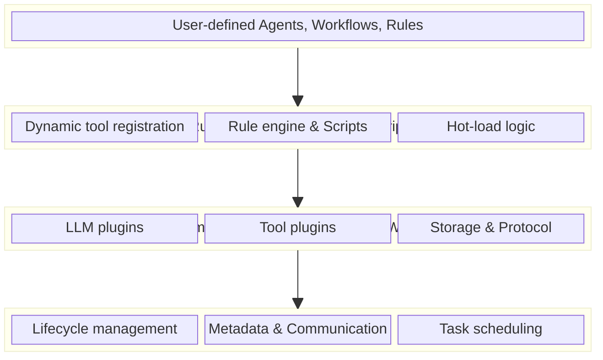

  <h1>MoFA Agent Framework</h1>
  

    The first production-grade framework to achieve **"write once, run everywhere"** across languages,
    built for extreme performance, boundless extensibility, and runtime programmability.
  

## What is MoFA?

MoFA (Modular Framework for Agents) is a revolutionary AI agent framework built in Rust that combines blazing performance with dynamic flexibility. Through its microkernel architecture and innovative dual-layer plugin system, MoFA strikes the perfect balance between raw performance and runtime adaptability.

<CardGroup cols={2}>
  <Card title="Quick start" icon="rocket" href="/quickstart">
    Get from zero to a running agent in under 10 minutes
  </Card>
  <Card title="Installation" icon="download" href="/installation">
    Install MoFA and set up your development environment
  </Card>
  <Card title="Architecture" icon="diagram-project" href="/architecture">
    Learn about the microkernel and dual-layer plugin system
  </Card>
  <Card title="Examples" icon="code" href="https://github.com/mofa-org/mofa/tree/main/examples">
    Browse 27+ ready-to-run examples
  </Card>
</CardGroup>

## What sets MoFA apart

<CardGroup cols={2}>
  <Card title="Extreme performance" icon="gauge-high">
    Built in Rust with zero-cost abstractions and memory safety without garbage collection. Orders of magnitude faster than Python-based frameworks.
  </Card>
  
  <Card title="Write once, run everywhere" icon="globe">
    Auto-generated bindings for Python, Java, Go, Kotlin, and Swift via UniFFI. Call Rust core logic natively from any supported language with near-zero overhead.
  </Card>
  
  <Card title="Dual-layer plugins" icon="puzzle-piece">
    Combine compile-time Rust/WASM plugins for extreme performance with runtime Rhai scripts for hot-reloadable business logic. No recompilation needed for updates.
  </Card>
  
  <Card title="Runtime programmability" icon="wand-magic-sparkles">
    Embedded Rhai scripting engine enables hot-reload of business logic, runtime configuration, rule adjustments, and user-defined extensions on the fly.
  </Card>
  
  <Card title="Microkernel architecture" icon="microchip">
    Clean separation of concerns with a minimal, stable kernel and modular components. Easy to extend and maintain.
  </Card>
  
  <Card title="Distributed by nature" icon="network-wired">
    Built on Dora-rs for distributed dataflow. Seamless cross-process, cross-machine agent communication. Edge computing ready.
  </Card>
</CardGroup>

## Core features

### Multi-agent coordination

MoFA supports 7 LLM-driven collaboration patterns:

- **Request-Response**: One-to-one deterministic tasks with synchronous replies
- **Publish-Subscribe**: One-to-many broadcast tasks with multiple receivers
- **Consensus**: Multi-round negotiation and voting for decision-making
- **Debate**: Multi-agent alternating discussion for quality improvement
- **Parallel**: Simultaneous execution with result aggregation
- **Sequential**: Pipeline execution where output flows to the next agent
- **Custom**: User-defined modes interpreted by the LLM

### ReAct pattern

Implement agents that combine reasoning and acting through a "Think-Act-Observe" cycle. Built-in tools for web search, calculations, string manipulation, JSON processing, and datetime operations.

### Secretary mode

Human-in-the-loop workflow management with 5 phases:

1. **Receive ideas** → Record todos
2. **Clarify requirements** → Project documents
3. **Schedule dispatch** → Call execution agents
4. **Monitor feedback** → Push key decisions to humans
5. **Acceptance report** → Update todos

### LLM integration

Standardized LLM abstraction layer with built-in support for:

- OpenAI (GPT-4, GPT-4o)
- Anthropic (Claude)
- Google Gemini
- Any OpenAI-compatible endpoint (Ollama, vLLM, OpenRouter)

### Persistence layer

Multiple database backends:

- PostgreSQL
- MySQL
- SQLite
- In-memory storage

Automatic session management and stateful memory for agents.

## Architecture overview

MoFA uses a layered microkernel architecture:

### Dual-layer plugin advantages

**Compile-time plugins** (Rust/WASM):
- Extreme performance, zero runtime overhead
- Type safety, compile-time error checking
- Support complex system calls and native integration
- WASM sandbox provides secure isolation

**Runtime plugins** (Rhai scripts):
- No recompilation needed, instant effect
- Business logic hot updates
- User-defined extensions
- Secure sandbox execution with configurable resource limits

**Combined power**:
- Use Rust plugins for performance-critical paths (LLM inference, data processing)
- Use Rhai scripts for business logic (rule engines, workflow orchestration)
- Seamless interoperability between both layers

## Why Rust?

<CardGroup cols={3}>
  <Card title="Memory safety" icon="shield-halved">
    No garbage collection, no null pointer exceptions, no data races
  </Card>
  <Card title="Zero-cost abstractions" icon="bolt">
    High-level features with C-like performance
  </Card>
  <Card title="Fearless concurrency" icon="gears">
    Actor-model concurrency via Ractor for high-load workloads
  </Card>
</CardGroup>

## Use cases

<Tabs>
  <Tab title="Research assistants">
    Build agents that search the web, query Wikipedia, perform calculations, and synthesize information from multiple sources.
  </Tab>
  <Tab title="Business automation">
    Create secretary agents that manage tasks, schedule work, coordinate with execution agents, and report progress to humans.
  </Tab>
  <Tab title="Multi-agent systems">
    Implement complex workflows with multiple specialized agents collaborating through various patterns (parallel, sequential, debate, consensus).
  </Tab>
  <Tab title="Edge computing">
    Deploy distributed agents across machines with Dora-rs runtime support for low-latency communication.
  </Tab>
  <Tab title="Production applications">
    Build production-grade systems with monitoring, persistence, distributed tracing, and comprehensive error handling.
  </Tab>
</Tabs>

## Community and support

<CardGroup cols={2}>
  <Card title="GitHub" icon="github" href="https://github.com/mofa-org/mofa">
    Star the repo, report issues, and contribute
  </Card>
  <Card title="Discord" icon="discord" href="https://discord.com/invite/hKJZzDMMm9">
    Join our community for help and discussions
  </Card>
  <Card title="GSoC 2026" icon="graduation-cap" href="https://github.com/mofa-org/GSoC">
    Participate in Google Summer of Code with MoFA
  </Card>
  <Card title="API docs" icon="book" href="https://docs.rs/mofa-sdk">
    Browse the complete Rust API documentation
  </Card>
</CardGroup>

## Next steps

<Steps>
  <Step title="Install MoFA">
    Set up Rust and install the MoFA framework
    
    [Installation guide →](/installation)
  </Step>
  
  <Step title="Build your first agent">
    Follow the quick start guide to create a working agent
    
    [Quick start →](/quickstart)
  </Step>
  
  <Step title="Explore examples">
    Browse 27+ examples covering all framework features
    
    [View examples →](https://github.com/mofa-org/mofa/tree/main/examples)
  </Step>
  
  <Step title="Join the community">
    Get help and share your projects
    
    [Join Discord →](https://discord.com/invite/hKJZzDMMm9)
  </Step>
</Steps>

---

<Note>
**License**: MoFA is open source under the Apache License 2.0
</Note>