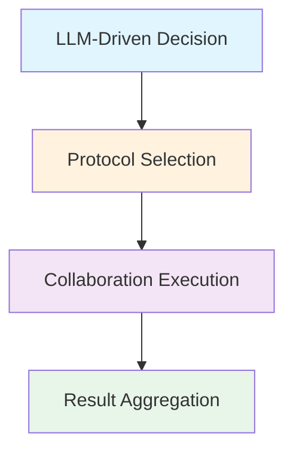

# Multi-Agent Collaboration Patterns

MoFA provides a comprehensive set of collaboration protocols that enable intelligent multi-agent coordination. All collaboration patterns support **optional LLM integration** for intelligent decision-making and natural language understanding.

## Architecture

The collaboration system follows a layered architecture:



## Core Collaboration Modes

MoFA supports seven standard collaboration patterns, each optimized for specific use cases:

<CardGroup cols={2}>
  <Card title="Request-Response" icon="message" href="/multi-agent/request-response">
    One-to-one deterministic tasks with synchronous replies
  </Card>
  
  <Card title="Publish-Subscribe" icon="broadcast-tower" href="/multi-agent/pub-sub">
    One-to-many broadcast tasks with multiple receivers
  </Card>
  
  <Card title="Consensus" icon="users" href="/multi-agent/consensus">
    Multi-round negotiation and voting for decision-making
  </Card>
  
  <Card title="Debate" icon="comments" href="/multi-agent/debate">
    Agents alternate speaking to iteratively refine results
  </Card>
  
  <Card title="Parallel" icon="layer-group" href="/multi-agent/parallel-sequential">
    Simultaneous execution with automatic result aggregation
  </Card>
  
  <Card title="Sequential" icon="arrow-right" href="/multi-agent/parallel-sequential">
    Pipeline execution where output flows to the next agent
  </Card>
  
  <Card title="Secretary Pattern" icon="user-tie" href="/multi-agent/secretary-pattern">
    Human-in-the-loop workflow management with 5-phase execution
  </Card>
</CardGroup>

## Key Features

### LLM-Driven Collaboration

All protocols support **optional LLM integration**:

- **Intelligent Protocol Selection**: LLM analyzes task description and selects the most appropriate collaboration mode
- **Natural Language Processing**: Protocols can process and understand natural language messages
- **Decision Context Recording**: LLM reasoning and decision-making process is tracked

```rust
use mofa_sdk::collaboration::{
    RequestResponseProtocol, LLMClient
};
use std::sync::Arc;

// Create LLM-enabled protocol
let protocol = RequestResponseProtocol::with_llm(
    "agent_001",
    llm_client.clone()
);

// Or create protocol without LLM (fast path)
let protocol = RequestResponseProtocol::new("agent_001");
```

### Protocol Registry

Manage and discover available collaboration protocols:

```rust
use mofa_sdk::collaboration::{
    LLMDrivenCollaborationManager,
    RequestResponseProtocol,
    PublishSubscribeProtocol
};

let manager = LLMDrivenCollaborationManager::new("agent_001");

// Register protocols
manager.register_protocol(Arc::new(
    RequestResponseProtocol::new("agent_001")
)).await?;

manager.register_protocol(Arc::new(
    PublishSubscribeProtocol::new("agent_001")
)).await?;

// Execute task with specific protocol
let result = manager.execute_task_with_protocol(
    "request_response",
    "Process this data: [1, 2, 3]"
).await?;
```

### Collaboration Messages

Standardized message format for inter-agent communication:

```rust
use mofa_sdk::collaboration::{
    CollaborationMessage,
    CollaborationContent,
    CollaborationMode
};

// Create a collaboration message
let msg = CollaborationMessage::new(
    "agent_001".to_string(),
    CollaborationContent::Text("Analyze this dataset".to_string()),
    CollaborationMode::RequestResponse
)
.with_receiver("agent_002".to_string())
.with_metadata("priority".to_string(), "high".to_string());

// Send via protocol
protocol.send_message(msg).await?;
```

## When to Use Each Pattern

<AccordionGroup>
  <Accordion title="Request-Response" icon="message">
    **Best for:**
    - Data query and processing
    - Deterministic task execution
    - Simple Q&A scenarios
    - Status retrieval
    
    **Characteristics:**
    - Synchronous communication
    - One sender, one receiver
    - Guaranteed response
  </Accordion>
  
  <Accordion title="Publish-Subscribe" icon="broadcast-tower">
    **Best for:**
    - Creative generation tasks
    - Event broadcasting
    - Notification distribution
    - Multi-party collaboration
    
    **Characteristics:**
    - Asynchronous communication
    - One publisher, multiple subscribers
    - Topic-based routing
  </Accordion>
  
  <Accordion title="Consensus" icon="users">
    **Best for:**
    - Decision-making processes
    - Voting and evaluation
    - Proposal selection
    - Quality review
    
    **Characteristics:**
    - Multi-round negotiation
    - Threshold-based agreement
    - Democratic decision-making
  </Accordion>
  
  <Accordion title="Debate" icon="comments">
    **Best for:**
    - Code review
    - Solution optimization
    - Dispute resolution
    - Iterative quality improvement
    
    **Characteristics:**
    - Turn-based discussion
    - Multiple rounds of refinement
    - Constructive criticism
  </Accordion>
  
  <Accordion title="Parallel" icon="layer-group">
    **Best for:**
    - Data analysis
    - Batch processing
    - Distributed search
    - Independent subtask execution
    
    **Characteristics:**
    - Simultaneous execution
    - Result aggregation
    - No dependencies between tasks
  </Accordion>
  
  <Accordion title="Sequential" icon="arrow-right">
    **Best for:**
    - Pipeline processing
    - Dependent task chains
    - Step-by-step workflows
    - Phased execution
    
    **Characteristics:**
    - Serial execution
    - Output flows to next agent
    - Dependency management
  </Accordion>
  
  <Accordion title="Secretary Pattern" icon="user-tie">
    **Best for:**
    - Complex project management
    - Human-in-the-loop workflows
    - Multi-phase task orchestration
    - Critical decision points
    
    **Characteristics:**
    - 5-phase workflow
    - Human intervention points
    - Task tracking and reporting
    - Intelligent agent scheduling
  </Accordion>
</AccordionGroup>

## Complete Example

```rust
use mofa_sdk::collaboration::{
    LLMDrivenCollaborationManager,
    RequestResponseProtocol,
    PublishSubscribeProtocol,
    ConsensusProtocol,
    CollaborationContent
};
use mofa_sdk::llm::{LLMClient, openai_from_env};
use std::sync::Arc;

#[tokio::main]
async fn main() -> Result<(), Box<dyn std::error::Error>> {
    // Create LLM client (optional)
    let provider = openai_from_env()?;
    let llm_client = Arc::new(LLMClient::new(Arc::new(provider)));
    
    // Create collaboration manager
    let manager = LLMDrivenCollaborationManager::new("agent_001");
    
    // Register LLM-enabled protocols
    manager.register_protocol(Arc::new(
        RequestResponseProtocol::with_llm("agent_001", llm_client.clone())
    )).await?;
    
    manager.register_protocol(Arc::new(
        PublishSubscribeProtocol::with_llm("agent_001", llm_client.clone())
    )).await?;
    
    manager.register_protocol(Arc::new(
        ConsensusProtocol::with_llm("agent_001", llm_client.clone())
    )).await?;
    
    // Execute task with automatic protocol selection
    let result = manager.execute_task_with_protocol(
        "request_response",
        CollaborationContent::Text(
            "Analyze customer feedback data and provide insights".to_string()
        )
    ).await?;
    
    println!("Success: {}", result.success);
    println!("Mode: {:?}", result.mode);
    println!("Duration: {}ms", result.duration_ms);
    
    if let Some(decision_ctx) = result.decision_context {
        println!("LLM Reasoning: {}", decision_ctx.reasoning);
        println!("Confidence: {}", decision_ctx.confidence);
    }
    
    Ok(())
}
```

## Next Steps

<CardGroup cols={2}>
  <Card title="Request-Response Pattern" icon="message" href="/multi-agent/request-response">
    Learn about one-to-one deterministic communication
  </Card>
  
  <Card title="Publish-Subscribe Pattern" icon="broadcast-tower" href="/multi-agent/pub-sub">
    Explore one-to-many event broadcasting
  </Card>
  
  <Card title="Consensus Mechanism" icon="users" href="/multi-agent/consensus">
    Implement multi-agent decision-making
  </Card>
  
  <Card title="Secretary Pattern" icon="user-tie" href="/multi-agent/secretary-pattern">
    Build human-in-the-loop workflows
  </Card>
</CardGroup>
