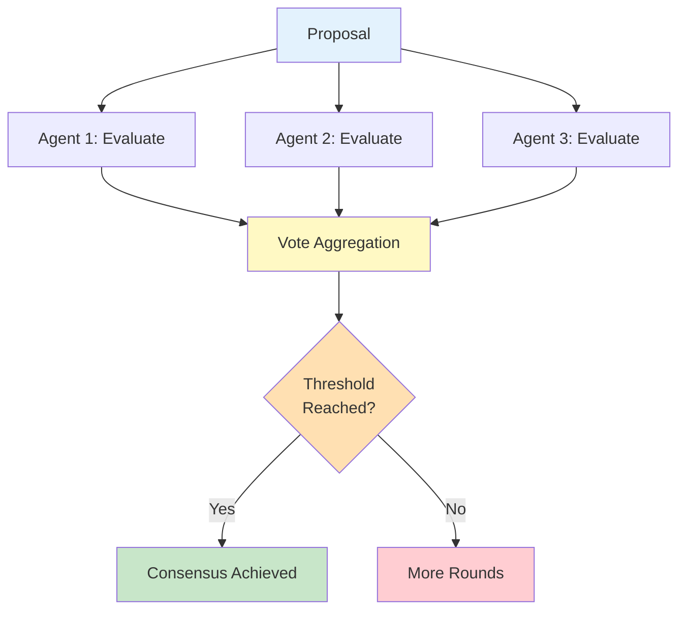

# Consensus Mechanism Pattern

The Consensus pattern enables **multi-agent collaborative decision-making** through negotiation, voting, and threshold-based agreement. Multiple agents contribute their perspectives to reach a collective decision.

## Overview

This pattern implements democratic decision-making among agents:

1. **Proposal** is submitted to all participating agents
2. **Each agent** evaluates and provides input
3. **Votes/opinions** are collected and aggregated
4. **Consensus threshold** determines if agreement is reached
5. **Final decision** is derived from collective input



<Note>
The Consensus protocol supports **optional LLM integration** for intelligent analysis and voting.
</Note>

## When to Use

<CardGroup cols={2}>
  <Card title="Decision Making" icon="gavel">
    Important choices requiring multiple perspectives
  </Card>
  
  <Card title="Quality Review" icon="star">
    Evaluate quality with multiple expert opinions
  </Card>
  
  <Card title="Proposal Selection" icon="check-to-slot">
    Choose from multiple competing options
  </Card>
  
  <Card title="Risk Assessment" icon="shield">
    Collective evaluation of risks and trade-offs
  </Card>
</CardGroup>

## Basic Usage

### Creating a Consensus Protocol

```rust
use mofa_sdk::collaboration::{
    ConsensusProtocol,
    CollaborationMessage,
    CollaborationMode,
    CollaborationContent
};
use std::sync::Arc;

// Create consensus protocol (threshold default: 0.7)
let protocol = Arc::new(ConsensusProtocol::new("decision_maker"));

// Create decision proposal
let proposal = CollaborationMessage::new(
    "proposer",
    CollaborationContent::Mixed {
        text: "Should we proceed with the new architecture?".to_string(),
        data: serde_json::json!({
            "proposal_id": "arch_001",
            "options": ["approve", "reject", "modify"],
            "context": "Microservices migration proposal"
        })
    },
    CollaborationMode::Consensus
);

// Submit for consensus
protocol.send_message(proposal).await?;
let result = protocol.process_message(
    protocol.receive_message().await?.unwrap()
).await?;

if result.success {
    println!("Consensus reached in {}ms", result.duration_ms);
}
```

### LLM-Enhanced Consensus

```rust
use mofa_sdk::collaboration::ConsensusProtocol;
use mofa_sdk::llm::{LLMClient, openai_from_env};
use std::sync::Arc;

#[tokio::main]
async fn main() -> Result<(), Box<dyn std::error::Error>> {
    // Create LLM client
    let provider = openai_from_env()?;
    let llm_client = Arc::new(LLMClient::new(Arc::new(provider)));
    
    // Create LLM-enabled consensus protocol
    let protocol = Arc::new(ConsensusProtocol::with_llm(
        "intelligent_voter",
        llm_client.clone()
    ));
    
    // LLM will analyze proposals and provide reasoned votes
    let proposal = CollaborationMessage::new(
        "proposer",
        "Evaluate the security implications of using JWT tokens",
        CollaborationMode::Consensus
    );
    
    protocol.send_message(proposal).await?;
    
    if let Some(msg) = protocol.receive_message().await? {
        let result = protocol.process_message(msg).await?;
        
        if let Some(data) = result.data {
            if let CollaborationContent::LLMResponse { reasoning, conclusion, .. } = data {
                println!("LLM Analysis: {}", reasoning);
                println!("LLM Vote: {}", conclusion);
            }
        }
    }
    
    Ok(())
}
```

## Multi-Agent Consensus

### Simple Voting Example

```rust
use mofa_sdk::collaboration::{
    ConsensusProtocol,
    CollaborationMessage,
    CollaborationContent,
    CollaborationMode
};
use std::sync::Arc;
use std::collections::HashMap;

async fn simple_vote() -> Result<(), Box<dyn std::error::Error>> {
    // Create multiple voting agents
    let agents = vec![
        Arc::new(ConsensusProtocol::new("agent_1")),
        Arc::new(ConsensusProtocol::new("agent_2")),
        Arc::new(ConsensusProtocol::new("agent_3")),
        Arc::new(ConsensusProtocol::new("agent_4")),
        Arc::new(ConsensusProtocol::new("agent_5")),
    ];
    
    // Proposal to vote on
    let proposal = CollaborationMessage::new(
        "coordinator",
        CollaborationContent::Data(serde_json::json!({
            "question": "Approve deployment to production?",
            "options": ["approve", "reject", "delay"],
            "details": {
                "tests_passed": true,
                "code_review_approved": true,
                "performance_benchmarks_met": true
            }
        })),
        CollaborationMode::Consensus
    );
    
    // Collect votes from all agents
    let mut votes = HashMap::new();
    for agent in &agents {
        agent.send_message(proposal.clone()).await?;
        
        if let Some(msg) = agent.receive_message().await? {
            let result = agent.process_message(msg).await?;
            
            if let Some(data) = result.data {
                let vote = data.to_text();
                *votes.entry(vote).or_insert(0) += 1;
            }
        }
    }
    
    // Tally votes
    println!("Vote results: {:?}", votes);
    
    // Check if threshold is met (>70%)
    let total_votes = votes.values().sum::<i32>() as f32;
    for (option, count) in votes {
        let percentage = (count as f32 / total_votes) * 100.0;
        println!("  {}: {:.1}%", option, percentage);
        
        if percentage >= 70.0 {
            println!("✅ Consensus reached: {}", option);
        }
    }
    
    Ok(())
}
```

## Real-World Examples

### Code Merge Decision

<Tabs>
  <Tab title="Setup">
    ```rust
    use mofa_sdk::collaboration::{
        ConsensusProtocol,
        CollaborationMessage,
        CollaborationContent,
        CollaborationMode
    };
    use mofa_sdk::llm::{LLMClient, openai_from_env};
    use std::sync::Arc;
    
    struct CodeReviewPanel {
        security_expert: Arc<ConsensusProtocol>,
        performance_expert: Arc<ConsensusProtocol>,
        code_quality_expert: Arc<ConsensusProtocol>,
        domain_expert: Arc<ConsensusProtocol>,
    }
    
    impl CodeReviewPanel {
        async fn new(llm_client: Arc<LLMClient>) -> Self {
            Self {
                security_expert: Arc::new(ConsensusProtocol::with_llm(
                    "security_expert",
                    llm_client.clone()
                )),
                performance_expert: Arc::new(ConsensusProtocol::with_llm(
                    "performance_expert",
                    llm_client.clone()
                )),
                code_quality_expert: Arc::new(ConsensusProtocol::with_llm(
                    "quality_expert",
                    llm_client.clone()
                )),
                domain_expert: Arc::new(ConsensusProtocol::with_llm(
                    "domain_expert",
                    llm_client.clone()
                )),
            }
        }
    }
    ```
  </Tab>
  
  <Tab title="Review Process">
    ```rust
    impl CodeReviewPanel {
        async fn review_pull_request(
            &self,
            pr_number: u32,
            code_diff: &str
        ) -> Result<bool, Box<dyn std::error::Error>> {
            let proposal = CollaborationMessage::new(
                "review_coordinator",
                CollaborationContent::Mixed {
                    text: format!("Review PR #{} for merge approval", pr_number),
                    data: serde_json::json!({
                        "pr_number": pr_number,
                        "diff": code_diff,
                        "files_changed": 12,
                        "lines_added": 234,
                        "lines_removed": 156
                    })
                },
                CollaborationMode::Consensus
            );
            
            // Collect expert opinions
            let mut approvals = 0;
            let mut total_reviewers = 0;
            
            // Security review
            self.security_expert.send_message(proposal.clone()).await?;
            if let Some(msg) = self.security_expert.receive_message().await? {
                let result = self.security_expert.process_message(msg).await?;
                if result.success {
                    approvals += 1;
                }
                total_reviewers += 1;
            }
            
            // Performance review
            self.performance_expert.send_message(proposal.clone()).await?;
            if let Some(msg) = self.performance_expert.receive_message().await? {
                let result = self.performance_expert.process_message(msg).await?;
                if result.success {
                    approvals += 1;
                }
                total_reviewers += 1;
            }
            
            // Code quality review
            self.code_quality_expert.send_message(proposal.clone()).await?;
            if let Some(msg) = self.code_quality_expert.receive_message().await? {
                let result = self.code_quality_expert.process_message(msg).await?;
                if result.success {
                    approvals += 1;
                }
                total_reviewers += 1;
            }
            
            // Domain expertise review
            self.domain_expert.send_message(proposal).await?;
            if let Some(msg) = self.domain_expert.receive_message().await? {
                let result = self.domain_expert.process_message(msg).await?;
                if result.success {
                    approvals += 1;
                }
                total_reviewers += 1;
            }
            
            // Check consensus (75% threshold)
            let approval_rate = approvals as f32 / total_reviewers as f32;
            let consensus_reached = approval_rate >= 0.75;
            
            println!("Review Results:");
            println!("  Approvals: {}/{}", approvals, total_reviewers);
            println!("  Approval Rate: {:.1}%", approval_rate * 100.0);
            println!("  Consensus: {}", 
                if consensus_reached { "✅ APPROVED" } else { "❌ REJECTED" }
            );
            
            Ok(consensus_reached)
        }
    }
    ```
  </Tab>
  
  <Tab title="Usage">
    ```rust
    #[tokio::main]
    async fn main() -> Result<(), Box<dyn std::error::Error>> {
        let provider = openai_from_env()?;
        let llm_client = Arc::new(LLMClient::new(Arc::new(provider)));
        
        let panel = CodeReviewPanel::new(llm_client).await;
        
        let code_diff = r#"
    diff --git a/src/auth.rs b/src/auth.rs
    +fn validate_token(token: &str) -> Result<Claims, AuthError> {
    +    let validation = Validation::default();
    +    decode::<Claims>(token, &DecodingKey::from_secret(SECRET), &validation)
    +        .map(|data| data.claims)
    +        .map_err(|_| AuthError::InvalidToken)
    +}
    "#;
        
        let approved = panel.review_pull_request(123, code_diff).await?;
        
        if approved {
            println!("\n🎉 PR approved by consensus! Proceeding with merge.");
        } else {
            println!("\n⚠️ PR needs revision. Consensus not reached.");
        }
        
        Ok(())
    }
    ```
  </Tab>
</Tabs>

### Architecture Decision Record (ADR)

```rust
use mofa_sdk::collaboration::{
    ConsensusProtocol,
    LLMDrivenCollaborationManager,
    CollaborationContent
};
use std::sync::Arc;

async fn architecture_decision() -> Result<(), Box<dyn std::error::Error>> {
    let manager = LLMDrivenCollaborationManager::new("architecture_board");
    
    // Register consensus protocol
    manager.register_protocol(Arc::new(
        ConsensusProtocol::new("architecture_board")
    )).await?;
    
    // Propose architectural change
    let adr = CollaborationContent::Data(serde_json::json!({
        "title": "ADR-001: Migrate to Event-Driven Architecture",
        "context": "Current monolithic architecture is difficult to scale",
        "decision": "Adopt event-driven microservices architecture",
        "consequences": {
            "pros": [
                "Better scalability",
                "Improved fault isolation",
                "Technology diversity"
            ],
            "cons": [
                "Increased complexity",
                "Distributed system challenges",
                "Higher operational overhead"
            ]
        },
        "alternatives": [
            "Continue with monolith + optimization",
            "Modular monolith approach",
            "Hybrid architecture"
        ]
    }));
    
    let result = manager.execute_task_with_protocol(
        "consensus",
        adr
    ).await?;
    
    println!("ADR Decision:");
    println!("  Status: {}", if result.success { "Approved" } else { "Rejected" });
    println!("  Participants: {:?}", result.participants);
    println!("  Duration: {}ms", result.duration_ms);
    
    Ok(())
}
```

## Multi-Round Consensus

Implement iterative consensus with multiple negotiation rounds:

```rust
use mofa_sdk::collaboration::{
    ConsensusProtocol,
    CollaborationMessage,
    CollaborationMode
};
use std::sync::Arc;

async fn multi_round_consensus() -> Result<(), Box<dyn std::error::Error>> {
    let protocol = Arc::new(ConsensusProtocol::new("negotiator"));
    
    let max_rounds = 3;
    let threshold = 0.75;
    
    for round in 1..=max_rounds {
        println!("\n=== Round {} ===", round);
        
        let proposal = CollaborationMessage::new(
            "coordinator",
            format!("Proposal iteration {}", round),
            CollaborationMode::Consensus
        );
        
        protocol.send_message(proposal).await?;
        
        if let Some(msg) = protocol.receive_message().await? {
            let result = protocol.process_message(msg).await?;
            
            // Check if consensus reached
            if result.success {
                println!("✅ Consensus reached in round {}", round);
                break;
            } else if round < max_rounds {
                println!("⚠️ No consensus yet, proceeding to round {}", round + 1);
                // Refine proposal based on feedback
            } else {
                println!("❌ Failed to reach consensus after {} rounds", max_rounds);
            }
        }
    }
    
    Ok(())
}
```

## Weighted Voting

Implement voting with different agent weights:

```rust
use std::collections::HashMap;

struct WeightedVote {
    agent_id: String,
    vote: String,
    weight: f32,
    reasoning: String,
}

async fn weighted_consensus() -> Result<(), Box<dyn std::error::Error>> {
    // Define agent weights (expertise-based)
    let weights: HashMap<String, f32> = HashMap::from([
        ("senior_architect".to_string(), 2.0),
        ("tech_lead".to_string(), 1.5),
        ("developer_1".to_string(), 1.0),
        ("developer_2".to_string(), 1.0),
    ]);
    
    let votes = vec![
        WeightedVote {
            agent_id: "senior_architect".to_string(),
            vote: "approve".to_string(),
            weight: 2.0,
            reasoning: "Architecture is sound".to_string(),
        },
        WeightedVote {
            agent_id: "tech_lead".to_string(),
            vote: "approve".to_string(),
            weight: 1.5,
            reasoning: "Meets technical requirements".to_string(),
        },
        WeightedVote {
            agent_id: "developer_1".to_string(),
            vote: "reject".to_string(),
            weight: 1.0,
            reasoning: "Concerns about complexity".to_string(),
        },
        WeightedVote {
            agent_id: "developer_2".to_string(),
            vote: "approve".to_string(),
            weight: 1.0,
            reasoning: "Good solution".to_string(),
        },
    ];
    
    // Calculate weighted votes
    let mut vote_totals: HashMap<String, f32> = HashMap::new();
    let mut total_weight = 0.0;
    
    for vote in &votes {
        *vote_totals.entry(vote.vote.clone()).or_insert(0.0) += vote.weight;
        total_weight += vote.weight;
    }
    
    println!("Weighted Vote Results:");
    for (option, weight) in &vote_totals {
        let percentage = (weight / total_weight) * 100.0;
        println!("  {}: {:.1}% (weight: {:.1})", option, percentage, weight);
    }
    
    // Determine winner
    if let Some((winner, weight)) = vote_totals.iter().max_by(|a, b| a.1.partial_cmp(b.1).unwrap()) {
        let percentage = (weight / total_weight) * 100.0;
        if percentage >= 70.0 {
            println!("\n✅ Weighted consensus reached: {} ({:.1}%)", winner, percentage);
        } else {
            println!("\n❌ No consensus: highest vote {} at {:.1}%", winner, percentage);
        }
    }
    
    Ok(())
}
```

## Best Practices

<Steps>
  <Step title="Set Appropriate Thresholds">
    Choose consensus thresholds based on decision importance:
    
    - **Simple decisions**: 50% (simple majority)
    - **Important decisions**: 70% (strong majority) - default
    - **Critical decisions**: 90%+ (near unanimous)
    
    ```rust
    // Configure threshold in protocol implementation
    // Default is 0.7 (70%)
    ```
  </Step>
  
  <Step title="Limit Consensus Rounds">
    Prevent infinite negotiation loops:
    
    ```rust
    const MAX_ROUNDS: usize = 5;
    const TIMEOUT_SECONDS: u64 = 300; // 5 minutes
    ```
  </Step>
  
  <Step title="Provide Context">
    Include comprehensive decision context:
    
    ```rust
    let proposal = CollaborationContent::Data(serde_json::json!({
        "question": "Clear decision question",
        "context": "Relevant background information",
        "options": ["option1", "option2", "option3"],
        "criteria": "Decision criteria",
        "deadline": "2024-12-31"
    }));
    ```
  </Step>
  
  <Step title="Track Decision Rationale">
    Record why each agent voted a certain way:
    
    ```rust
    if let CollaborationContent::LLMResponse { reasoning, conclusion, .. } = data {
        println!("Agent: {}", agent_id);
        println!("Vote: {}", conclusion);
        println!("Reasoning: {}", reasoning);
    }
    ```
  </Step>
</Steps>

## See Also

<CardGroup cols={2}>
  <Card title="Debate Pattern" icon="comments" href="/multi-agent/debate">
    For iterative refinement through discussion
  </Card>
  
  <Card title="Request-Response" icon="message" href="/multi-agent/request-response">
    For simple decision queries
  </Card>
  
  <Card title="Collaboration Overview" icon="diagram-project" href="/multi-agent/collaboration-patterns">
    Return to patterns overview
  </Card>
  
  <Card title="LLM Integration" icon="brain" href="/llm/overview">
    Learn about LLM-powered decision-making
  </Card>
</CardGroup>
