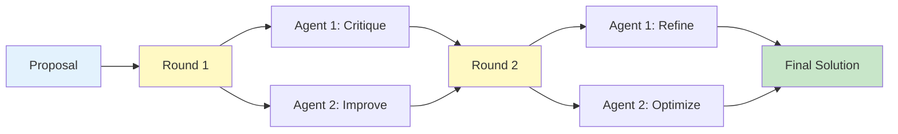

# Debate Pattern

The Debate pattern enables **multi-agent iterative refinement** through structured discussion. Agents alternate presenting arguments, counter-arguments, and improvements over multiple rounds to reach an optimized solution.

## Overview

This pattern implements a turn-based discussion model:

1. **Initial proposal** is presented
2. **Agents take turns** providing feedback and alternatives
3. **Each round** builds on previous discussions
4. **Refinement continues** until convergence or max rounds
5. **Final solution** incorporates insights from all participants



<Note>
The Debate protocol supports **LLM integration** for intelligent argumentation and refinement.
</Note>

## When to Use

<CardGroup cols={2}>
  <Card title="Code Review" icon="code">
    Iterative improvement of code quality
  </Card>
  
  <Card title="Solution Optimization" icon="chart-line">
    Refine technical approaches through discussion
  </Card>
  
  <Card title="Dispute Resolution" icon="scale-balanced">
    Resolve conflicting viewpoints constructively
  </Card>
  
  <Card title="Quality Improvement" icon="star">
    Enhance deliverables through multiple perspectives
  </Card>
</CardGroup>

## Basic Usage

### Creating a Debate Protocol

```rust
use mofa_sdk::collaboration::{
    DebateProtocol,
    CollaborationMessage,
    CollaborationMode,
    CollaborationContent
};
use std::sync::Arc;

// Create debate protocol (default: 3 rounds)
let protocol = Arc::new(DebateProtocol::new("debater_001"));

// Create initial proposal
let proposal = CollaborationMessage::new(
    "proposer",
    "Proposal: Use microservices architecture for the new system",
    CollaborationMode::Debate
);

// Start debate
protocol.send_message(proposal).await?;

if let Some(msg) = protocol.receive_message().await? {
    let result = protocol.process_message(msg).await?;
    println!("Round 1 response in {}ms", result.duration_ms);
}
```

### LLM-Enhanced Debate

```rust
use mofa_sdk::collaboration::DebateProtocol;
use mofa_sdk::llm::{LLMClient, openai_from_env};
use std::sync::Arc;

#[tokio::main]
async fn main() -> Result<(), Box<dyn std::error::Error>> {
    let provider = openai_from_env()?;
    let llm_client = Arc::new(LLMClient::new(Arc::new(provider)));
    
    // Create LLM-enabled debate protocol
    let protocol = Arc::new(DebateProtocol::with_llm(
        "intelligent_debater",
        llm_client.clone()
    ));
    
    // LLM will provide constructive criticism and improvements
    let proposal = CollaborationMessage::new(
        "proposer",
        "Design proposal: Client-side state management approach",
        CollaborationMode::Debate
    );
    
    protocol.send_message(proposal).await?;
    
    if let Some(msg) = protocol.receive_message().await? {
        let result = protocol.process_message(msg).await?;
        
        if let Some(CollaborationContent::LLMResponse { 
            reasoning, 
            conclusion, 
            .. 
        }) = result.data {
            println!("LLM Critique: {}", reasoning);
            println!("Suggested Improvement: {}", conclusion);
        }
    }
    
    Ok(())
}
```

## Multi-Round Debate

### Code Review Debate

```rust
use mofa_sdk::collaboration::{
    DebateProtocol,
    CollaborationMessage,
    CollaborationContent,
    CollaborationMode
};
use mofa_sdk::llm::{LLMClient, openai_from_env};
use std::sync::Arc;

async fn code_review_debate() -> Result<(), Box<dyn std::error::Error>> {
    let provider = openai_from_env()?;
    let llm_client = Arc::new(LLMClient::new(Arc::new(provider)));
    
    // Create debaters with different perspectives
    let security_expert = Arc::new(DebateProtocol::with_llm(
        "security_expert",
        llm_client.clone()
    ));
    
    let performance_expert = Arc::new(DebateProtocol::with_llm(
        "performance_expert",
        llm_client.clone()
    ));
    
    let code_to_review = r#"
fn authenticate_user(username: &str, password: &str) -> bool {
    let stored_hash = database::get_password_hash(username);
    stored_hash == hash_password(password)
}
"#;
    
    let max_rounds = 3;
    let mut current_version = code_to_review.to_string();
    
    for round in 1..=max_rounds {
        println!("\n=== Round {} ===", round);
        
        // Security expert critique
        let security_msg = CollaborationMessage::new(
            "security_expert",
            CollaborationContent::Mixed {
                text: format!("Security review (Round {})", round),
                data: serde_json::json!({
                    "code": current_version,
                    "focus": "security vulnerabilities"
                })
            },
            CollaborationMode::Debate
        );
        
        security_expert.send_message(security_msg).await?;
        
        if let Some(msg) = security_expert.receive_message().await? {
            let result = security_expert.process_message(msg).await?;
            
            if let Some(data) = result.data {
                println!("Security Expert: {}", data.to_text());
            }
        }
        
        // Performance expert critique
        let perf_msg = CollaborationMessage::new(
            "performance_expert",
            CollaborationContent::Mixed {
                text: format!("Performance review (Round {})", round),
                data: serde_json::json!({
                    "code": current_version,
                    "focus": "performance optimization"
                })
            },
            CollaborationMode::Debate
        );
        
        performance_expert.send_message(perf_msg).await?;
        
        if let Some(msg) = performance_expert.receive_message().await? {
            let result = performance_expert.process_message(msg).await?;
            
            if let Some(data) = result.data {
                println!("Performance Expert: {}", data.to_text());
            }
        }
        
        // In a real implementation, incorporate feedback into next round
    }
    
    println!("\nDebate concluded after {} rounds", max_rounds);
    
    Ok(())
}
```

## Real-World Examples

### API Design Debate

<Tabs>
  <Tab title="Setup">
    ```rust
    use mofa_sdk::collaboration::DebateProtocol;
    use mofa_sdk::llm::{LLMClient, openai_from_env};
    use std::sync::Arc;
    
    struct DesignDebate {
        round: usize,
        max_rounds: usize,
        participants: Vec<Arc<DebateProtocol>>,
        current_design: serde_json::Value,
    }
    
    impl DesignDebate {
        async fn new(
            max_rounds: usize,
            initial_design: serde_json::Value,
            llm_client: Arc<LLMClient>
        ) -> Self {
            let participants = vec![
                Arc::new(DebateProtocol::with_llm(
                    "rest_expert",
                    llm_client.clone()
                )),
                Arc::new(DebateProtocol::with_llm(
                    "graphql_expert",
                    llm_client.clone()
                )),
                Arc::new(DebateProtocol::with_llm(
                    "developer_experience",
                    llm_client.clone()
                )),
            ];
            
            Self {
                round: 0,
                max_rounds,
                participants,
                current_design: initial_design,
            }
        }
    }
    ```
  </Tab>
  
  <Tab title="Debate Loop">
    ```rust
    impl DesignDebate {
        async fn run(&mut self) -> Result<serde_json::Value, Box<dyn std::error::Error>> {
            while self.round < self.max_rounds {
                self.round += 1;
                println!("\n=== Debate Round {} ===", self.round);
                
                let mut critiques = Vec::new();
                
                // Each participant provides feedback
                for participant in &self.participants {
                    let msg = CollaborationMessage::new(
                        "moderator",
                        CollaborationContent::Data(self.current_design.clone()),
                        CollaborationMode::Debate
                    );
                    
                    participant.send_message(msg).await?;
                    
                    if let Some(response) = participant.receive_message().await? {
                        let result = participant.process_message(response).await?;
                        
                        if let Some(data) = result.data {
                            critiques.push(data);
                        }
                    }
                }
                
                // Synthesize feedback (in real implementation, use LLM)
                println!("Received {} critiques", critiques.len());
                
                // Check for convergence
                if self.has_converged(&critiques) {
                    println!("Debate converged at round {}", self.round);
                    break;
                }
                
                // Incorporate feedback for next round
                self.incorporate_feedback(critiques).await?;
            }
            
            Ok(self.current_design.clone())
        }
        
        fn has_converged(&self, critiques: &[CollaborationContent]) -> bool {
            // Check if critiques are minor or all positive
            critiques.iter().all(|c| {
                c.to_text().to_lowercase().contains("approved")
                || c.to_text().to_lowercase().contains("minor")
            })
        }
        
        async fn incorporate_feedback(
            &mut self,
            critiques: Vec<CollaborationContent>
        ) -> Result<(), Box<dyn std::error::Error>> {
            // Synthesize critiques and update design
            println!("Incorporating feedback into next iteration...");
            Ok(())
        }
    }
    ```
  </Tab>
  
  <Tab title="Usage">
    ```rust
    #[tokio::main]
    async fn main() -> Result<(), Box<dyn std::error::Error>> {
        let provider = openai_from_env()?;
        let llm_client = Arc::new(LLMClient::new(Arc::new(provider)));
        
        let initial_api_design = serde_json::json!({
            "name": "User API",
            "version": "v1",
            "endpoints": [
                {
                    "path": "/users",
                    "method": "GET",
                    "description": "List all users"
                },
                {
                    "path": "/users/:id",
                    "method": "GET",
                    "description": "Get user by ID"
                }
            ]
        });
        
        let mut debate = DesignDebate::new(
            5, // max rounds
            initial_api_design,
            llm_client
        ).await;
        
        let final_design = debate.run().await?;
        
        println!("\n=== Final Design ===");
        println!("{}", serde_json::to_string_pretty(&final_design)?);
        
        Ok(())
    }
    ```
  </Tab>
</Tabs>

### Architecture Decision Debate

```rust
use mofa_sdk::collaboration::{
    DebateProtocol,
    CollaborationMessage,
    CollaborationContent,
    CollaborationMode
};
use std::sync::Arc;

struct ArchitectureProposal {
    title: String,
    description: String,
    pros: Vec<String>,
    cons: Vec<String>,
    alternatives: Vec<String>,
}

async fn architecture_debate(
    proposal: ArchitectureProposal
) -> Result<(), Box<dyn std::error::Error>> {
    let debaters = vec![
        Arc::new(DebateProtocol::new("scalability_expert")),
        Arc::new(DebateProtocol::new("maintainability_expert")),
        Arc::new(DebateProtocol::new("cost_expert")),
    ];
    
    let proposal_data = serde_json::json!({
        "title": proposal.title,
        "description": proposal.description,
        "pros": proposal.pros,
        "cons": proposal.cons,
        "alternatives": proposal.alternatives
    });
    
    for round in 1..=3 {
        println!("\n=== Round {}: Architecture Review ===", round);
        
        for (i, debater) in debaters.iter().enumerate() {
            let focus_area = match i {
                0 => "scalability",
                1 => "maintainability",
                2 => "cost-effectiveness",
                _ => "general"
            };
            
            let msg = CollaborationMessage::new(
                format!("debater_{}", i),
                CollaborationContent::Mixed {
                    text: format!("Evaluate from {} perspective", focus_area),
                    data: proposal_data.clone()
                },
                CollaborationMode::Debate
            );
            
            debater.send_message(msg).await?;
            
            if let Some(response) = debater.receive_message().await? {
                let result = debater.process_message(response).await?;
                
                if let Some(data) = result.data {
                    println!("  {} Expert: {}", 
                        focus_area.to_uppercase(), 
                        data.to_text()
                    );
                }
            }
        }
    }
    
    Ok(())
}
```

## Advanced Debate Patterns

### Structured Argumentation

```rust
use serde::{Serialize, Deserialize};

#[derive(Debug, Clone, Serialize, Deserialize)]
struct Argument {
    claim: String,
    evidence: Vec<String>,
    reasoning: String,
    counter_arguments: Vec<String>,
}

#[derive(Debug, Clone, Serialize, Deserialize)]
struct DebatePosition {
    agent_id: String,
    round: usize,
    stance: String, // "support", "oppose", "neutral"
    arguments: Vec<Argument>,
    confidence: f32,
}

async fn structured_debate() -> Result<(), Box<dyn std::error::Error>> {
    let positions = vec![
        DebatePosition {
            agent_id: "agent_1".to_string(),
            round: 1,
            stance: "support".to_string(),
            arguments: vec![
                Argument {
                    claim: "Microservices improve scalability".to_string(),
                    evidence: vec![
                        "Independent scaling of services".to_string(),
                        "Better resource utilization".to_string(),
                    ],
                    reasoning: "Each service can scale independently based on demand".to_string(),
                    counter_arguments: vec![],
                }
            ],
            confidence: 0.8,
        },
        DebatePosition {
            agent_id: "agent_2".to_string(),
            round: 1,
            stance: "oppose".to_string(),
            arguments: vec![
                Argument {
                    claim: "Microservices add complexity".to_string(),
                    evidence: vec![
                        "Distributed system challenges".to_string(),
                        "Increased operational overhead".to_string(),
                    ],
                    reasoning: "Complexity can outweigh benefits for small teams".to_string(),
                    counter_arguments: vec![
                        "Tools can mitigate operational complexity".to_string(),
                    ],
                }
            ],
            confidence: 0.7,
        },
    ];
    
    // Analyze positions
    for position in &positions {
        println!("\nAgent: {} ({})", position.agent_id, position.stance);
        println!("Confidence: {:.1}%", position.confidence * 100.0);
        println!("Arguments:");
        for arg in &position.arguments {
            println!("  Claim: {}", arg.claim);
            println!("  Evidence: {:?}", arg.evidence);
            println!("  Reasoning: {}", arg.reasoning);
        }
    }
    
    Ok(())
}
```

### Debate Moderation

```rust
use mofa_sdk::collaboration::{
    DebateProtocol,
    CollaborationMessage,
    CollaborationMode
};
use std::sync::Arc;

struct DebateModerator {
    max_rounds: usize,
    participants: Vec<Arc<DebateProtocol>>,
    history: Vec<CollaborationMessage>,
}

impl DebateModerator {
    fn new(max_rounds: usize) -> Self {
        Self {
            max_rounds,
            participants: Vec::new(),
            history: Vec::new(),
        }
    }
    
    fn add_participant(&mut self, participant: Arc<DebateProtocol>) {
        self.participants.push(participant);
    }
    
    async fn moderate(
        &mut self,
        topic: &str
    ) -> Result<CollaborationContent, Box<dyn std::error::Error>> {
        let mut current_proposal = CollaborationContent::Text(topic.to_string());
        
        for round in 1..=self.max_rounds {
            println!("\n=== Round {} ===", round);
            
            let mut round_feedback = Vec::new();
            
            // Each participant responds
            for participant in &self.participants {
                let msg = CollaborationMessage::new(
                    "moderator",
                    current_proposal.clone(),
                    CollaborationMode::Debate
                );
                
                // Record in history
                self.history.push(msg.clone());
                
                participant.send_message(msg).await?;
                
                if let Some(response) = participant.receive_message().await? {
                    let result = participant.process_message(response).await?;
                    
                    if let Some(data) = result.data {
                        round_feedback.push(data);
                    }
                }
            }
            
            // Synthesize feedback
            current_proposal = self.synthesize_feedback(round_feedback)?;
            
            // Check for convergence
            if self.check_convergence(round) {
                println!("Debate converged at round {}", round);
                break;
            }
        }
        
        Ok(current_proposal)
    }
    
    fn synthesize_feedback(
        &self,
        feedback: Vec<CollaborationContent>
    ) -> Result<CollaborationContent, Box<dyn std::error::Error>> {
        // Combine all feedback into next iteration
        let combined = feedback
            .iter()
            .map(|f| f.to_text())
            .collect::<Vec<_>>()
            .join("\n\n");
        
        Ok(CollaborationContent::Text(combined))
    }
    
    fn check_convergence(&self, round: usize) -> bool {
        // Simple convergence check
        round >= self.max_rounds
    }
}
```

## Using with Collaboration Manager

```rust
use mofa_sdk::collaboration::{
    LLMDrivenCollaborationManager,
    DebateProtocol,
    CollaborationContent
};
use std::sync::Arc;

#[tokio::main]
async fn main() -> Result<(), Box<dyn std::error::Error>> {
    let manager = LLMDrivenCollaborationManager::new("debate_coordinator");
    
    // Register debate protocol
    manager.register_protocol(Arc::new(
        DebateProtocol::new("debate_coordinator")
    )).await?;
    
    // Start debate on a topic
    let result = manager.execute_task_with_protocol(
        "debate",
        CollaborationContent::Data(serde_json::json!({
            "topic": "Best database choice for high-throughput application",
            "options": ["PostgreSQL", "MongoDB", "Cassandra"],
            "criteria": ["throughput", "consistency", "operational_complexity"]
        }))
    ).await?;
    
    println!("Debate result: {}", result.success);
    println!("Duration: {}ms", result.duration_ms);
    println!("Rounds completed: {}", result.participants.len());
    
    Ok(())
}
```

## Best Practices

<Steps>
  <Step title="Limit Debate Rounds">
    Set reasonable limits to prevent endless discussion:
    
    ```rust
    const MAX_ROUNDS: usize = 5;
    const ROUND_TIMEOUT_SECONDS: u64 = 120;
    ```
  </Step>
  
  <Step title="Define Clear Criteria">
    Establish evaluation criteria upfront:
    
    ```rust
    let criteria = vec![
        "Performance impact",
        "Maintainability",
        "Security implications",
        "Cost considerations"
    ];
    ```
  </Step>
  
  <Step title="Track Evolution">
    Record how proposals evolve:
    
    ```rust
    let mut version_history = Vec::new();
    version_history.push((round, proposal.clone()));
    ```
  </Step>
  
  <Step title="Moderate Discussions">
    Implement a moderator to guide the debate:
    
    ```rust
    let moderator = DebateModerator::new(5);
    moderator.add_participant(debater_1);
    moderator.add_participant(debater_2);
    let final_result = moderator.moderate("topic").await?;
    ```
  </Step>
</Steps>

## See Also

<CardGroup cols={2}>
  <Card title="Consensus Pattern" icon="users" href="/multi-agent/consensus">
    For voting-based decision-making
  </Card>
  
  <Card title="Sequential Pattern" icon="arrow-right" href="/multi-agent/parallel-sequential">
    For step-by-step refinement
  </Card>
  
  <Card title="Collaboration Overview" icon="diagram-project" href="/multi-agent/collaboration-patterns">
    Return to patterns overview
  </Card>
  
  <Card title="LLM Integration" icon="brain" href="/llm/overview">
    Learn about LLM-powered argumentation
  </Card>
</CardGroup>
