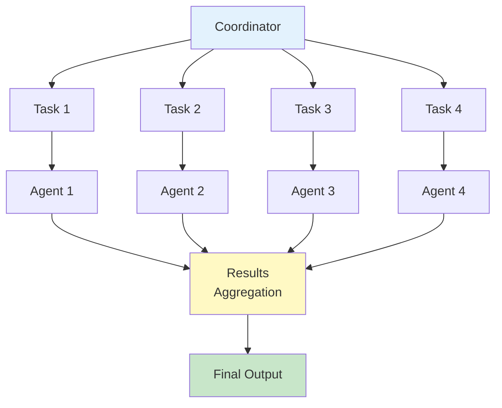
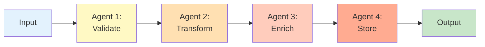

# Parallel and Sequential Patterns

MoFA provides two complementary patterns for task orchestration: **Parallel** for concurrent execution of independent tasks, and **Sequential** for pipeline processing of dependent task chains.

## Pattern Comparison

<CardGroup cols={2}>
  <Card title="Parallel Pattern" icon="layer-group">
    Simultaneous execution of independent tasks with result aggregation
  </Card>
  
  <Card title="Sequential Pattern" icon="arrow-right">
    Step-by-step execution where each task depends on previous results
  </Card>
</CardGroup>

---

## Parallel Pattern

The Parallel pattern enables **concurrent task execution** across multiple agents, maximizing throughput and resource utilization.

### Architecture



### When to Use Parallel

- **Data Analysis**: Process multiple datasets simultaneously
- **Batch Processing**: Execute independent operations in parallel
- **Distributed Search**: Query multiple sources concurrently
- **Map-Reduce**: Parallel data processing followed by aggregation

### Basic Parallel Usage

```rust
use mofa_sdk::collaboration::{
    ParallelProtocol,
    CollaborationMessage,
    CollaborationMode,
    CollaborationContent
};
use std::sync::Arc;

// Create parallel protocol (default: 4 workers)
let protocol = Arc::new(ParallelProtocol::new("coordinator"));

// Create parallel task
let task = CollaborationMessage::new(
    "coordinator",
    CollaborationContent::Data(serde_json::json!({
        "action": "analyze",
        "data_chunks": [
            {"id": 1, "data": "chunk_1"},
            {"id": 2, "data": "chunk_2"},
            {"id": 3, "data": "chunk_3"},
            {"id": 4, "data": "chunk_4"}
        ]
    })),
    CollaborationMode::Parallel
);

protocol.send_message(task).await?;

if let Some(msg) = protocol.receive_message().await? {
    let result = protocol.process_message(msg).await?;
    println!("Parallel processing completed in {}ms", result.duration_ms);
}
```

### LLM-Enhanced Parallel Processing

```rust
use mofa_sdk::collaboration::ParallelProtocol;
use mofa_sdk::llm::{LLMClient, openai_from_env};
use std::sync::Arc;

#[tokio::main]
async fn main() -> Result<(), Box<dyn std::error::Error>> {
    let provider = openai_from_env()?;
    let llm_client = Arc::new(LLMClient::new(Arc::new(provider)));
    
    // Create LLM-enabled parallel protocol
    let protocol = Arc::new(ParallelProtocol::with_llm(
        "parallel_coordinator",
        llm_client.clone()
    ));
    
    // LLM will intelligently distribute and process tasks
    let documents = vec![
        "Document 1: Customer feedback about product quality...",
        "Document 2: Market analysis report...",
        "Document 3: Competitor pricing strategy...",
        "Document 4: Internal team feedback..."
    ];
    
    let task = CollaborationMessage::new(
        "coordinator",
        CollaborationContent::Data(serde_json::json!({
            "action": "analyze_sentiment",
            "documents": documents
        })),
        CollaborationMode::Parallel
    );
    
    protocol.send_message(task).await?;
    
    if let Some(msg) = protocol.receive_message().await? {
        let result = protocol.process_message(msg).await?;
        
        if let Some(data) = result.data {
            println!("Analysis results: {}", data.to_text());
        }
    }
    
    Ok(())
}
```

### Real-World Parallel Examples

#### Data Processing Pipeline

```rust
use mofa_sdk::collaboration::{
    ParallelProtocol,
    CollaborationMessage,
    CollaborationContent,
    CollaborationMode
};
use std::sync::Arc;
use tokio::task;

async fn parallel_data_processing() -> Result<(), Box<dyn std::error::Error>> {
    let protocol = Arc::new(ParallelProtocol::new("data_processor"));
    
    // Simulate large dataset split into chunks
    let data_chunks: Vec<_> = (0..10)
        .map(|i| serde_json::json!({
            "chunk_id": i,
            "data": format!("data_chunk_{}", i),
            "size_mb": 100
        }))
        .collect();
    
    let task = CollaborationMessage::new(
        "coordinator",
        CollaborationContent::Data(serde_json::json!({
            "operation": "transform_and_validate",
            "chunks": data_chunks
        })),
        CollaborationMode::Parallel
    );
    
    let start = std::time::Instant::now();
    
    protocol.send_message(task).await?;
    
    if let Some(msg) = protocol.receive_message().await? {
        let result = protocol.process_message(msg).await?;
        
        let duration = start.elapsed();
        println!("Processed 10 chunks in parallel");
        println!("Total time: {:.2}s", duration.as_secs_f64());
        println!("Success: {}", result.success);
    }
    
    Ok(())
}
```

#### Multi-Source Search

```rust
use mofa_sdk::collaboration::{
    ParallelProtocol,
    CollaborationMessage,
    CollaborationContent,
    CollaborationMode
};
use std::sync::Arc;

async fn parallel_search() -> Result<(), Box<dyn std::error::Error>> {
    let protocol = Arc::new(ParallelProtocol::new("search_coordinator"));
    
    let search_sources = vec![
        ("database", "SELECT * FROM docs WHERE title LIKE '%rust%'"),
        ("elasticsearch", "{ \"query\": { \"match\": { \"content\": \"rust\" } } }"),
        ("filesystem", "find . -name '*.rs' -exec grep 'async' {} \\;"),
        ("api", "GET /search?q=rust&type=code")
    ];
    
    let task = CollaborationMessage::new(
        "search_coordinator",
        CollaborationContent::Data(serde_json::json!({
            "query": "rust programming",
            "sources": search_sources
        })),
        CollaborationMode::Parallel
    );
    
    protocol.send_message(task).await?;
    
    if let Some(msg) = protocol.receive_message().await? {
        let result = protocol.process_message(msg).await?;
        
        println!("Search completed across {} sources", search_sources.len());
        println!("Participants: {:?}", result.participants);
    }
    
    Ok(())
}
```

---

## Sequential Pattern

The Sequential pattern implements **pipeline processing** where tasks execute in order, with each task receiving the output of the previous one.

### Architecture



### When to Use Sequential

- **Data Pipelines**: Transform data through multiple stages
- **Workflow Orchestration**: Execute dependent tasks in order
- **Request Processing**: Chain of processing steps
- **Validation Chains**: Multi-stage validation and enrichment

### Basic Sequential Usage

```rust
use mofa_sdk::collaboration::{
    SequentialProtocol,
    CollaborationMessage,
    CollaborationMode,
    CollaborationContent
};
use std::sync::Arc;

// Create sequential protocol
let protocol = Arc::new(SequentialProtocol::new("pipeline_coordinator"));

// Create sequential task
let task = CollaborationMessage::new(
    "coordinator",
    CollaborationContent::Data(serde_json::json!({
        "pipeline": "data_processing",
        "stages": [
            {"name": "validate", "agent": "validator"},
            {"name": "transform", "agent": "transformer"},
            {"name": "enrich", "agent": "enricher"},
            {"name": "store", "agent": "storage"}
        ],
        "input_data": {"user_id": 123, "action": "purchase"}
    })),
    CollaborationMode::Sequential
);

protocol.send_message(task).await?;

if let Some(msg) = protocol.receive_message().await? {
    let result = protocol.process_message(msg).await?;
    println!("Pipeline completed in {}ms", result.duration_ms);
}
```

### LLM-Enhanced Sequential Processing

```rust
use mofa_sdk::collaboration::SequentialProtocol;
use mofa_sdk::llm::{LLMClient, openai_from_env};
use std::sync::Arc;

#[tokio::main]
async fn main() -> Result<(), Box<dyn std::error::Error>> {
    let provider = openai_from_env()?;
    let llm_client = Arc::new(LLMClient::new(Arc::new(provider)));
    
    // Create LLM-enabled sequential protocol
    let protocol = Arc::new(SequentialProtocol::with_llm(
        "intelligent_pipeline",
        llm_client.clone()
    ));
    
    // LLM will process each stage intelligently
    let content = "User feedback: The app crashes when I try to upload large files.";
    
    let task = CollaborationMessage::new(
        "coordinator",
        CollaborationContent::Mixed {
            text: "Process customer feedback through pipeline".to_string(),
            data: serde_json::json!({
                "stages": [
                    "classify_issue_type",
                    "extract_key_details",
                    "determine_severity",
                    "route_to_team",
                    "generate_response"
                ],
                "content": content
            })
        },
        CollaborationMode::Sequential
    );
    
    protocol.send_message(task).await?;
    
    if let Some(msg) = protocol.receive_message().await? {
        let result = protocol.process_message(msg).await?;
        
        if let Some(data) = result.data {
            println!("Pipeline output: {}", data.to_text());
        }
    }
    
    Ok(())
}
```

### Real-World Sequential Examples

#### ETL Pipeline

<Tabs>
  <Tab title="Extract">
    ```rust
    use mofa_sdk::collaboration::{
        SequentialProtocol,
        CollaborationMessage,
        CollaborationContent,
        CollaborationMode
    };
    
    async fn extract_stage() -> Result<CollaborationContent, Box<dyn std::error::Error>> {
        println!("Stage 1: Extract data from source");
        
        // Simulate data extraction
        let extracted_data = serde_json::json!({
            "records": [
                {"id": 1, "name": "Alice", "status": "active"},
                {"id": 2, "name": "Bob", "status": "inactive"},
                {"id": 3, "name": "Charlie", "status": "active"}
            ],
            "metadata": {
                "source": "production_db",
                "timestamp": "2024-01-15T10:30:00Z",
                "count": 3
            }
        });
        
        Ok(CollaborationContent::Data(extracted_data))
    }
    ```
  </Tab>
  
  <Tab title="Transform">
    ```rust
    async fn transform_stage(
        input: CollaborationContent
    ) -> Result<CollaborationContent, Box<dyn std::error::Error>> {
        println!("Stage 2: Transform data");
        
        // Parse input from previous stage
        let input_data = match input {
            CollaborationContent::Data(data) => data,
            _ => return Err("Invalid input format".into())
        };
        
        // Transform data
        let transformed = serde_json::json!({
            "records": input_data["records"].as_array()
                .unwrap()
                .iter()
                .filter(|r| r["status"] == "active")
                .map(|r| {
                    serde_json::json!({
                        "user_id": r["id"],
                        "user_name": r["name"],
                        "is_active": true,
                        "processed_at": chrono::Utc::now().to_rfc3339()
                    })
                })
                .collect::<Vec<_>>(),
            "metadata": {
                "stage": "transform",
                "filtered_count": 2
            }
        });
        
        Ok(CollaborationContent::Data(transformed))
    }
    ```
  </Tab>
  
  <Tab title="Load">
    ```rust
    async fn load_stage(
        input: CollaborationContent
    ) -> Result<CollaborationContent, Box<dyn std::error::Error>> {
        println!("Stage 3: Load data to destination");
        
        let input_data = match input {
            CollaborationContent::Data(data) => data,
            _ => return Err("Invalid input format".into())
        };
        
        // Simulate loading to database
        let record_count = input_data["records"].as_array().unwrap().len();
        
        println!("Loaded {} records to data warehouse", record_count);
        
        Ok(CollaborationContent::Data(serde_json::json!({
            "status": "success",
            "records_loaded": record_count,
            "destination": "data_warehouse",
            "completed_at": chrono::Utc::now().to_rfc3339()
        })))
    }
    ```
  </Tab>
  
  <Tab title="Pipeline">
    ```rust
    async fn run_etl_pipeline() -> Result<(), Box<dyn std::error::Error>> {
        println!("Starting ETL Pipeline\n");
        
        let start = std::time::Instant::now();
        
        // Stage 1: Extract
        let extracted = extract_stage().await?;
        println!("Extract completed\n");
        
        // Stage 2: Transform
        let transformed = transform_stage(extracted).await?;
        println!("Transform completed\n");
        
        // Stage 3: Load
        let result = load_stage(transformed).await?;
        println!("Load completed\n");
        
        let duration = start.elapsed();
        println!("ETL Pipeline Summary:");
        println!("  Total time: {:.2}s", duration.as_secs_f64());
        println!("  Result: {}", result.to_text());
        
        Ok(())
    }
    ```
  </Tab>
</Tabs>

#### Content Moderation Pipeline

```rust
use mofa_sdk::collaboration::{
    SequentialProtocol,
    CollaborationMessage,
    CollaborationContent,
    CollaborationMode
};
use mofa_sdk::llm::{LLMClient, openai_from_env};
use std::sync::Arc;

async fn content_moderation_pipeline() -> Result<(), Box<dyn std::error::Error>> {
    let provider = openai_from_env()?;
    let llm_client = Arc::new(LLMClient::new(Arc::new(provider)));
    
    let protocol = Arc::new(SequentialProtocol::with_llm(
        "moderation_pipeline",
        llm_client.clone()
    ));
    
    let user_content = "This is a sample user-generated comment...";
    
    let task = CollaborationMessage::new(
        "moderator",
        CollaborationContent::Data(serde_json::json!({
            "content": user_content,
            "stages": [
                {
                    "name": "spam_detection",
                    "description": "Check for spam patterns"
                },
                {
                    "name": "toxicity_analysis",
                    "description": "Analyze for toxic language"
                },
                {
                    "name": "pii_detection",
                    "description": "Detect personally identifiable information"
                },
                {
                    "name": "policy_compliance",
                    "description": "Check against community guidelines"
                },
                {
                    "name": "final_decision",
                    "description": "Approve, flag, or reject content"
                }
            ]
        })),
        CollaborationMode::Sequential
    );
    
    protocol.send_message(task).await?;
    
    if let Some(msg) = protocol.receive_message().await? {
        let result = protocol.process_message(msg).await?;
        
        println!("Moderation complete:");
        println!("  Success: {}", result.success);
        println!("  Duration: {}ms", result.duration_ms);
        
        if let Some(data) = result.data {
            println!("  Decision: {}", data.to_text());
        }
    }
    
    Ok(())
}
```

## Combining Parallel and Sequential

### Map-Reduce Pattern

```rust
use mofa_sdk::collaboration::{
    ParallelProtocol,
    SequentialProtocol,
    CollaborationMessage,
    CollaborationContent,
    CollaborationMode
};
use std::sync::Arc;

async fn map_reduce() -> Result<(), Box<dyn std::error::Error>> {
    // Step 1: Parallel map phase
    let parallel_protocol = Arc::new(ParallelProtocol::new("mapper"));
    
    let map_task = CollaborationMessage::new(
        "coordinator",
        CollaborationContent::Data(serde_json::json!({
            "operation": "map",
            "chunks": [
                {"id": 1, "data": [1, 2, 3, 4, 5]},
                {"id": 2, "data": [6, 7, 8, 9, 10]},
                {"id": 3, "data": [11, 12, 13, 14, 15]}
            ],
            "map_fn": "square" // x => x * x
        })),
        CollaborationMode::Parallel
    );
    
    parallel_protocol.send_message(map_task).await?;
    
    let map_results = if let Some(msg) = parallel_protocol.receive_message().await? {
        let result = parallel_protocol.process_message(msg).await?;
        result.data
    } else {
        None
    };
    
    // Step 2: Sequential reduce phase
    let sequential_protocol = Arc::new(SequentialProtocol::new("reducer"));
    
    let reduce_task = CollaborationMessage::new(
        "coordinator",
        CollaborationContent::Data(serde_json::json!({
            "operation": "reduce",
            "map_results": map_results,
            "reduce_fn": "sum" // (acc, x) => acc + x
        })),
        CollaborationMode::Sequential
    );
    
    sequential_protocol.send_message(reduce_task).await?;
    
    if let Some(msg) = sequential_protocol.receive_message().await? {
        let result = sequential_protocol.process_message(msg).await?;
        
        println!("Map-Reduce completed:");
        println!("  Duration: {}ms", result.duration_ms);
        if let Some(data) = result.data {
            println!("  Final result: {}", data.to_text());
        }
    }
    
    Ok(())
}
```

## Using with Collaboration Manager

```rust
use mofa_sdk::collaboration::{
    LLMDrivenCollaborationManager,
    ParallelProtocol,
    SequentialProtocol
};
use std::sync::Arc;

#[tokio::main]
async fn main() -> Result<(), Box<dyn std::error::Error>> {
    let manager = LLMDrivenCollaborationManager::new("orchestrator");
    
    // Register both protocols
    manager.register_protocol(Arc::new(
        ParallelProtocol::new("orchestrator")
    )).await?;
    
    manager.register_protocol(Arc::new(
        SequentialProtocol::new("orchestrator")
    )).await?;
    
    // Execute parallel task
    let parallel_result = manager.execute_task_with_protocol(
        "parallel",
        "Analyze multiple data sources simultaneously"
    ).await?;
    
    println!("Parallel execution: {}ms", parallel_result.duration_ms);
    
    // Execute sequential task
    let sequential_result = manager.execute_task_with_protocol(
        "sequential",
        "Process data through validation pipeline"
    ).await?;
    
    println!("Sequential execution: {}ms", sequential_result.duration_ms);
    
    // Get statistics
    let stats = manager.stats().await;
    println!("Total tasks: {}", stats.total_tasks);
    println!("Mode usage: {:?}", stats.mode_usage);
    
    Ok(())
}
```

## Best Practices

<Steps>
  <Step title="Choose the Right Pattern">
    - Use **Parallel** for independent tasks
    - Use **Sequential** for dependent tasks
    - Combine both for complex workflows
  </Step>
  
  <Step title="Handle Failures Gracefully">
    **Parallel**: Continue processing other tasks if one fails
    
    **Sequential**: Implement rollback or retry logic
    
    ```rust
    if !result.success {
        if let Some(error) = result.error {
            eprintln!("Stage failed: {}", error);
            // Implement retry or rollback
        }
    }
    ```
  </Step>
  
  <Step title="Monitor Performance">
    Track execution times for optimization:
    
    ```rust
    println!("Participants: {:?}", result.participants);
    println!("Duration: {}ms", result.duration_ms);
    ```
  </Step>
  
  <Step title="Optimize Resource Usage">
    **Parallel**: Set appropriate worker limits
    
    **Sequential**: Minimize data copying between stages
  </Step>
</Steps>

## See Also

<CardGroup cols={2}>
  <Card title="Publish-Subscribe" icon="broadcast-tower" href="/multi-agent/pub-sub">
    For event-driven parallel processing
  </Card>
  
  <Card title="Request-Response" icon="message" href="/multi-agent/request-response">
    For simple sequential chains
  </Card>
  
  <Card title="Collaboration Overview" icon="diagram-project" href="/multi-agent/collaboration-patterns">
    Return to patterns overview
  </Card>
  
  <Card title="Workflow Orchestration" icon="sitemap" href="/workflows/overview">
    Learn about advanced workflow patterns
  </Card>
</CardGroup>
