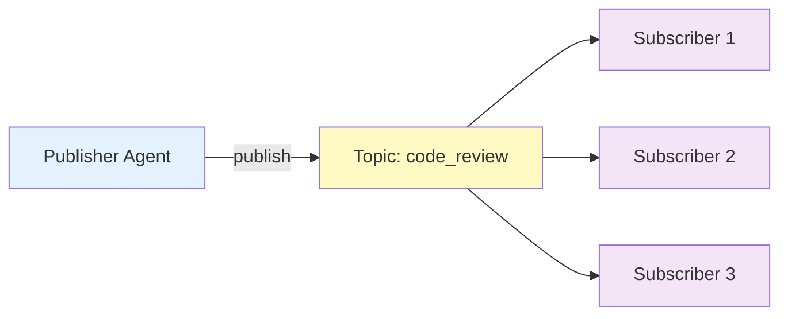

# Publish-Subscribe Pattern

The Publish-Subscribe pattern enables **one-to-many asynchronous communication** between agents through topic-based message routing. Publishers broadcast events without knowing who will receive them, while subscribers listen to topics of interest.

## Overview

This pattern implements an event-driven communication model:

1. **Agents subscribe** to topics they're interested in
2. **Publishers** broadcast messages to topics
3. **All subscribers** of that topic receive the message
4. **Subscribers process** messages independently



<Note>
The Publish-Subscribe protocol supports **optional LLM integration** for intelligent message interpretation and filtering.
</Note>

## When to Use

<CardGroup cols={2}>
  <Card title="Event Broadcasting" icon="tower-broadcast">
    Distribute notifications to multiple interested parties
  </Card>
  
  <Card title="Creative Generation" icon="lightbulb">
    Gather diverse perspectives from multiple agents
  </Card>
  
  <Card title="Notification Systems" icon="bell">
    Send alerts to all subscribed agents
  </Card>
  
  <Card title="Multi-Party Collaboration" icon="users">
    Enable agents to react to shared events
  </Card>
</CardGroup>

## Basic Usage

### Creating a Publisher

```rust
use mofa_sdk::collaboration::{
    PublishSubscribeProtocol,
    CollaborationMessage,
    CollaborationMode
};
use std::sync::Arc;

// Create protocol without LLM
let publisher = Arc::new(PublishSubscribeProtocol::new("publisher_001"));

// Create message with topic
let msg = CollaborationMessage::new(
    "publisher_001".to_string(),
    "New code review available: PR #123",
    CollaborationMode::PublishSubscribe
)
.with_topic("code_review".to_string())
.with_metadata("pr_number".to_string(), "123".to_string());

// Publish to topic
publisher.send_message(msg).await?;
```

### Creating Subscribers

```rust
use mofa_sdk::collaboration::PublishSubscribeProtocol;
use std::sync::Arc;

// Create subscriber protocol
let subscriber = Arc::new(PublishSubscribeProtocol::new("subscriber_001"));

// Subscribe to topics
subscriber.subscribe("code_review".to_string()).await?;
subscriber.subscribe("deployment".to_string()).await?;

// Listen for messages
while let Some(msg) = subscriber.receive_message().await? {
    println!("Received on topic {:?}: {}", 
        msg.topic, 
        msg.content.to_text()
    );
    
    // Process message
    let result = subscriber.process_message(msg).await?;
    println!("Processed in {}ms", result.duration_ms);
}
```

## LLM-Enhanced Pub/Sub

Enable intelligent message filtering and processing:

```rust
use mofa_sdk::collaboration::PublishSubscribeProtocol;
use mofa_sdk::llm::{LLMClient, openai_from_env};
use std::sync::Arc;

#[tokio::main]
async fn main() -> Result<(), Box<dyn std::error::Error>> {
    // Create LLM client
    let provider = openai_from_env()?;
    let llm_client = Arc::new(LLMClient::new(Arc::new(provider)));
    
    // Create LLM-enabled subscriber
    let subscriber = Arc::new(PublishSubscribeProtocol::with_llm(
        "intelligent_subscriber",
        llm_client.clone()
    ));
    
    subscriber.subscribe("code_review".to_string()).await?;
    
    // LLM will intelligently process messages
    if let Some(msg) = subscriber.receive_message().await? {
        let result = subscriber.process_message(msg).await?;
        
        // LLM generates intelligent response
        if let Some(data) = result.data {
            match data {
                CollaborationContent::LLMResponse { 
                    reasoning, 
                    conclusion, 
                    .. 
                } => {
                    println!("LLM Reasoning: {}", reasoning);
                    println!("LLM Conclusion: {}", conclusion);
                }
                _ => println!("Response: {}", data.to_text())
            }
        }
    }
    
    Ok(())
}
```

## Topic Management

### Dynamic Topic Subscription

```rust
use mofa_sdk::collaboration::PublishSubscribeProtocol;
use std::sync::Arc;

async fn manage_subscriptions() -> Result<(), Box<dyn std::error::Error>> {
    let subscriber = Arc::new(PublishSubscribeProtocol::new("agent_001"));
    
    // Subscribe to multiple topics
    let topics = vec![
        "code_review",
        "deployment",
        "security_alert",
        "performance_report"
    ];
    
    for topic in topics {
        subscriber.subscribe(topic.to_string()).await?;
        println!("Subscribed to: {}", topic);
    }
    
    // Check subscription stats
    let stats = subscriber.stats();
    println!("Subscription stats: {:?}", stats);
    
    Ok(())
}
```

### Topic Filtering with Metadata

```rust
use mofa_sdk::collaboration::{
    CollaborationMessage,
    CollaborationContent,
    CollaborationMode
};

let msg = CollaborationMessage::new(
    "publisher",
    CollaborationContent::Data(serde_json::json!({
        "event": "code_review",
        "pr_id": 123,
        "priority": "high"
    })),
    CollaborationMode::PublishSubscribe
)
.with_topic("code_review".to_string())
.with_metadata("priority".to_string(), "high".to_string())
.with_metadata("language".to_string(), "rust".to_string());

// Subscribers can filter based on metadata
if let Some(priority) = msg.metadata.get("priority") {
    if priority == "high" {
        println!("High priority message!");
    }
}
```

## Real-World Examples

### Build Notification System

<Tabs>
  <Tab title="Publisher">
    ```rust
    use mofa_sdk::collaboration::{
        PublishSubscribeProtocol,
        CollaborationMessage,
        CollaborationContent,
        CollaborationMode
    };
    use std::sync::Arc;
    
    async fn publish_build_event() -> Result<(), Box<dyn std::error::Error>> {
        let publisher = Arc::new(
            PublishSubscribeProtocol::new("ci_server")
        );
        
        // Build completed event
        let build_result = serde_json::json!({
            "build_id": "build_12345",
            "status": "success",
            "duration_seconds": 180,
            "branch": "main",
            "commit": "abc123",
            "tests_passed": 156,
            "tests_failed": 0
        });
        
        let msg = CollaborationMessage::new(
            "ci_server",
            CollaborationContent::Mixed {
                text: "Build completed successfully".to_string(),
                data: build_result
            },
            CollaborationMode::PublishSubscribe
        )
        .with_topic("build_events".to_string())
        .with_metadata("status".to_string(), "success".to_string());
        
        publisher.send_message(msg).await?;
        println!("Build notification published");
        
        Ok(())
    }
    ```
  </Tab>
  
  <Tab title="Subscriber: Slack Notifier">
    ```rust
    use mofa_sdk::collaboration::PublishSubscribeProtocol;
    use std::sync::Arc;
    
    async fn slack_notifier() -> Result<(), Box<dyn std::error::Error>> {
        let notifier = Arc::new(
            PublishSubscribeProtocol::new("slack_notifier")
        );
        
        notifier.subscribe("build_events".to_string()).await?;
        
        while let Some(msg) = notifier.receive_message().await? {
            // Only notify on failures
            if let Some(status) = msg.metadata.get("status") {
                if status == "failure" {
                    // Send Slack notification
                    send_slack_alert(&msg.content.to_text()).await?;
                }
            }
        }
        
        Ok(())
    }
    
    async fn send_slack_alert(message: &str) -> Result<(), Box<dyn std::error::Error>> {
        // Slack API integration
        println!("🔔 Slack alert: {}", message);
        Ok(())
    }
    ```
  </Tab>
  
  <Tab title="Subscriber: Dashboard">
    ```rust
    use mofa_sdk::collaboration::PublishSubscribeProtocol;
    use std::sync::Arc;
    
    async fn dashboard_updater() -> Result<(), Box<dyn std::error::Error>> {
        let dashboard = Arc::new(
            PublishSubscribeProtocol::new("dashboard")
        );
        
        dashboard.subscribe("build_events".to_string()).await?;
        
        while let Some(msg) = dashboard.receive_message().await? {
            // Update dashboard with all build events
            update_dashboard(&msg).await?;
        }
        
        Ok(())
    }
    
    async fn update_dashboard(
        msg: &CollaborationMessage
    ) -> Result<(), Box<dyn std::error::Error>> {
        println!("📊 Dashboard updated: {}", msg.content.to_text());
        Ok(())
    }
    ```
  </Tab>
</Tabs>

### Code Review Workflow

```rust
use mofa_sdk::collaboration::{
    PublishSubscribeProtocol,
    CollaborationMessage,
    CollaborationContent,
    CollaborationMode,
    LLMDrivenCollaborationManager
};
use mofa_sdk::llm::{LLMClient, openai_from_env};
use std::sync::Arc;

async fn code_review_workflow() -> Result<(), Box<dyn std::error::Error>> {
    let provider = openai_from_env()?;
    let llm_client = Arc::new(LLMClient::new(Arc::new(provider)));
    
    // Create review coordinator (publisher)
    let coordinator = Arc::new(
        PublishSubscribeProtocol::with_llm(
            "review_coordinator",
            llm_client.clone()
        )
    );
    
    // Create reviewers (subscribers)
    let security_reviewer = Arc::new(
        PublishSubscribeProtocol::with_llm(
            "security_reviewer",
            llm_client.clone()
        )
    );
    
    let performance_reviewer = Arc::new(
        PublishSubscribeProtocol::with_llm(
            "performance_reviewer",
            llm_client.clone()
        )
    );
    
    let style_reviewer = Arc::new(
        PublishSubscribeProtocol::with_llm(
            "style_reviewer",
            llm_client.clone()
        )
    );
    
    // Subscribe to review topic
    security_reviewer.subscribe("code_review".to_string()).await?;
    performance_reviewer.subscribe("code_review".to_string()).await?;
    style_reviewer.subscribe("code_review".to_string()).await?;
    
    // Publish code review request
    let code_snippet = r#"
fn process_user_input(input: &str) -> String {
    input.to_uppercase()
}
"#;
    
    let review_msg = CollaborationMessage::new(
        "review_coordinator",
        CollaborationContent::Mixed {
            text: "Please review this code for security, performance, and style".to_string(),
            data: serde_json::json!({
                "code": code_snippet,
                "language": "rust",
                "pr_number": 123
            })
        },
        CollaborationMode::PublishSubscribe
    ).with_topic("code_review".to_string());
    
    coordinator.send_message(review_msg).await?;
    
    println!("Code review request published to all reviewers");
    
    Ok(())
}
```

## Using with Collaboration Manager

```rust
use mofa_sdk::collaboration::{
    LLMDrivenCollaborationManager,
    PublishSubscribeProtocol,
    CollaborationContent
};
use std::sync::Arc;

#[tokio::main]
async fn main() -> Result<(), Box<dyn std::error::Error>> {
    let manager = LLMDrivenCollaborationManager::new("event_hub");
    
    // Register pub/sub protocol
    manager.register_protocol(Arc::new(
        PublishSubscribeProtocol::new("event_hub")
    )).await?;
    
    // Publish event via manager
    let result = manager.execute_task_with_protocol(
        "publish_subscribe",
        CollaborationContent::Data(serde_json::json!({
            "event_type": "deployment",
            "environment": "production",
            "service": "api-gateway",
            "version": "v2.3.1"
        }))
    ).await?;
    
    println!("Event published: success={}", result.success);
    
    // Get statistics
    let stats = manager.stats().await;
    println!("Total events published: {}", stats.total_tasks);
    
    Ok(())
}
```

## Advanced Patterns

### Topic Hierarchies

```rust
use mofa_sdk::collaboration::PublishSubscribeProtocol;

async fn hierarchical_topics() -> Result<(), Box<dyn std::error::Error>> {
    let subscriber = Arc::new(PublishSubscribeProtocol::new("multi_sub"));
    
    // Subscribe to hierarchical topics
    subscriber.subscribe("events.build".to_string()).await?;
    subscriber.subscribe("events.build.success".to_string()).await?;
    subscriber.subscribe("events.build.failure".to_string()).await?;
    subscriber.subscribe("events.deployment".to_string()).await?;
    
    // More specific topics take precedence
    while let Some(msg) = subscriber.receive_message().await? {
        match msg.topic.as_deref() {
            Some(topic) if topic.starts_with("events.build.failure") => {
                println!("❌ Build failed!");
            }
            Some(topic) if topic.starts_with("events.build.success") => {
                println!("✅ Build succeeded!");
            }
            Some(topic) if topic.starts_with("events.deployment") => {
                println!("🚀 Deployment event");
            }
            _ => println!("📨 Generic event")
        }
    }
    
    Ok(())
}
```

### Fan-Out/Fan-In Pattern

```rust
use mofa_sdk::collaboration::{
    PublishSubscribeProtocol,
    CollaborationMessage,
    CollaborationContent,
    CollaborationMode
};
use std::sync::Arc;
use tokio::sync::mpsc;

async fn fan_out_fan_in() -> Result<(), Box<dyn std::error::Error>> {
    // Fan-out: Publish to multiple workers
    let publisher = Arc::new(PublishSubscribeProtocol::new("coordinator"));
    
    let task_msg = CollaborationMessage::new(
        "coordinator",
        "Process dataset chunk",
        CollaborationMode::PublishSubscribe
    ).with_topic("data_processing".to_string());
    
    publisher.send_message(task_msg).await?;
    
    // Multiple workers subscribe and process
    let (result_tx, mut result_rx) = mpsc::channel(32);
    
    for i in 1..=5 {
        let worker = Arc::new(
            PublishSubscribeProtocol::new(&format!("worker_{}", i))
        );
        worker.subscribe("data_processing".to_string()).await?;
        
        let tx = result_tx.clone();
        tokio::spawn(async move {
            if let Some(msg) = worker.receive_message().await.ok().flatten() {
                let result = worker.process_message(msg).await;
                tx.send(result).await.ok();
            }
        });
    }
    
    drop(result_tx);
    
    // Fan-in: Collect results
    let mut results = Vec::new();
    while let Some(result) = result_rx.recv().await {
        results.push(result);
    }
    
    println!("Collected {} results", results.len());
    
    Ok(())
}
```

## Best Practices

<Steps>
  <Step title="Use Descriptive Topic Names">
    Choose clear, hierarchical topic names that describe the event type:
    
    ```rust
    // Good
    "events.ci.build.success"
    "notifications.security.alert"
    "metrics.performance.cpu"
    
    // Avoid
    "topic1"
    "events"
    "stuff"
    ```
  </Step>
  
  <Step title="Include Metadata for Filtering">
    Add metadata to enable subscribers to filter messages:
    
    ```rust
    let msg = msg
        .with_metadata("priority".to_string(), "high".to_string())
        .with_metadata("environment".to_string(), "production".to_string())
        .with_metadata("service".to_string(), "api".to_string());
    ```
  </Step>
  
  <Step title="Handle Back-Pressure">
    Implement flow control to prevent overwhelming subscribers:
    
    ```rust
    use tokio::sync::mpsc;
    
    let (tx, mut rx) = mpsc::channel(100); // Buffer size
    
    // If channel is full, messages will be dropped or publisher will block
    ```
  </Step>
  
  <Step title="Monitor Subscription Health">
    Track subscriber count and message delivery:
    
    ```rust
    let stats = protocol.stats();
    println!("Subscriptions: {:?}", stats.get("subscribed_topics"));
    ```
  </Step>
</Steps>

## See Also

<CardGroup cols={2}>
  <Card title="Request-Response" icon="message" href="/multi-agent/request-response">
    For synchronous one-to-one communication
  </Card>
  
  <Card title="Parallel Pattern" icon="layer-group" href="/multi-agent/parallel-sequential">
    For distributing work across agents
  </Card>
  
  <Card title="Collaboration Overview" icon="diagram-project" href="/multi-agent/collaboration-patterns">
    Return to patterns overview
  </Card>
  
  <Card title="LLM Integration" icon="brain" href="/llm/overview">
    Learn about LLM-powered filtering
  </Card>
</CardGroup>
