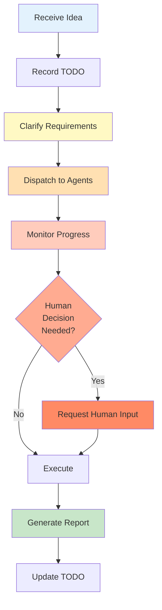

# Secretary Agent Pattern

The Secretary Agent pattern provides **human-in-the-loop workflow management** through a 5-phase execution cycle. It acts as an intelligent assistant that coordinates tasks, seeks human approval at critical decision points, and manages complex multi-agent workflows.

## Overview

The Secretary pattern implements an intelligent task management system:

1. **Receive Ideas** → Record and generate TODOs
2. **Clarify Requirements** → Convert ideas into project documents
3. **Schedule & Dispatch** → Assign tasks to execution agents
4. **Monitor Feedback** → Push critical decisions to humans
5. **Acceptance & Report** → Update TODOs and generate reports



<Note>
The Secretary pattern is ideal for complex projects requiring human oversight and intelligent agent coordination.
</Note>

## When to Use

<CardGroup cols={2}>
  <Card title="Project Management" icon="tasks">
    Coordinate multi-phase projects with human oversight
  </Card>
  
  <Card title="Critical Workflows" icon="exclamation-triangle">
    Tasks requiring human approval at key decision points
  </Card>
  
  <Card title="Complex Orchestration" icon="sitemap">
    Multi-agent workflows with dependencies
  </Card>
  
  <Card title="Task Tracking" icon="clipboard-check">
    Comprehensive TODO management and reporting
  </Card>
</CardGroup>

## Quick Start

### Basic Secretary Agent

```rust
use mofa_sdk::secretary::{
    DefaultSecretaryBuilder,
    ChannelConnection,
    DefaultInput,
    DefaultOutput,
    SecretaryCore,
    AgentInfo,
    TodoPriority
};

#[tokio::main]
async fn main() -> Result<(), Box<dyn std::error::Error>> {
    // Create execution agents
    let mut backend_agent = AgentInfo::new("backend_agent", "Backend Developer");
    backend_agent.capabilities = vec!["backend".to_string(), "api".to_string()];
    backend_agent.available = true;
    backend_agent.performance_score = 0.9;
    
    // Build secretary agent
    let secretary = DefaultSecretaryBuilder::new()
        .with_name("Project Secretary")
        .with_auto_clarify(true)
        .with_auto_dispatch(true)
        .with_executor(backend_agent)
        .build();
    
    // Create communication channel
    let (connection, input_tx, mut output_rx) = ChannelConnection::new_pair(32);
    
    // Start secretary core
    let (handle, join_handle) = SecretaryCore::new(secretary)
        .start(connection)
        .await;
    
    // Send an idea
    input_tx.send(DefaultInput::Idea {
        content: "Develop a REST API for user management".to_string(),
        priority: Some(TodoPriority::High),
        metadata: None,
    }).await?;
    
    // Receive responses
    while let Some(output) = output_rx.recv().await {
        match output {
            DefaultOutput::Acknowledgment { message } => {
                println!("Secretary: {}", message);
            }
            DefaultOutput::DecisionRequired { decision } => {
                println!("Decision needed: {}", decision.description);
                // Handle decision...
                break;
            }
            _ => {}
        }
    }
    
    // Cleanup
    handle.stop().await;
    join_handle.abort();
    
    Ok(())
}
```

## 5-Phase Workflow

### Phase 1: Receive Ideas

Capture user ideas and convert them to structured TODOs:

```rust
use mofa_sdk::secretary::{DefaultInput, TodoPriority};

// Send an idea
input_tx.send(DefaultInput::Idea {
    content: "Implement authentication system with JWT tokens".to_string(),
    priority: Some(TodoPriority::High),
    metadata: Some(serde_json::json!({
        "category": "security",
        "estimated_hours": 16
    }))
}).await?;

// Priority levels
let priorities = [
    TodoPriority::Urgent,   // Critical, immediate attention
    TodoPriority::High,     // Important, near-term
    TodoPriority::Medium,   // Standard priority (default)
    TodoPriority::Low,      // Nice to have
];
```

### Phase 2: Clarify Requirements

Use LLM to analyze and expand requirements:

```rust
use mofa_sdk::secretary::{
    DefaultSecretaryBuilder,
    SecretaryCommand,
    DefaultInput
};
use mofa_sdk::llm::{openai_from_env, LLMClient};
use std::sync::Arc;

// Create LLM-enabled secretary
let provider = openai_from_env()?;
let llm_client = Arc::new(LLMClient::new(Arc::new(provider)));

let secretary = DefaultSecretaryBuilder::new()
    .with_name("Intelligent Secretary")
    .with_llm(Arc::new(provider))
    .with_auto_clarify(true)  // Automatically clarify requirements
    .build();

// Or manually trigger clarification
input_tx.send(DefaultInput::Command(
    SecretaryCommand::Clarify {
        todo_id: "todo_001".to_string()
    }
)).await?;
```

The LLM analyzes the idea and generates:
- Detailed project description
- Acceptance criteria
- Subtasks with dependencies
- Estimated effort

### Phase 3: Schedule & Dispatch

Intelligently assign tasks to execution agents:

<Tabs>
  <Tab title="Configure Agents">
    ```rust
    use mofa_sdk::secretary::{AgentInfo, DispatchStrategy};
    
    // Define execution agents
    let mut frontend_agent = AgentInfo::new("frontend_agent", "Frontend Developer");
    frontend_agent.capabilities = vec![
        "frontend".to_string(),
        "react".to_string(),
        "ui_design".to_string()
    ];
    frontend_agent.current_load = 20;
    frontend_agent.available = true;
    frontend_agent.performance_score = 0.85;
    
    let mut backend_agent = AgentInfo::new("backend_agent", "Backend Developer");
    backend_agent.capabilities = vec![
        "backend".to_string(),
        "api_design".to_string(),
        "database".to_string()
    ];
    backend_agent.current_load = 30;
    backend_agent.available = true;
    backend_agent.performance_score = 0.9;
    
    let mut test_agent = AgentInfo::new("test_agent", "QA Engineer");
    test_agent.capabilities = vec!["testing".to_string(), "qa".to_string()];
    test_agent.current_load = 10;
    test_agent.available = true;
    test_agent.performance_score = 0.88;
    ```
  </Tab>
  
  <Tab title="Configure Strategy">
    ```rust
    use mofa_sdk::secretary::{DefaultSecretaryBuilder, DispatchStrategy};
    
    let secretary = DefaultSecretaryBuilder::new()
        .with_dispatch_strategy(DispatchStrategy::CapabilityFirst)
        .with_executor(frontend_agent)
        .with_executor(backend_agent)
        .with_executor(test_agent)
        .build();
    
    // Dispatch strategies:
    // - CapabilityFirst: Match task to agent capabilities
    // - LoadBalanced: Distribute evenly across agents
    // - PerformanceBased: Prioritize high-performing agents
    ```
  </Tab>
  
  <Tab title="Manual Dispatch">
    ```rust
    use mofa_sdk::secretary::{DefaultInput, SecretaryCommand};
    
    // Manually dispatch a TODO
    input_tx.send(DefaultInput::Command(
        SecretaryCommand::Dispatch {
            todo_id: "todo_001".to_string()
        }
    )).await?;
    ```
  </Tab>
</Tabs>

### Phase 4: Monitor & Human Decisions

Secretary monitors execution and requests human input at critical points:

```rust
use mofa_sdk::secretary::{DefaultOutput, DefaultInput};

// Handle secretary output
while let Some(output) = output_rx.recv().await {
    match output {
        DefaultOutput::DecisionRequired { decision } => {
            println!("\nDecision Required:");
            println!("  ID: {}", decision.id);
            println!("  Description: {}", decision.description);
            println!("  Options:");
            
            for (i, option) in decision.options.iter().enumerate() {
                let marker = if decision.recommended_option == Some(i) {
                    "[RECOMMENDED]"
                } else {
                    ""
                };
                println!("    [{}] {} - {} {}", 
                    i, 
                    option.label, 
                    option.description,
                    marker
                );
            }
            
            // Human makes decision
            let selected_option = 0; // Get from user input
            
            input_tx.send(DefaultInput::Decision {
                decision_id: decision.id,
                selected_option,
                comment: Some("Approved with modifications".to_string())
            }).await?;
        }
        DefaultOutput::StatusUpdate { todo_id, status } => {
            println!("Task {} status: {:?}", todo_id, status);
        }
        _ => {}
    }
}
```

### Phase 5: Reports & Updates

Generate progress reports and update TODO status:

```rust
use mofa_sdk::secretary::{
    DefaultInput,
    SecretaryCommand,
    ReportType,
    QueryType
};

// Generate progress report
input_tx.send(DefaultInput::Command(
    SecretaryCommand::GenerateReport {
        report_type: ReportType::Progress
    }
)).await?;

// Generate daily summary
input_tx.send(DefaultInput::Command(
    SecretaryCommand::GenerateReport {
        report_type: ReportType::DailySummary
    }
)).await?;

// Query TODO list
input_tx.send(DefaultInput::Query(
    QueryType::ListTodos { filter: None }
)).await?;

// Get statistics
input_tx.send(DefaultInput::Query(
    QueryType::Statistics
)).await?;
```

## Complete Example

Here's a comprehensive example of the Secretary pattern in action:

```rust
use mofa_sdk::secretary::{
    DefaultSecretaryBuilder,
    ChannelConnection,
    DefaultInput,
    DefaultOutput,
    SecretaryCore,
    AgentInfo,
    DispatchStrategy,
    TodoPriority,
    TodoStatus,
    SecretaryCommand,
    QueryType,
    ReportType
};
use mofa_sdk::llm::{openai_from_env, LLMClient};
use std::sync::Arc;

#[tokio::main]
async fn main() -> Result<(), Box<dyn std::error::Error>> {
    // Setup LLM
    let provider = openai_from_env()?;
    let llm_provider = Arc::new(provider);
    
    // Configure execution agents
    let mut frontend = AgentInfo::new("frontend", "Frontend Developer");
    frontend.capabilities = vec!["frontend".to_string(), "react".to_string()];
    frontend.available = true;
    frontend.performance_score = 0.85;
    
    let mut backend = AgentInfo::new("backend", "Backend Developer");
    backend.capabilities = vec!["backend".to_string(), "api".to_string()];
    backend.available = true;
    backend.performance_score = 0.9;
    
    // Build secretary
    let secretary = DefaultSecretaryBuilder::new()
        .with_name("Development Project Manager")
        .with_llm(llm_provider)
        .with_dispatch_strategy(DispatchStrategy::CapabilityFirst)
        .with_auto_clarify(true)
        .with_auto_dispatch(false) // Manual dispatch for demo
        .with_executor(frontend)
        .with_executor(backend)
        .build();
    
    // Create communication channel
    let (connection, input_tx, mut output_rx) = ChannelConnection::new_pair(64);
    
    // Start secretary
    let (handle, join_handle) = SecretaryCore::new(secretary)
        .start(connection)
        .await;
    
    println!("Secretary Agent started\n");
    
    // Phase 1: Submit idea
    println!("=== Phase 1: Submit Idea ===");
    input_tx.send(DefaultInput::Idea {
        content: "Build a user authentication system with social login".to_string(),
        priority: Some(TodoPriority::High),
        metadata: Some(serde_json::json!({
            "category": "feature",
            "epic": "authentication"
        }))
    }).await?;
    
    // Wait for acknowledgment
    if let Some(DefaultOutput::Acknowledgment { message }) = output_rx.recv().await {
        println!("  {}", message);
    }
    
    // Phase 2: Clarification happens automatically (auto_clarify = true)
    println!("\n=== Phase 2: Auto Clarification ===");
    tokio::time::sleep(tokio::time::Duration::from_secs(2)).await;
    
    // Phase 3: Manual dispatch
    println!("\n=== Phase 3: Dispatch Tasks ===");
    input_tx.send(DefaultInput::Command(
        SecretaryCommand::Dispatch {
            todo_id: "todo_1".to_string()
        }
    )).await?;
    
    // Phase 4: Monitor and handle decisions
    println!("\n=== Phase 4: Monitor Progress ===");
    
    let mut decision_handled = false;
    while !decision_handled {
        tokio::select! {
            Some(output) = output_rx.recv() => {
                match output {
                    DefaultOutput::DecisionRequired { decision } => {
                        println!("  Decision: {}", decision.description);
                        println!("  Options: {}", 
                            decision.options.iter()
                                .map(|o| &o.label)
                                .cloned()
                                .collect::<Vec<_>>()
                                .join(", ")
                        );
                        
                        // Auto-select recommended option
                        let selected = decision.recommended_option.unwrap_or(0);
                        
                        input_tx.send(DefaultInput::Decision {
                            decision_id: decision.id,
                            selected_option: selected,
                            comment: Some("Approved".to_string())
                        }).await?;
                        
                        decision_handled = true;
                    }
                    DefaultOutput::StatusUpdate { todo_id, status } => {
                        println!("  Task {}: {:?}", todo_id, status);
                    }
                    DefaultOutput::TaskCompleted { todo_id, result } => {
                        println!("  Task {} completed: {}", todo_id, result.success);
                    }
                    _ => {}
                }
            }
            _ = tokio::time::sleep(tokio::time::Duration::from_secs(5)) => {
                println!("  No decision required, continuing...");
                break;
            }
        }
    }
    
    // Phase 5: Generate report
    println!("\n=== Phase 5: Generate Report ===");
    input_tx.send(DefaultInput::Command(
        SecretaryCommand::GenerateReport {
            report_type: ReportType::Progress
        }
    )).await?;
    
    if let Some(DefaultOutput::Report { report }) = output_rx.recv().await {
        println!("  Report:\n{}", report.content);
    }
    
    // Get final statistics
    input_tx.send(DefaultInput::Query(QueryType::Statistics)).await?;
    
    // Cleanup
    handle.stop().await;
    join_handle.abort();
    
    println!("\nSecretary Agent workflow completed!");
    
    Ok(())
}
```

## Advanced Features

### Custom Input/Output Types

```rust
use serde::{Serialize, Deserialize};
use mofa_sdk::secretary::{SecretaryInput, SecretaryOutput};

#[derive(Debug, Clone, Serialize, Deserialize)]
enum CustomInput {
    CreateProject { name: String, description: String },
    AssignTask { task_id: String, agent_id: String },
    RequestReview { pr_number: u32 },
}

impl SecretaryInput for CustomInput {}

#[derive(Debug, Clone, Serialize, Deserialize)]
enum CustomOutput {
    ProjectCreated { project_id: String },
    TaskAssigned { task_id: String, agent_id: String },
    ReviewRequested { reviewer: String },
}

impl SecretaryOutput for CustomOutput {}

// Use custom types
let (connection, input_tx, mut output_rx) = 
    ChannelConnection::<CustomInput, CustomOutput>::new_pair(32);
```

### Custom Secretary Behavior

```rust
use mofa_sdk::secretary::{
    SecretaryBehavior,
    SecretaryContext,
    SecretaryInput,
    SecretaryOutput
};
use async_trait::async_trait;

struct CustomSecretary {
    // Custom state
}

#[async_trait]
impl<I: SecretaryInput, O: SecretaryOutput> SecretaryBehavior<I, O> for CustomSecretary {
    async fn handle_input(
        &mut self,
        input: I,
        ctx: &mut SecretaryContext
    ) -> Vec<O> {
        // Custom input handling logic
        vec![]
    }
    
    fn should_request_human_decision(&self, ctx: &SecretaryContext) -> bool {
        // Custom decision logic
        false
    }
}
```

## Best Practices

<Steps>
  <Step title="Enable Auto-Clarification">
    Use LLM to automatically expand and clarify requirements:
    
    ```rust
    .with_auto_clarify(true)
    .with_llm(llm_provider)
    ```
  </Step>
  
  <Step title="Configure Appropriate Dispatch Strategy">
    Choose strategy based on your workflow:
    
    - `CapabilityFirst`: Match task requirements to agent skills
    - `LoadBalanced`: Distribute work evenly
    - `PerformanceBased`: Prefer high-performing agents
  </Step>
  
  <Step title="Set Clear Decision Points">
    Define when human intervention is needed:
    
    ```rust
    fn should_request_human_decision(&self, ctx: &SecretaryContext) -> bool {
        ctx.current_task.priority == TodoPriority::Urgent
        || ctx.estimated_cost > 10000.0
        || ctx.risk_level == "high"
    }
    ```
  </Step>
  
  <Step title="Monitor and Report Regularly">
    Generate periodic reports:
    
    ```rust
    // Daily summary
    SecretaryCommand::GenerateReport {
        report_type: ReportType::DailySummary
    }
    
    // Progress report
    SecretaryCommand::GenerateReport {
        report_type: ReportType::Progress
    }
    ```
  </Step>
</Steps>

## See Also

<CardGroup cols={2}>
  <Card title="Sequential Pattern" icon="arrow-right" href="/multi-agent/parallel-sequential">
    For simpler workflow orchestration
  </Card>
  
  <Card title="Consensus Pattern" icon="users" href="/multi-agent/consensus">
    For collaborative decision-making
  </Card>
  
  <Card title="Collaboration Overview" icon="diagram-project" href="/multi-agent/collaboration-patterns">
    Return to patterns overview
  </Card>
  
  <Card title="LLM Integration" icon="brain" href="/llm/overview">
    Learn about LLM-powered clarification
  </Card>
</CardGroup>
